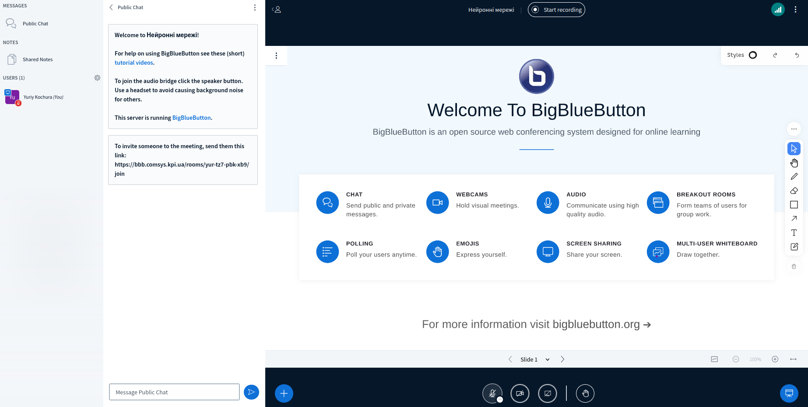
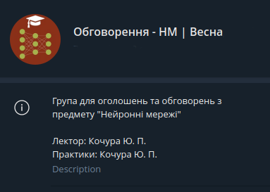
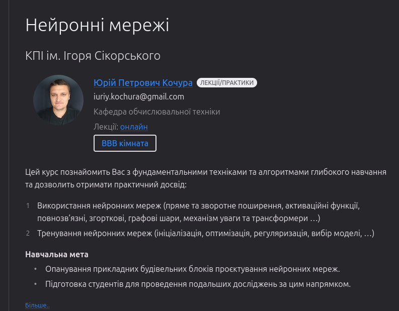
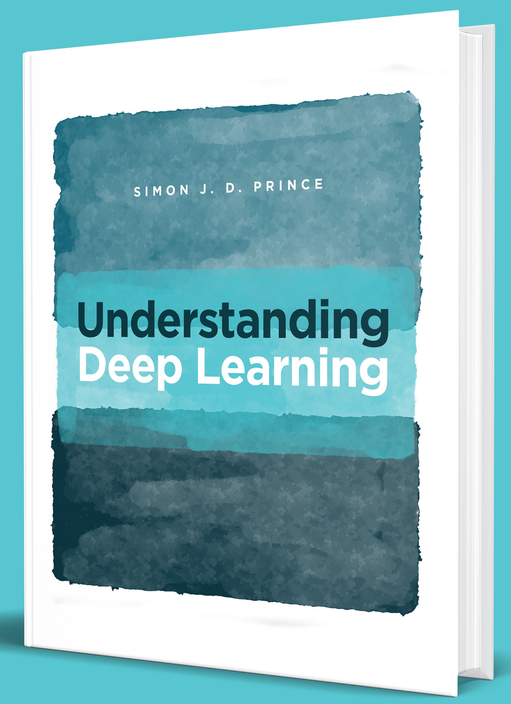
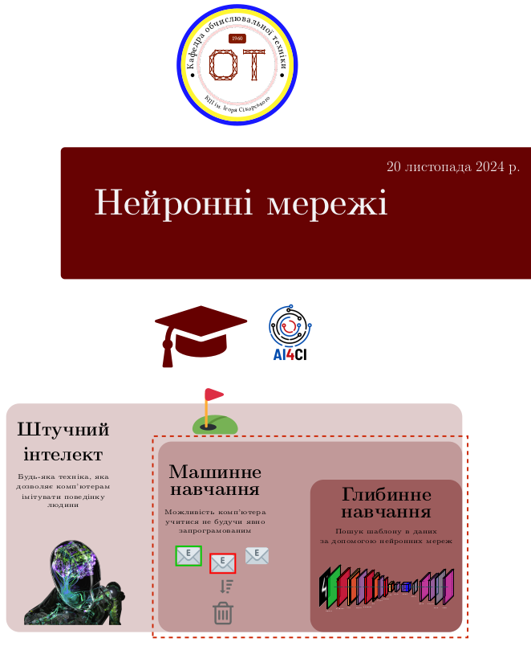

class: middle, center, title-slide 

# Нейронні мережі

Весна, 2026

  
Кочура Юрій Петрович 
[iuriy.kochura@gmail.com](mailto:iuriy.kochura@gmail.com)  
<a href="https://t.me/y_kochura">@y_kochura</a>  

???

R: https://www.cs.toronto.edu/~duvenaud/courses/csc2541/index.html projects

---

# Викладач

.larger-x[📖 Лекції та практики]

.grid[
.kol-1-1[ 
.circle.center.width-40[]
.bold.center[👤 Кочура Юрій Петрович ] 

.bold.center[🏢 Кафедра ОТ, ФІОТ]

]]

---

class: middle 
# Опис
Цей курс познайомить Вас з фундаментальними техніками та алгоритмами глибокого навчання та дозволить отримати практичний досвiд:
  - Використання нейронних мереж (пряме та зворотне поширення, активацiйнi функцiї, повнозв’язні, згорткові, графові шари, механізм уваги та трансформери …)
---

class: middle 
count: false
# Опис
Цей курс познайомить Вас з фундаментальними техніками та алгоритмами глибокого навчання та дозволить отримати практичний досвiд:
  - .inactive[Використання нейронних мереж (пряме та зворотне поширення, активацiйнi функцiї, повнозв’язні, згорткові, графові шари, механізм уваги та трансформери …)]
  - Тренування нейронних мереж (iнiцiалiзацiя, оптимiзацiя, регуляризацiя, вибiр моделі, …)

---

class: middle 

# Опис

## Навчальна мета
- Опанування прикладних будівельних блоків проєктування нейронних мереж.

---

class: middle 
count: false
# Опис

## Навчальна мета
- .inactive[Опанування прикладних будівельних блоків проєктування нейронних мереж.]
- Підготовка студентів для проведення подальших досліджень за цим напрямком.

---

class: middle 
# Потрібні навички

- Рівень володіння англійською мовою не нижче А2.

---

class: middle 
count: false
# Потрібні навички

- .inactive[Рівень володіння англійською мовою не нижче А2.]
- .bold[Математика]: знання та вміння використовувати обчислення, аналітичну геометрію, лінійну алгебру та теорію ймовірностей.

---

class: middle 
count: false
# Потрібні навички

- .inactive[Рівень володіння англійською мовою не нижче А2.]
- .inactive[.bold[Математика]: знання та вміння використовувати обчислення, аналітичну геометрію, лінійну алгебру та теорію ймовірностей.]
- .bold[Програмування]: написання коду на Python.

---

class: middle 
# Заняття

- *Лекції* та *практики* онлайн на платформі .bold[*BigBlueButton*]:   [https://bbb.comsys.kpi.ua/rooms/yur-tz7-pbk-xb9/join](https://bbb.comsys.kpi.ua/rooms/yur-tz7-pbk-xb9/join)

.center.width-100[]

---

class: middle

# Оголошення та обговорення

Усі *оголошення* та *обговорення* будуть здійснюватись в Telegram (повідомте мене, якщо потрібно Вас додати)

.quote[Ставте запитання, діліться корисними ресурсами та спілкуйтеся з одногрупниками і викладачем.]

.center.width-45[]
.center.smaller-x[Оголошення + обговорення]

---

class: middle

# Що робити, якщо розпочалась повітряна тривога?

.alert[📢 У випадку оголошення повітряної тривоги  &mdash; залиште заняття та .bold[прямуйте до найближчого укриття].]

---

class: middle 
# Вебсторінка

Усі навчальні матеріали будуть розміщуватись на цій вебсторінці:   [https://courses-cs-kpi.github.io/nn-26sp/](https://courses-cs-kpi.github.io/nn-26sp/)

.center.width-80[]

---

class: middle

# Підручники

.grid[
.kol-1-3[
[.center.width-100[]](https://udlbook.github.io/udlbook/)
.center[Безкоштовно]
]

.kol-1-3[
[.center.width-110[]](https://https://d2l.ai/)
.center[Безкоштовно]
]

.kol-1-3[
[.center.width-105[]](https://github.com/dml-book/dml/releases/download/v0.1.10/0.1.10-final.pdf)
.center[Безкоштовно]
  ]
]

---

class: middle
# Особливості

- Для магiстрiв 1-го курсу
- Мова викладання: українська, англiйська
- 10 лекцій
- 4 практичнi роботи + контрольна
- Проєкт
- Екзамен

---

class: middle

# Практичні завдання

Вправи, які допоможуть Вам краще познайомитись з предметом. 

---

class: middle

# Проєкт 

Над проєктною роботою можна працювати у групах (до трьох людей) або самостiйно. .bold[Мета проєктної роботи] &mdash; застосування методів глибокого навчання для розв’язання прикладного завдання, визначеного викладачем.

.success[Проєктна робота, на відміну від практичної роботи, має комплексний характер і передбачає самостійне застосування методів та підходів до розв’язання прикладного завдання, визначеного викладачем, із отриманням завершеного результату. Практична робота спрямована на відпрацювання окремих умінь і навичок за заздалегідь визначеним алгоритмом та, як правило, виконується в межах одного заняття або короткого проміжку часу.]

---

class: middle
# Система оцінювання

- 40%  &nbsp;&emsp; Практичнi завдання (10% кожне)
- 10%  &nbsp;&emsp; Контрольна
- 20%  &nbsp;&emsp; Проєкт
- 30%  &nbsp;&emsp; Екзамен 

**Примітка!** Умова допуску до семестрового контролю (екзамену): 
 .center[*Практичні + Контрольна +  Проєкт* $\geq 42\%$]

---

class: middle 
# Шкала оцінок

Шкала оцiнок [КПI iм. Iгоря Сiкорського](https://kpi.ua/grading):

.center.width-65[]

---

class: middle 
# Кодекс честі

## Академічна доброчесність

Ви можете обговорювати завдання практичних робiт у групах. Однак, кожен студент(-ка)
повинен(-на) пiдготувати розв’язки завдань самостiйно. Пiд час проходження цього курсу Ви
зобов’язанi дотримуватись політики та принципів академічної доброчесності визначених
Кодексом честi КПI iм. Iгоря Сiкорського ([Розліл 3](https://kpi.ua/code)) та усi наступнi
правила:

---

class: middle 
count: false
# Кодекс честі

## Академічна доброчесність

Ви можете обговорювати завдання практичних робiт у групах. Однак, кожен студент(-ка)
повинен(-на) пiдготувати розв’язки завдань самостiйно. Пiд час проходження цього курсу Ви
зобов’язанi дотримуватись політики та принципів академічної доброчесності визначених
Кодексом честi КПI iм. Iгоря Сiкорського ([Розліл 3](https://kpi.ua/code)) та усi наступнi
правила:

1. Кожен з Вас повинен вiдправляти на перевiрку власно виконану роботу. Використання чужих розв’язкiв або програмного коду i представлення їх за свої напрацювання є плагiатом та серйозним порушенням основних академiчних стандартiв.

---

class: middle 
count: false
# Кодекс честі

## Академічна доброчесність

Ви можете обговорювати завдання практичних робiт у групах. Однак, кожен студент(-ка)
повинен(-на) пiдготувати розв’язки завдань самостiйно. Пiд час проходження цього курсу Ви
зобов’язанi дотримуватись політики та принципів академічної доброчесності визначених
Кодексом честi КПI iм. Iгоря Сiкорського ([Розліл 3](https://kpi.ua/code)) та усi наступнi
правила:

1. .inactive[Кожен з Вас повинен вiдправляти на перевiрку власно виконану роботу. Використання чужих розв’язкiв або програмного коду i представлення їх за свої напрацювання є плагiатом та серйозним порушенням основних академiчних стандартiв.]

1. Ви не повиннi дiлитися своїми розв’язками з iншими студентами, а також просити iнших дiлитися своїми розв’язками з Вами.

---

class: middle 
count: false
# Кодекс честі

## Академічна доброчесність

Ви можете обговорювати завдання практичних робiт у групах. Однак, кожен студент(-ка)
повинен(-на) пiдготувати розв’язки завдань самостiйно. Пiд час проходження цього курсу Ви
зобов’язанi дотримуватись політики та принципів академічної доброчесності визначених
Кодексом честi КПI iм. Iгоря Сiкорського ([Розліл 3](https://kpi.ua/code)) та усi наступнi
правила:

1. .inactive[Кожен з Вас повинен вiдправляти на перевiрку власно виконану роботу. Використання чужих розв’язкiв або програмного коду i представлення їх за свої напрацювання є плагiатом та серйозним порушенням основних академiчних стандартiв.]

1. .inactive[Ви не повиннi дiлитися своїми розв’язками з iншими студентами, а також просити iнших дiлитися своїми розв’язками з Вами.]

1. Якщо Ви отримували допомогу у вирiшеннi певного завдання, Ви маєте зазначити це у звiтi, а саме: вiд кого та яку допомогу отримали.

---

class: middle 
# Кодекс честі

## Норми етичної поведінки

Норми етичної поведінки студентів і працівників університету визначені у [розділі 2 Кодексу честі](https://kpi.ua/code) 
Національного технічного університету України «Київський політехнічний інститут імені Ігоря
Сікорського».

---

class: middle 
# Кодекс честі

## Виконання завдань: практики та проєкт

Викладачем встановлюється граничний термін для виконання усіх видів завдань з метою послідовного і збалансованого засвоєння студентами навчального матеріалу та моніторингу виконання здобувачами індивідуальних навчальних планів згідно з графіком навчального процесу. Здача на перевірку виконаних завдань після встановлених термінів
супроводжується штрафними балами. Кінцевим терміном для здачі на перевірку усіх видів завдань є останнє заняття з комп’ютерного практикуму. У період проведення в університеті заліково-екзаменаційної сесії приймання завдань не буде здійснюватись. На перездачі кожен має можливість переробити або доопрацювати завдання з метою підвищення свого поточного рейтингу.

---

class: middle 
# Кодекс честі

## Процедура оскарження оцінок

.quote[Якщо студент(-ка) вважає, що його(її) роботу недооцінено або переоцінено &mdash; потрібно
звернутися до викладача, який здійснював оцінювання та повідомити про це із зазначенням
короткого обґрунтування (оцінка буде переглянута).]

---

class: end-slide, center
count: false

.larger-xx[Почнемо 🎬⏳] 