class: middle, center, title-slide
# Нейронні мережі

Лекція 5: Згорткові мережі

<br><br>
Кочура Юрій Петрович<br>
[iuriy.kochura@gmail.com](mailto:iuriy.kochura@gmail.com) <br>
<a href="https://t.me/y_kochura">@y_kochura</a> <br>


---

class:  black-slide,
background-image: url(./figures/lec1/nn.jpg)
background-size: cover

<br>
# Сьогодні
.larger-x[<p class="shadow" style="line-height: 180%;">Розуміння згорткових нейронних мереж (convnets або СNNs): <br>

- Повнозв'язна мережа <br>
- Згорткова мережа: <br>
    1. Візуальне сприйняття <br>
    2. Операція згортки <br>
    3. Крок згортки <br>
    4. Ефект доповнення (padding) <br>
    5. Операція агрегації (pooling)</p>]

---


class: blue-slide, middle, center
count: false

.larger-xx[Повнозв'язна мережа]

---

class: middle, black-slide

# MNIST: приклади

.center.width-100[]

.success[**Примітка!** У машинному навчанні для задачі класифікації категорія даних називається *класом*. Кожна одиниця даних називається
прикладом. Клас, який пов’язаний із певним прикладом називається *міткою (label)*.]

.footnote[Джерело: François Chollet. Deep Learning with Python, 2021.]

???
Ми збираємося зануритися в теорію того, що таке convnets і чому вони настільки успішні в задачах комп’ютерного зору. Але спочатку давайте практично розглянемо приклад мережі з щільним зв’язком, яка класифікує цифри MNIST. Не хвилюйтеся, якщо деякі кроки здаються вам довільними або схожими на магію! Ми повинні з чогось почати.

Проблема, яку ми тут намагаємося вирішити, полягає в тому, щоб класифікувати зображення в градаціях сірого рукописних цифр (28 × 28 пікселів) за 10 категоріями (від 0 до 9). Ми будемо використовувати набір даних MNIST, класичний у спільноті машинного навчання, який існує майже стільки ж, скільки сама галузь, і інтенсивно вивчається. Це набір із 60 000 навчальних зображень, а також 10 000 тестових зображень, зібраних Національним інститутом стандартів і технологій (NIST у MNIST) у 1980-х роках. Ви можете розглядати «розв’язання» MNIST як «Hello World» глибокого навчання &mdash; це те, що ви робите, щоб перевірити, чи ваші алгоритми працюють належним чином. Коли ви станете практиком машинного навчання, ви побачите, що MNIST знову і знову з’являється в наукових статтях, публікаціях у блогах тощо. Ви можете побачити деякі зразки MNIST
на цьому слайді.

---


class: middle, black-slide

.center.width-100[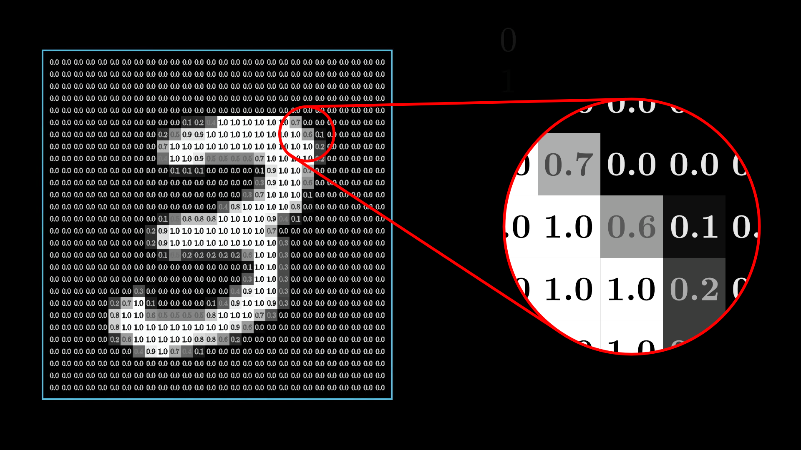]

---

class: middle, black-slide

.center[
<video loop controls preload="auto" height="600" width="800">
  <source src="./figures/lec5/pixels-to-neurons.mp4" type="video/mp4">
</video>
]

.footnote[Джерело: [3Blue1Brown](https://www.3blue1brown.com/lessons/neural-networks).]

---

class: middle, black-slide

# Імпортування набору даних MNIST у Keras

```python
from tensorflow.keras.datasets import mnist
(train_images, train_labels), (test_images, test_labels) = mnist.load_data()
```

- *train_images* та  *train_labels* &mdash; навчальний набір даних (дані на яких
модель буде навчатись)

-  *test_images* та *test_labels* &mdash; тестовий набір (дані на яких буде оцінено продуктивність моделі)

???
Набір даних MNIST попередньо завантажений у Keras у формі набору з чотирьох масивів NumPy.

---

class: middle, black-slide

# Навчальний набір

```python
train_images.shape
```
```
(60000, 28, 28)
```

```python
len(train_labels)
```
```
60000
```

```python
train_labels
```
```
array([5, 0, 4, ..., 5, 6, 8], dtype=uint8)
```

???
Зображення закодовані як масиви NumPy, а мітки – це масив цифр від 0 до 9. Зображення та мітки мають взаємну відповідність.

---

class: middle, black-slide

# Тестовий набір

```python
test_images.shape
```
```
(10000, 28, 28)
```

```python
len(test_labels)
```
```
10000
```

```python
test_labels
```
```
array([7, 2, 1, ..., 4, 5, 6], dtype=uint8)
```
---

class: middle, black-slide

# Архітектура мережі

```python
from tensorflow import keras
from tensorflow.keras import layers
model = keras.Sequential([
    layers.Dense(512, activation='relu'),
    layers.Dense(10, activation='softmax')
])
```

.success[Робочий процес буде таким: спочатку ми передамо нейронній мережі навчальні дані *train_images* та *train_labels*. Таким чином мережа навчиться пов’язувати зображення з мітками. Потім ми попросимо мережу створити прогнози для *test_images* та перевіримо, чи відповідають ці прогнози міткам з *test_labels*.]

???
Основним будівельним блоком нейронних мереж є *шар*. Ви можете розглядати шар як фільтр для даних: деякі дані надходять в нього, а виходять у більш корисній формі. Зокрема, шари витягують представлення з даних, що заложені в ці дані &mdash; у перспективі ці представлення будуть більш значущими для розглянутої проблеми. Глибинне навчання полягяє в об’єднанні простих шарів, які реалізують форму прогресивної дистиляції даних. Модель глибокого навчання схожа на сито для обробки даних, яка складається з сукупності все більш уточнюючих фільтрів даних &mdash; шарів.

Тут наша модель складається з послідовності двох *щільних* шарів, які є щільно зв’язаними (також називаються *повністю зв’язаними*) нейронними шарами. Другий (він же останній) шар — це 10-класовий *класифікаційний шар *softmax*, що означає, що він повертатиме масив з 10 оцінок ймовірності (сума дорівнює 1). Кожна оцінка буде ймовірністю того, що поточне зображення цифри належить до одного з наших 10 класів цифр.

---

class: middle, black-slide

# Готуємо мережу до навчання

Щоб підготувати мережу до навчання, нам потрібно визначити на етапі *компіляції*:

- *Оптимізатор* &mdash; алгоритм за допомогою якого модель оновлюватиметься на основі навчальних даних, які надаються моделі для покращеня свої продуктивності.

- *Функція втрат* &mdash; спосіб виміру втрат моделі. Оптимізатор намагається мінімізувати втрати моделі.

- *Метрики для моніторингу під час навчання та тестування* &mdash; у цій задачі ми слідкуватимо за точністю (відсоток зображень, які були правильно класифіковані).

---

class: middle, black-slide

# Компіляція моделі

```python
model.compile(optimizer="rmsprop",
              loss="sparse_categorical_crossentropy",
              metrics=["accuracy"])
```

---


class: middle, black-slide

# Підготовка даних

```python
train_images = train_images.reshape(60000, 28 * 28)
train_images = train_images.astype("float32") / 255

test_images = test_images.reshape(10000, 28 * 28)
test_images = test_images.astype("float32") / 255
```

.alert[Раніше наші навчальні зображення зберігалися в масиві *(60000, 28, 28)* типу **uint8** зі значеннями в інтервалі *[0, 255]*. Ми
перетворюємо його на масив **float32** форми *(60000, 28 ∗ 28)* зі значеннями від *0* до *1*. Тестовий набір даних перетворюємо аналогічним чином.]


???
Перед навчанням ми попередньо обробимо дані, змінивши їх у форму, яку очікує модель, і масштабуємо так, щоб усі значення були в інтервалі $[0, 1]$.

Тепер ми готові до навчання моделі, що в Keras виконується за допомогою виклику методу моделі *fit()* &mdash; ми адаптуємо модель до даних навчання.

---

class: middle, black-slide

# Навчання моделі

```python
model.fit(train_images, train_labels, epochs=5, batch_size=128)
```

```bash
Epoch 1/5
469/469 [==============================] - 3s 5ms/step - loss: 0.2633 - accuracy: 0.9239
Epoch 2/5
469/469 [==============================] - 2s 5ms/step - loss: 0.1079 - accuracy: 0.9679
Epoch 3/5
469/469 [==============================] - 2s 5ms/step - loss: 0.0714 - accuracy: 0.9784
Epoch 4/5
469/469 [==============================] - 3s 6ms/step - loss: 0.0524 - accuracy: 0.9844
Epoch 5/5
469/469 [==============================] - 3s 6ms/step - loss: 0.0390 - accuracy: 0.9882

<keras.src.callbacks.History at 0x7e81cba25e70>
```

???
Під час навчання відображаються дві величини: втрати та точність моделі на навчальній вибірці. Наша модель швидко досягає точності 0,989 (98,8%) на навчальній вибірці. Тепер, коли ми маємо навчену модель, ми можемо використовувати її для прогнозування ймовірностей класів для нових цифр &mdash; зображення, які не були частиною тренувальних даних, наприклад із тестового набору.

---

class: middle, black-slide

# Виконання прогнозу

```python
test_digits = test_images[0:10]
prediction = model.predict(test_digits)
prediction[0]
```

```
array([3.9224375e-08, 4.9862869e-09, 9.4487259e-06, 8.6249776e-05,
       2.9801717e-11, 3.3959207e-08, 4.4558798e-13, 9.9990362e-01,
       1.0565784e-07, 3.3271664e-07], dtype=float32)
```

.success[Кожне індекс $i$ в цьому масиві відповідає ймовірності того, що наше тестове зображення *test_digits[0]* належить до класу $i$.]

---

class: middle, black-slide
# Виконання прогнозу

Перше тестове зображення має найбільшу ймовірність (*0.99990362*, майже 1) для індекса масива *7*, тому відповідно до цього прогнозу моделі це має
бути *7*:

```python
prediction[0].argmax()
```
```
7
```

```python
prediction[0][7]
```
```
0.9999036
```

.success[Перевіримо на відповідність тестовій мітці:]

```python
test_labels[0]
```
```
7
```

???
Наскільки в середньому наша модель здатна добре класифікувати такі цифри, яких раніше не бачили? Давайте перевіримо, обчисливши середню точність для всього тестового набору.

---

class: middle, black-slide

# Оцінка моделі на нових даних

```python
test_loss, test_acc = model.evaluate(test_images, test_labels)
```
```bash
313/313 [==============================] - 1s 2ms/step - loss: 0.0605 - accuracy: 0.9817
```

```python
print(f"test accuracy: {test_acc}")
```
```
test accuracy: 0.9817000031471252
```

???
Точність на тестовому наборі виявилася 98,1% &mdash; це трохи нижче, ніж точність тренувального набору (98,8%). Цей розрив між точністю навчання та точністю тесту є прикладом перенавчання: той факт, коли модель мають тенденцію працювати гірше на нових даних, ніж на даних навчання. 

На цьому завершується наш перший приклад — ви щойно бачили, як можна створити та навчити нейронну мережу класифікувати рукописні цифри менш ніж у 15 рядках коду Python.

---


class: blue-slide, middle, center
count: false

.larger-xx[Згорткові мережі]

???
Ми збираємося зануритися в теорію того, що таке convnets і чому вони настільки успішні в задачах комп’ютерного зору. Але спочатку давайте практично розглянемо простий приклад convnet, який класифікує цифри MNIST, завдання, яке ми виконали вище, використовуючи мережу з щільним зв’язком (точність нашого тесту тоді становила 98,1%). Незважаючи на те, що мережа буде простою, її точність перевершить точність повнозв'язної моделі.

---

class: middle, black-slide

# Візуальне сприйняття

У 1959-1962 роках Девід Г'юбел і Торстен Візел зробили відкриття, що стосується принципів переробки інформації в нейронних структурах.
За своє відкриття вони отримали Нобелівську премію з медицини в 1981 році.

.grid.center[
.kol-4-5.center[.width-80[].width-25[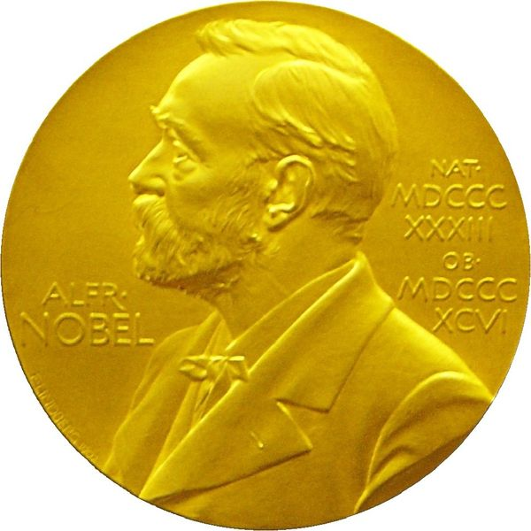]]
.kol-1-5[.width-100[].bold.smaller-x.center[Девід Г'юбел].width-100[].bold.smaller-x.center[Торстен Візел]]
]


???
Канадець Девід Г'юбел (David Hubel) та швед Торстен Візел (Torsten Wiesel)  — відомі нейрофізіологи, які зробили значний внесок у розуміння роботи зорової кори мозку. У 1959 році вони почали співпрацювати, що призвело до важливих відкриттів у галузі нейробіології, зокрема у вивченні того, як мозок обробляє візуальну інформацію.

- Вони показали, що нейрони зорової кори мають багатошарову структуру з локальним просторовим зв’язком: клітина вироблятиме відповідь, лише якщо клітини в рецептивному полі були активовані.

- Вони показали, що нейрони зорової кори спеціалізуються на обробці певних аспектів зорової інформації, таких як орієнтація країв об'єктів. Це відкриття пояснило, як мозок будує образ із сигналів, що надходять із сітківки ока.

- Г'юбел і Візел виявили, що нейрони поділяються на "прості", які реагують на конкретні орієнтації ліній, і "складні", які реагують на рух цих ліній.

- Вони виявили, що існують критичні періоди розвитку, під час яких правильна візуальна стимуляція є необхідною для нормального розвитку зорової системи. Це відкриття мало велике значення для розуміння таких порушень, як амбліопія (синдром "ледачого ока").


За свої дослідження Девід Г'юбел і Торстен Візел отримали Нобелівську премію з медицини у 1981 році. Їхнє відкриття стало основою для подальших досліджень у галузі нейробіології та розуміння функціонування мозку.
---

class: middle, black-slide

.center[

<iframe width="640" height="480" src="https://www.youtube.com/embed/IOHayh06LJ4?&loop=1&start=0" frameborder="0" volume="0" allowfullscreen></iframe>

]

---

class: middle, black-slide

.center[

<iframe width="640" height="480" src="https://www.youtube.com/embed/OGxVfKJqX5E?&loop=1" frameborder="0" volume="0" allowfullscreen></iframe>

]

???

Під час запису вони помітили кілька цікавих речей:
1. нейрони спрацьовували лише тоді, коли лінія була в певному місці на сітківці,
2. активність цих нейронів змінювалася в залежності від орієнтації лінії
3. іноді нейрони спрацьовували лише тоді, коли лінія рухалася в певному напрямку.

---

class: middle, black-slide

# Індуктивйний зсув
Чи можемо ми оснастити нейронні мережі *індуктивними зсувами*, характерними для зорової ситеми?

- Локальність (як у простих нейронів)
- Інваріантність зміщень (як у складних нейронах)
- Ієрархічна композиційність (як у гіперкомплексних нейронах)


???
Inductive bias (індуктивне упередження) — це сукупність припущень або зсувів, які алгоритм або модель використовує для навчання та прийняття рішень, навіть коли даних недостатньо. Ці припущення дозволяють робити узагальнення на основі наявних даних і прогнозувати результати для нових, раніше невідомих ситуацій.

- Без індуктивного упередження модель була б просто "запам'ятовувачем" даних і не могла б ефективно узагальнювати чи передбачати нову інформацію.
- Типи індуктивних упереджень: Вони можуть бути простими (наприклад, "лінійні зв'язки між змінними") або складними (наприклад, певні патерни в зображеннях чи структура в текстах).

Індуктивні упередження визначають, як модель буде шукати закономірності в даних і які види рішень вона віддаватиме перевагу. Наприклад:

- Лінійні моделі мають індуктивне упередження, що залежність між змінними є лінійною.
- Нейронні мережі з певною архітектурою мають індуктивні упередження щодо типу оброблюваних сигналів (наприклад, згорткові нейронні мережі краще підходять для обробки зображень через упередження щодо локальної залежності пікселів).

Індуктивні упередження важливі, бо без них модель може або взагалі не навчитися, або перенавчитися (overfitting), намагаючись відтворити усі особливості навчальних даних без узагальнення. 
---

class: middle, black-slide

# Неокогнітрон 

У 1979 році Фукусіма пропонує реалізацію ієрархічної багатошарової штучної нейронної мережі для моделі зорової нервової системи Г'юбеля та Візеля.

.width-100.center[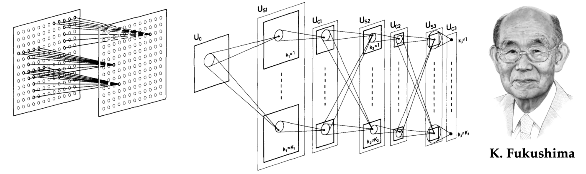].smaller-x.center[Куніхіко Фукусіма та неокогнітрон, рання геометрична архітектура глибокого навчання та попередник сучасних згорткових нейронних мереж]


- Побудований на основі **згорток** і дозволяє створювати *ієрархію ознак*.

.footnote[Credits: Kunihiko Fukushima, [Neocognitron: A Self-organizing Neural Network Model](https://www.rctn.org/bruno/public/papers/Fukushima1980.pdf), 1980.]

???
1979: First Deep Convolutional NN (1969: ReLUs) 

Оскільки основним застосуванням неокогнітрона було розпізнавання символів, інваріантність відносно зміщень була вирішальною. Ця властивість була принциповою відмінністю від попередніх нейронних мереж, таких як персептрон Розенблатта: щоб ефективно використовувати персептрон, потрібно було спочатку нормалізувати положення вхідного шаблону, тоді як у неокогнітроні нечутливість до положення шаблону була вбудована в архітектура. Неокогнітрон досяг цього шляхом чергування трансляційно-еквіваріантних шарів виділення локальних ознак з об’єднанням, створюючи багатомасштабне представлення. Експерименти показали, що архітектура Фукусіми здатна успішно розпізнавати складні шаблони, такі як літери чи цифри, навіть за наявності шуму та геометричних спотворень.

---

class: middle, black-slide

# LeNet-1 

У 1989 році ЛеКун навчає згорткову мережу методом зворотного поширення.

<br>
.center.width-100[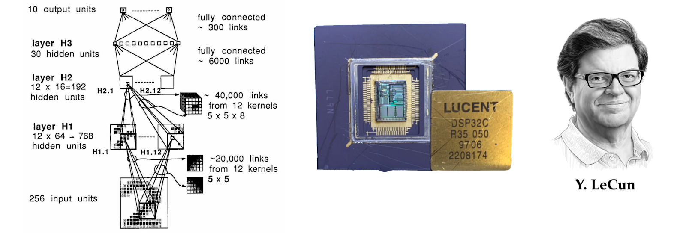].smaller-xxx.center[Джерело: [Towards Geometric Deep Learning](https://thegradient.pub/towards-geometric-deep-learning/)]

.footnote[Credits: LeCun et al, [Handwritten Digit Recognition with a Back-Propagation Network](http://yann.lecun.com/exdb/publis/pdf/lecun-90c.pdf), 1990.]

???
Дизайн Фукусіми був далі вдосконалений Янном Лекуном, який щойно закінчив Паризький університет із PhD дисертацією про використання зворотного поширення для навчання нейронних мереж. На своїй першій пост-докторській посаді в AT&T Bell Laboratories Лекун і його колеги створили систему розпізнавання рукописних цифр на конвертах, щоб дозволити Поштовій службі США автоматично маршрутизувати пошту.

LeCun та ін. описав першу тришарову згортову нейронну мережу (CNN). Подібно до неокогнітрона, CNN Лекуна також використовував локальне підключення зі спільними вагами та об’єднанням. Однак він відмовився від більш складної нелінійної фільтрації Фукусіми (гальмівних з’єднань) на користь простих лінійних фільтрів, які можна було б ефективно реалізувати як згортки за допомогою операцій множення та накопичення на цифровому сигнальному процесорі (DSP).

Роботи Лекуна переконливо показали силу градієнтних методів для складних задач розпізнавання образів і були однією з перших практичних систем комп’ютерного зору на основі глибокого навчання.  Розвиток цієї архітектури, CNN із п’ятьма рівнями LeNet-5, названа на честь автора, використовувалась банками США для читання рукописних чеків.

---

class: middle, black-slide

.center[

<iframe width="640" height="480" src="https://www.youtube.com/embed/FwFduRA_L6Q?&loop=1&start=0" frameborder="0" volume="0" allowfullscreen></iframe>

]

.center[LeNet-1 (LeCun et al, 1993)]

---

class: middle

## LeNet-5 (LeCun et al, 1998)

Композиція з двох шарів $\texttt{CONV}+\texttt{POOL}$ за якими йде блок повністю пов’язаних шарів.

.center.width-110[]

.footnote[Credits: [Dive Into Deep Learning](https://d2l.ai/), 2020.]

---

class: middle, black-slide

## Тріумф глибокого навчання

.center.width-95[].smaller-x.center[Результати [ImageNet Large Scale Visual Recognition Challenge (ILSVRC)](https://www.image-net.org/challenges/LSVRC/index.php). У 2012 році AlexNet стала першою архітектурою глибокого навчання, яка перевершила підходи, що базувались на «ручному» видобуванню ознак; відтоді всі методи-переможці базувалися на глибокому навчанні.]

.footnote[Credits: [Towards Geometric Deep Learning](https://thegradient.pub/towards-geometric-deep-learning/).]

???
Початкове сприйняття того, що пізніше буде названо «глибоким навчанням», спочатку викликало досить прохолодне ставлення. Переважна частина спільноти комп’ютерного зору  в першому десятилітті нового століття (2000-2010), коли домінували ручні дескриптори ознак, ставилась особливо ворожо до використання нейронних мереж. Проте баланс сил незабаром змінився завдяки швидкому зростанню обчислювальної потужності та збільшенню доступних анотованих візуальних даних. Стало можливим реалізовувати та навчати все більші й складніші згорткові нейронні мережі (CNN), що дозволило вирішувати все складніші завдання розпізнавання візуальних шаблонів, кульмінацією стало досягнення CNN в змаганні ImageNet Large Scale Visual Recognition Challenge.

ImageNet був ініційований та створений під керівництвом американсько-китайської дослідниці в галузі комп'ютерного зору і штучного інтелекту Фей-Фей Лі (Fei-Fei Li). Вона розпочала роботу над ImageNet у 2007 році разом зі своїми колегами та студентами зі Стенфордського університету та Принстонського університету.  Засноване змагання ImageNet  Large Scale Visual Recognition Challenge у 2009 році. Це було щорічним змаганням, що складалося з класифікації 14,197,122 мільйонів зображень, анатованих людьми, на 1000 різних категорій.

---

class: middle

.grid[
.kol-3-5[
.center.circle.width-50[]

## AlexNet ([Krizhevsky et al, 2012](https://proceedings.neurips.cc/paper/2012/file/c399862d3b9d6b76c8436e924a68c45b-Paper.pdf))

Композиція 8-шарової згорткової нейронної мережі з 3-шарами MLP.

Оригінальна реалізація складалася з двох частин, щоб вона могла поміститися в два графічні прискорювачі GeForce NVIDIA.
]
.kol-2-5.center[.width-100[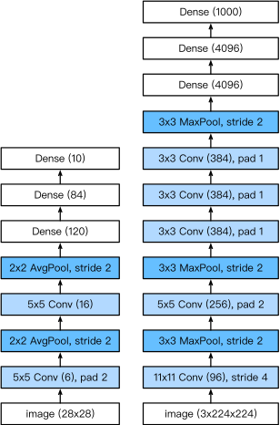]
.caption[LeNet vs. AlexNet]
]
]

.footnote[Credits: [Dive Into Deep Learning](https://d2l.ai/), 2020.]

???
Архітектура згорткової нейронної мережі (CNN), розроблена в Університеті Торонто Крижевський, Суцкевером і Гінтоном, зуміла значно перевершити усі конкуруючі підходи, такі як вдосконалені детектори ознак, розроблені на основі десятиліть досліджень у цій галузі. AlexNet (назвали архітектуру на честь її розробника Алекса Крижевський) була значно більшою за кількістю параметрів і шарів у порівнянні зі своєю попередницею LeNet-5, але концептуально залишалася такою ж. Ключовою відмінністю було використання графічного процесора (GPU) для навчання, який зараз є основною апаратною платформою для глибокого навчання.

---

class: middle

.grid[
.kol-2-5[
  <br>

## VGG ([Simonyan and Zisserman, 2014](https://arxiv.org/pdf/1409.1556))

Композиція з 5  VGG блоків, що складається з шарів $\texttt{CONV}+\texttt{POOL}$, за якими йде блок повністю зв’язаних шарів.

Глибина мережі зросла до 19 шарів, а розмір ядра зменшився до 3.
]
.kol-3-5.center[.width-100[]
.caption[AlexNet vs. VGG]
]
]

.footnote[Credits: [Dive Into Deep Learning](https://d2l.ai/), 2020.]

---

class: middle

.grid[
.kol-4-5[
## GoogLeNet (Szegedy et al, 2014)

Композиція з двох шарів $\texttt{CONV}+\texttt{POOL}$, стеку з 9 блоків *Inception* і глобального об’єднання за середнім.

Кожен *Inception* блок сам по собі визначається як згорткова мережа з 4 паралельними шляхами.

.center.width-80[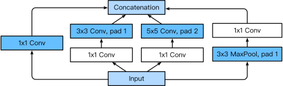]
.caption[Блок Inception]
]
.kol-1-5.center[.width-100[]]
]

.footnote[Credits: [Dive Into Deep Learning](https://d2l.ai/), 2020.]

---

class: middle

.grid[
.kol-4-5[

## ResNet (He et al, 2015)

Композиція шарів $\texttt{CONV}$, організованих у стек з блоків *residual*. Можна додавати більше блоків *residual*, загалом до 152 шарів (ResNet-152).

.center.width-80[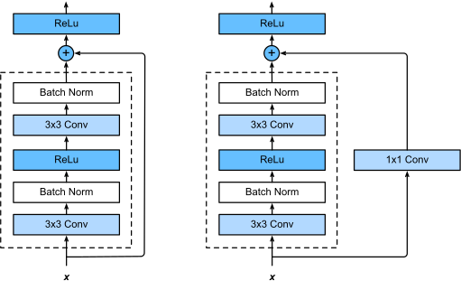]
.center.caption[ResNet vs. ResNet з $1\times 1$ згорткою.]
]
.kol-1-5[.center.width-100[]]
]

.footnote[Credits: [Dive Into Deep Learning](https://d2l.ai/), 2020.]

---

class: middle

Навчальні мережі такої глибини стали можливими завдяки .bold[пропущеним з'єднанням] $f(\mathbf{x}) = \mathbf{x} + g(\mathbf{x})$ у блоках *residual*. Вони дозволяють градієнтам обходити шари і проходити крізь мережу, не зникаючи.

.center.width-60[].smaller-xx[У звичайному блоці (ліворуч) частина в полі з пунктирною лінією має безпосередньо вивчати відображення $f(\mathbf{x})$. У залишковому блоці (справа) частина в межах пунктирної лінії має вивчити залишкове відображення $g(\mathbf{x}) = f(\mathbf{x}) - \mathbf{x}$, що полегшує вивчення відображення ідентичності $f(\mathbf{x}) = \mathbf{x}$.]

.footnote[Credits: [Dive Into Deep Learning](https://d2l.ai/), 2020.]

???
Позначимо вхід $\mathbf{x}$. Ми припускаємо, що $f(\mathbf{x})$, бажане базове відображення, яке ми хочемо отримати шляхом навчання, має використовуватися як вхідні дані для функції активації у верхній частині. Зліва частина в пунктирній рамці має безпосередньо навчатися $f(\mathbf{x})$. Праворуч частина в межах пунктирної лінії має дізнатися про залишкове відображення $g(\mathbf{x}) = f(\mathbf{x}) - \mathbf{x}$, від чого залишковий блок отримує свою назву.

У звичайному блоці (ліворуч) частина в полі з пунктирною лінією має безпосередньо вивчати відображення. У залишковому блоці (справа) частина в межах пунктирної лінії має вивчити залишкове відображення, що полегшує вивчення відображення ідентичності.

---


class: middle, black-slide

# Створюємо згорткову мережу

```python
from tensorflow import keras
from tensorflow.keras import layers
input = keras.Input(shape=(28, 28, 1))
x = layers.Conv2D(filters=32, kernel_size=3, activation="relu") (input)
x = layers.MaxPool2D(pool_size=2) (x)
x = layers.Conv2D(filters=64, kernel_size=3, activation="relu") (x)
x = layers.MaxPool2D(pool_size=2)(x)
x = layers.Conv2D(filters=128, kernel_size=3, activation="relu") (x)
x = layers.Flatten() (x)
output = layers.Dense(10, activation="softmax") (x)
model = keras.Model(inputs=input, outputs=output)
```

.alert.smaller-xx[Важливо, що convnet приймає на вхід тензори форми *(image_height, image_width, image_channels)*, не включаючи розмірність пакету. У цьому випадку ми налаштуємо convnet для обробки вхідних даних розміром *(28, 28, 1)*, що відповідає формату зображень MNIST.]


???
Це стек шарів *Conv2D* і *MaxPooling2D*. За хвилину ви побачите, що саме вони роблять. Ми створимо модель за допомогою функціонального API.

Давайте розглянемо детальніше архітектуру convnet.

---

class: middle, black-slide

```python
model.summary()
```

.smaller-x[
```bash
Model: "model"
_________________________________________________________________
 Layer (type)                Output Shape              Param #   
=================================================================
 input_2 (InputLayer)        [(None, 28, 28, 1)]       0         
                                                                 
 conv2d_1 (Conv2D)           (None, 26, 26, 32)        320       
                                                                 
 max_pooling2d (MaxPooling2  (None, 13, 13, 32)        0         
 D)                                                              
                                                                 
 conv2d_2 (Conv2D)           (None, 11, 11, 64)        18496     
                                                                 
 max_pooling2d_1 (MaxPoolin  (None, 5, 5, 64)          0         
 g2D)                                                            
                                                                 
 conv2d_3 (Conv2D)           (None, 3, 3, 128)         73856     
                                                                 
 flatten (Flatten)           (None, 1152)              0         
                                                                 
 dense (Dense)               (None, 10)                11530     
                                                                 
=================================================================
Total params: 104202 (407.04 KB)
Trainable params: 104202 (407.04 KB)
Non-trainable params: 0 (0.00 Byte)
```
]

???
Ви бачите, що результатом кожного шару *Conv2D* і *MaxPooling2D* є тензор рангу 3 форми $(висота, ширина, канали)$. Розміри ширини та висоти мають тенденцію до зменшення, коли ви заглиблюєтеся в модель. Кількість каналів контролюється першим аргументом, який передається на рівні Conv2D $(32, 64 або 128)$.

Після останнього шару Conv2D ми отримуємо форму (3, 3, 128) &mdash; карту функцій 3 × 3 із 128 каналами. Наступним кроком є передача цього виводу в щільно пов’язаний класифікатор, подібний до тих, з якими ви вже знайомі: стек шарів *Dense*. Ці класифікатори обробляють вектори, які є одновимірними, тоді як поточний вихід є тензором рангу 3. Щоб подолати розрив, ми зводимо 3D-виходи до 1D за допомогою шару *Flatten* перед додаванням шарів *Dense*.

Нарешті, ми виконуємо 10-класову класифікацію, тому наш останній шар має 10 виходів (нейронів) з активацію softmax. Тепер давайте навчимо конвнет розпізнавати цифри з MNIST. Оскільки ми виконуємо 10-класову класифікацію з результатом softmax, ми використовуватимемо *categorical crossentropy loss*, а оскільки наші мітки є цілими числами, ми використовуватимемо розріджену версію *sparse_categorical_crossentropy*.

---

class: middle, black-slide

# Підготовка даних, компіляція та навчання моделі

```python
from tensorflow.keras.datasets import mnist
(train_images, train_labels), (test_images, test_labels) = mnist.load_data()
train_images = train_images.reshape(60000, 28, 28, 1)
train_images = train_images.astype("float32") / 255

test_images = test_images.reshape(10000, 28, 28, 1)
test_images = test_images.astype("float32") / 255

model.compile(optimizer="rmsprop",
              loss="sparse_categorical_crossentropy",
              metrics=["accuracy"])

model.fit(train_images, train_labels, epochs=5, batch_size=128)
```

???
Давайте оцінимо модель на тестових даних.

---


class: middle, black-slide

# Оцінка згорткової моделі на нових даних

```python
test_loss, test_acc = model.evaluate(test_images, test_labels)
```
```bash
313/313 [==============================] - 2s 6ms/step - loss: 0.0271 - accuracy: 0.9911
```

```python
print(f"test accuracy: {test_acc}")
```
```
test accuracy: 0.991100013256073
```

???
У той час як щільно зв’язана модель мала точність тесту 98,1%, базова згорткова мережа має точність тесту 99,1%: ми зменшили рівень помилок. Непогано!

Але чому цей простий convnet працює так добре порівняно з щільно зв’язаною моделлю? Щоб відповісти на це питання, давайте зануримося в те, що роблять шари *Conv2D* і *MaxPooling2D*.

---

class: blue-slide, middle, center
count: false

.larger-xx[Будівельні блоки]

---


class: black-slide, middle

# Тензор (tensor)

масив чисел, розташованих у сітці зі змінною кількістю осей

.footnote[Джерело: Kosta Derpanis. [Convolutional Networks](pdf/ConvNets.pdf)]

---

class: black-slide, middle

.center.width-100[]

.footnote[Джерело: Kosta Derpanis. [Convolutional Networks](pdf/ConvNets.pdf)]

---

class: black-slide, middle

.center.width-100[]

.footnote[Джерело: Kosta Derpanis. [Convolutional Networks](pdf/ConvNets.pdf)]

---

class: black-slide, middle

.center.width-100[]

.footnote[Джерело: Kosta Derpanis. [Convolutional Networks](pdf/ConvNets.pdf)]

---

class: black-slide, middle

.center.width-100[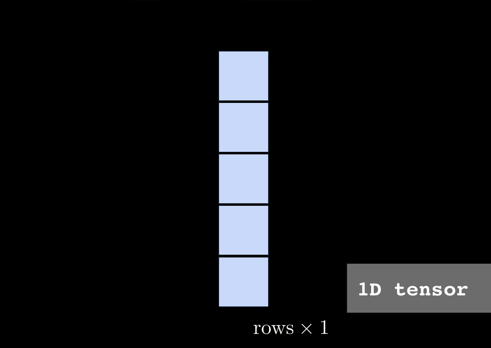]

.footnote[Джерело: Kosta Derpanis. [Convolutional Networks](pdf/ConvNets.pdf)]

---

class: black-slide, middle

.center.width-100[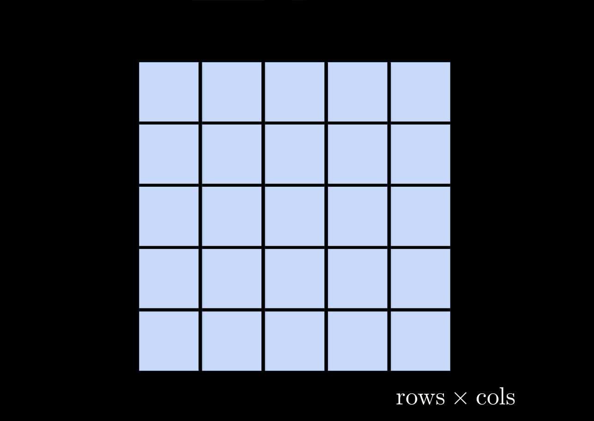]

.footnote[Джерело: Kosta Derpanis. [Convolutional Networks](pdf/ConvNets.pdf)]

---

class: black-slide, middle

.center.width-100[]

.footnote[Джерело: Kosta Derpanis. [Convolutional Networks](pdf/ConvNets.pdf)]

---

class: black-slide, middle

.center.width-100[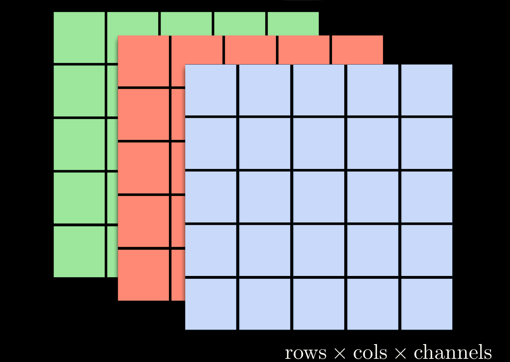]

.footnote[Джерело: Kosta Derpanis. [Convolutional Networks](pdf/ConvNets.pdf)]

---

class: black-slide, middle

.center.width-100[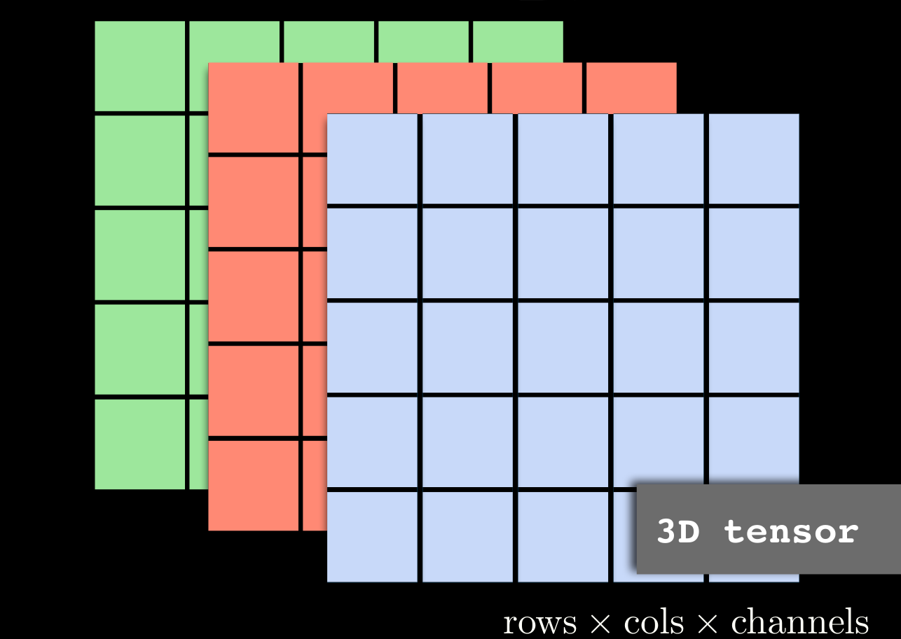]

.footnote[Джерело: Kosta Derpanis. [Convolutional Networks](pdf/ConvNets.pdf)]

---

class: black-slide, middle

.center.width-100[]

---


class: black-slide, middle

.center.width-100[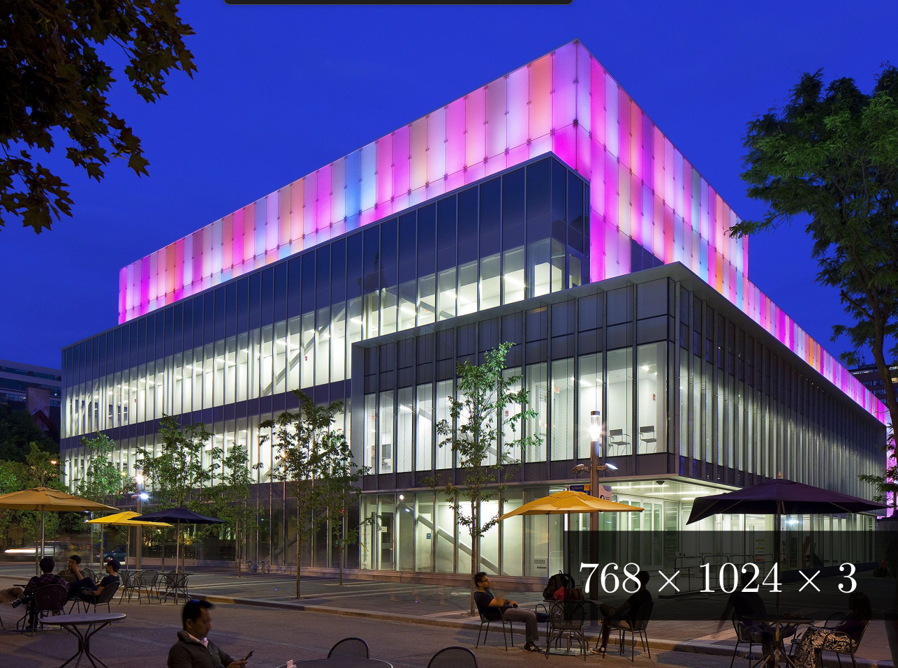]

.footnote[Джерело: Kosta Derpanis. [Convolutional Networks](pdf/ConvNets.pdf)]

---

class: black-slide, middle

.center.width-100[]

.footnote[Джерело: Kosta Derpanis. [Convolutional Networks](pdf/ConvNets.pdf)]

---

class: black-slide, middle

.center.width-100[]

.footnote[Джерело: Kosta Derpanis. [Convolutional Networks](pdf/ConvNets.pdf)]

---


class: black-slide, middle

.center.width-100[]

.footnote[Джерело: Kosta Derpanis. [Convolutional Networks](pdf/ConvNets.pdf)]

---

class: black-slide, middle

.center.width-100[]

.footnote[Джерело: Kosta Derpanis. [Convolutional Networks](pdf/ConvNets.pdf)]

---


class: black-slide, middle

# Згортка (convolution)

.larger-xl[$$\boxed{(f*g)(x) = \int f(z)g(x - z) \, dz}$$]

???
Тобто ми вимірюємо перекриття між функціями коли одна функція «перевертається» і зсувається на z. Щоразу, коли ми маємо дискретні об’єкти, інтеграл перетворюється на суму.

---

class: middle

.center.width-100[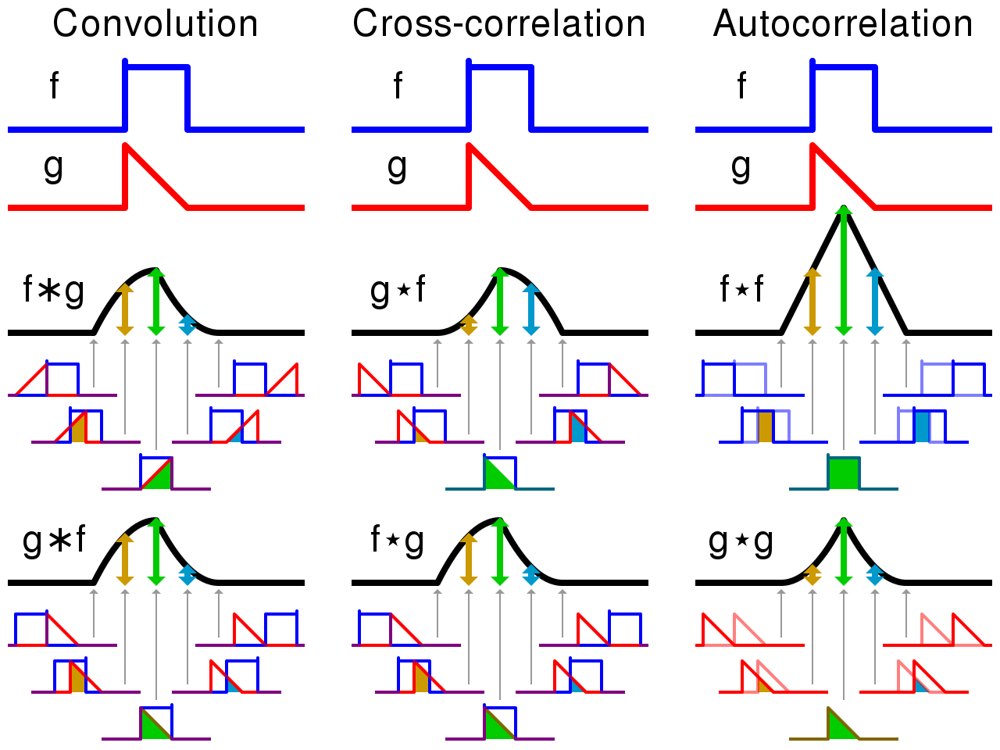]

.footnote[Джерело: [Вікіпедія](https://en.wikipedia.org/wiki/Convolution)]

---


class: black-slide, middle

.center.width-100[]

.footnote[Джерело: Kosta Derpanis. [Convolutional Networks](pdf/ConvNets.pdf)]

???
Строго кажучи, назва “згортковi шари” є не зовсiм коректною, оскiльки операцiї, якi виконуються у цих шарах точнiше описуються не згорткою, а взаємною кореляцiєю (англ. cross-correlation).

---

class: middle, center, black-slide

# Демо

.larger-xl[[Відмінність згортки та взаємної кореляції?](https://colab.research.google.com/github/YKochura/mld-kpi/blob/main/tutor/convolution_vs_correlation.ipynb)]

---

class: middle, black-slide

## 1d згортка

Згортковий шар застосовує те саме лінійне перетворення локально всюди, зберігаючи структуру сигналу.

<br>
.center.width-70[]

.footnote[Credits: Francois Fleuret, [EE559 Deep Learning](https://fleuret.org/ee559/), EPFL.]

???

Draw vertically.

---

class: middle, black-slide

## 1d згортка

Для одновимірного вхідного сигналу $\mathbf{x} \in \mathbb{R}^W$ та згорткового фільтра $\mathbf{u} \in \mathbb{R}^w$, дискретна **згортка** $\mathbf{x} \circledast \mathbf{u}$ є вектором розміром  $W - w + 1$:
$$\begin{aligned}
(\mathbf{x} \circledast \mathbf{u})[i] &= \sum\_{m=0}^{w-1} \mathbf{x}\_{m+i}  \mathbf{u}\_m .
\end{aligned}
$$

.italic[
Технічно, $\circledast$ позначає оператор взаємної кореляції.
Однак більшість бібліотек машинного навчання називають це згорткою.
]

---

class: middle, black-slide 

Взаємна кореляція може реалізовувати диференціальні оператори:
$$(0,0,0,0,1,2,3,4,4,4,4) \circledast (-1,1) = (0,0,0,1,1,1,1,0,0,0) $$
.center.width-100[]
або прості порівняння шаблоннів:
$$(0, 0, 3, 0, 0, 0, 0, 0, 3, 0, 3, 0, 0, 0) \circledast (1, 0, 1) = (3, 0, 3, 0, 0, 0, 3, 0, 6, 0, 3, 0)$$
.center.width-100[]

.footnote[Credits: Francois Fleuret, [EE559 Deep Learning](https://fleuret.org/ee559/), EPFL.]

---


class: middle

# Взаємна кореляція

.center.width-100[]

???
У згортковому шарi вхiдний тензор та тензор ядра (фiльтра) об’єднуються для отримання вихiдного тензора за допомогою операцiї взаємної кореляцiї. Розглянемо як це працює з двовимiрними даними для випадку, коли в згортковому шарi обчислюється один фiльтр. На рисунку 2.12 показаний вхiдний двовимiрний тензор висотою 4 та шириною 4. Висота та ширина фiльтра 3. Розмiр вiкна згортки задається розмiром фiльтра, у цьому випадку розмiр вiкна згортки буде 3×3.

---


class: middle, black-slide

.center[
<video loop controls preload="auto" height="600" width="800">
  <source src="./figures/lec5/2Dconv.mp4" type="video/mp4">
</video>
]

---

class: middle, black-slide

.center[
<video loop controls preload="auto" height="600" width="800">
  <source src="./figures/lec5/2Dconv2.mp4" type="video/mp4">
</video>
]

---


class: middle, 

# Згортковий шар

.center.width-50[]


.footnote[Джерело: François Chollet. Deep Learning with Python, 2021.]

???
Фундаментальна відмінність між щільно зв’язаним шаром і шаром згортки полягає в наступному: щільні шари вивчають глобальні шаблони у своєму вхідному просторі ознак (наприклад, для цифри MNIST, шаблони, що включають усі пікселі), тоді як шари згортки вивчають локальні шаблони &mdash; у випадку зображень, візерунки, знайдені в маленьких двовимірних вікнах входів (див. малюнок на цьому слайді). У попередньому прикладі всі ці вікна мали розмір 3 × 3. Ця особливiсть надає згортковим нейронним мережам наступнi двi важливi властивостi

Зображення можна розбити на локальні шаблони, такі як краї, текстури тощо.

---

class: middle, black-slide

## Еквіваріантність 


Формально, функція $f$ є еквіваріантною відносно перетворення $g$, якщо для будь-якого $\mathbf{x}$ виконується рівність: $f(g(\mathbf{x})) = g(f(\mathbf{x}))$.

Використання спільних параметрів у згортковому шарі спричиняє, що цей шар стає еквіваріантним до трансляцій.

.center.width-75[]
.smaller-xx[Якщо об’єкт змінює розташування у вхідному зображенні, його представлення рухатиметься на таку саму величину у вихідному.]

.footnote[Credits: LeCun et al, Gradient-based learning applied to document recognition, 1998.]

???

- У згортковому шарі нейронної мережі застосовується фільтр (ядро), який ковзає по всьому зображенню. Параметри фільтра є спільними для всіх ділянок зображення, тобто один і той самий фільтр застосовується до кожної частини зображення.
- Згортка не еквіваріантна іншим операціям, таким як зміна масштабу або обертання.

---

class: middle

# Інваріантнти відносно зміщень

Функція $f$ є інваріантною відносно перетворення $g$, якщо для будь-якого $\mathbf{x}$ виконується рівність: $f(g(\mathbf{x})) = f(\mathbf{x})$.

CNN інварiантнти вiдносно зміщень
.center.width-100[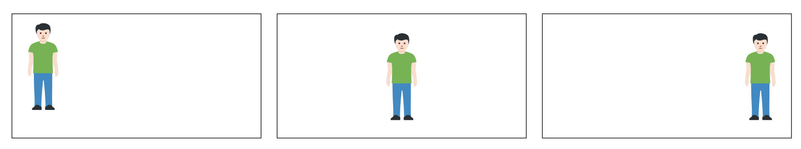]

???
Шаблони, якi вони вивчають, є iнварiантними вiдносно змiщень об’єктiв. Це означає, що пiсля того як згорткова нейронна мережа вивчить певний шаблон, скажiмо у центрi зображення, вона зможе розпiзнати його у будь-якому iншому мiсцi на зображеннi. Повнозв’язнiй нейроннiй мережi довелося б вивчити шаблон заново, якщо вiн з’явився б в iншому мiсцi. Ця властивiсть збiльшує ефективнiсть згорткових мереж в задачах комп’ютерного зору, оскiльки свiт за своєю природою є iнварiантним вiдносно змiщень.

Ключова різниця:
- Еквіваріантність: зміна входу викликає таку ж зміну в результаті.
- Інваріантність: результат залишається незмінним незалежно від зміни входу.

---


class: middle

# Вивчають просторову ієрархію шаблонів

.center.width-80[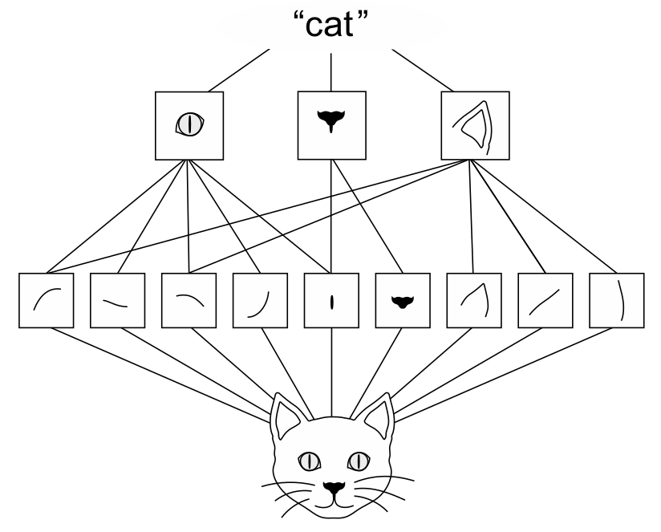]


.footnote[Джерело: François Chollet. Deep Learning with Python, 2021.]

???
Візуальний світ формує просторову ієрархію візуальних модулів: елементарні лінії або текстури об’єднуються в прості об’єкти, такі як очі чи вуха, які об’єднуються в поняття високого рівня, такі як «кіт».

CNNs можуть вивчати просторовi iєрархiї шаблонiв. У першому згортковому шарi будуть вивчатись невеликi локальнi шаблони,
такi як межi об’єктiв, у другому – бiльшi шаблони, якi складаються з ознак, вивчених у попередньому шарi i так далi. Це дозволяє згортковим мережам ефективно вивчати з кожним згортковим шаром усе бiльш складнi та абстрактнi вiзуальнi шаблони об’єктiв, що є природно, оскiльки свiт за своєю природою є просторово-iєрархiчним.


Згортки працюють з тензорами рангу 3, які називаються *картами ознак*, з двома просторовими осями (*висота* і *ширина*), а також віссю глибини (також називається віссю *каналів*). Для зображення RGB розмір осі глибини дорівнює 3, оскільки зображення має три кольорові канали: червоний, зелений і синій. Для чорно-білого зображення, як і для цифр MNIST, глибина дорівнює 1. Операція згортки витягує патчі з вхідної карти ознак та продукує вихідну карту ознак. Ця вихідна карта ознак все ще є тензором рангу 3: вона має ширину та висоту. Його глибина може бути довільною, оскільки вихідна глибина є параметром шару, а різні канали на цій осі глибини більше не позначають певні кольори
як у вході RGB; швидше, вони означають *фільтри*. Фільтри кодують певні аспекти вхідних даних: на високому рівні один фільтр може кодувати концепцію «присутності обличчя у вхідних даних», наприклад.

---


class: middle

## Вихідна карта ознак: двовимірна карта присутності візерунка в різних місцях вхідного тезора

.center.width-80[]

.smaller-xx[У прикладі MNIST перший шар згортки приймає карту ознак розміром $(28, 28, 1)$ і виводить карту ознак розміром $(26, 26, 32)$: він обчислює 32 фільтри над своїм входом. Кожен із цих 32 вихідних каналів містить сітку значень 26 × 26, яка є картою відгуку фільтра над входом, що вказує на відповідь цього шаблону фільтра в різних місцях входу (див. малюнок вище).]


.footnote[Джерело: François Chollet. Deep Learning with Python, 2021.]

???

Ось що означає термін карта ознак: кожен вимір на осі глибини є ознакою (або фільтром), а тензор рангу 2 $output[:, :, n]$ є двовимірною просторовою картою відгуку цього фільтра. над входом.

---

class: middle

# Розмір виходу згортки

.center.width-100[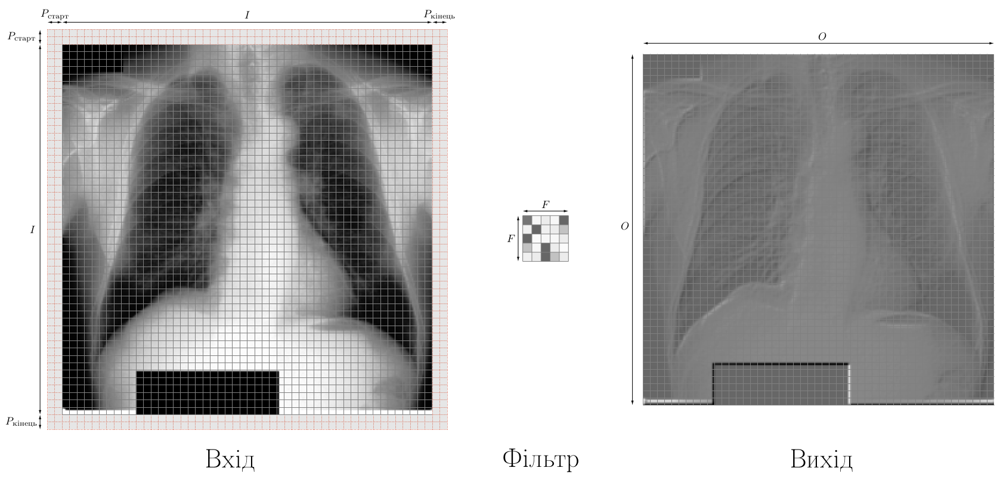]


<!-- .larger-xl[$$\boxed{O = \frac{I - F + P_\text{старт} + P_\text{кінець}}{S} + 1}$$] -->
.larger-xl[$$\boxed{O = \frac{I - F + 2P}{S} + 1}$$]

---

class: middle, center, black-slide

# Демо

.larger-xl[[Як працює згортка?](https://ml4a.github.io/demos/convolution/)]

---


class: middle

Згортки визначаються двома ключовими параметрами:

- *Розмір патчів, отриманих із вхідних даних* &mdash; зазвичай це 3×3 або 5×5. У прикладі вони були 3 × 3, що є звичайним вибором.
- *Глибина вихідної карти ознак* &mdash; це кількість фільтрів, обчислених згорткою. Приклад почався з глибини 32 і закінчився глибиною 128.

```python
from tensorflow import keras
from tensorflow.keras import layers
input = keras.Input(shape=(28, 28, 1))
x = layers.Conv2D(filters=32, kernel_size=3, activation="relu") (input)
x = layers.MaxPool2D(pool_size=2) (x)
x = layers.Conv2D(filters=64, kernel_size=3, activation="relu") (x)
x = layers.MaxPool2D(pool_size=2)(x)
x = layers.Conv2D(filters=128, kernel_size=3, activation="relu") (x)
x = layers.Flatten() (x)
output = layers.Dense(10, activation="softmax") (x)
model = keras.Model(inputs=input, outputs=output)
```

---


class: middle

У Keras шар Conv2D має наступні параметри (*Глибина вихідної карти ознак*, *Розмір патчів, отриманих із вхідних даних*):

```python
Conv2D(output_depth, (window_height, window_width))
```

---


class: middle

# Розуміння ефекту доповнення (*padding*)

## Ядро розміром 3×3, вхідна карта ознак 5×5


.center.width-90[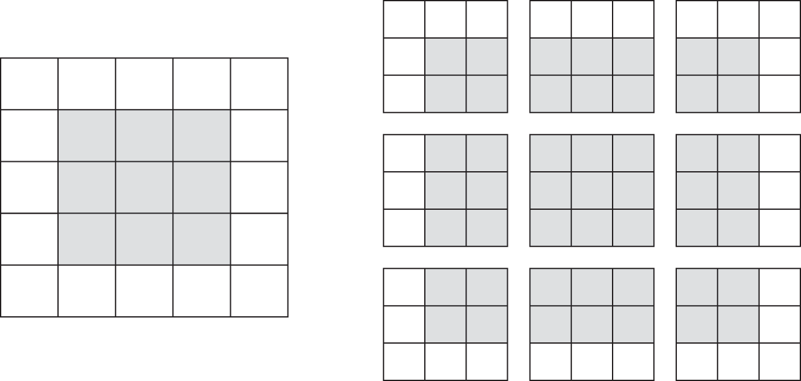]


.footnote[Джерело: François Chollet. Deep Learning with Python, 2021.]

???
Розглянемо карту функцій 5×5 (загалом 25 плиток). Є лише 9 плиток, навколо яких можна відцентрувати вікно 3×3, утворюючи сітку 3×3 (див. малюнок на цьому слайді). Отже, вихідна карта функцій буде 3×3. Він трохи зменшується: у цьому випадку рівно на дві плитки вздовж кожного розміру. Ви можете побачити цей ефект межі в дії в попередньому прикладі: ви починаєте з 28×28 входів, які стають 26×26 після першого шару згортки.

---

class: middle

# Розуміння ефекту доповнення

## Доповнюємо вхідну карту ознак 5×5 для того, щоб можна було витягнути 25 патчів розміром 3×3 


.center.width-90[]


.footnote[Джерело: François Chollet. Deep Learning with Python, 2021.]

???
Якщо ви хочете отримати вихідну карту ознак з тими самими просторовими розмірами, що й вхідні дані, ви можете використовувати *padding*. Доповнення складається з додавання відповідної кількості рядків і стовпців з кожного боку карти вхідних ознак. Для вікна 3×3 ви додаєте один стовпець праворуч, один стовпець ліворуч, один рядок угорі та один рядок унизу. Для вікна 5×5 ви додаєте два ряди.

У шарах Conv2D доповнення можна налаштувати за допомогою аргументу padding, який приймає два значення: *"valid"* , що означає відсутність доповнень (використовуватимуться лише дійсні розташування вікон), і *"same"*, що означає "padd у такому спосіб отримати вихідні дані тієї ж ширини та висоти, що й вхідні дані». Аргумент padding за умовчанням має значення *"valid"*.

---


class: middle,

# Розуміння кроку згортки

## 3×3 ядро з кроком 2×2 


.center.width-90[]


.footnote[Джерело: François Chollet. Deep Learning with Python, 2021.]

???
Іншим фактором, який може вплинути на розмір виходу, є поняття *кроку*. У нашому описі згортки досі припускалося, що центральні плитки вікон згортки є суміжними. Але відстань між двома послідовними вікнами є параметром згортки, який називається *кроком*, який за замовчуванням дорівнює 1. Згортки з кроком бiльше 1 називають згортками з прогалинами (strided
convolutions). Використання згортки з кроком бiльше 1 означає зменшення ширини та висоти карти ознак в таку ж кiлькiсть разiв як розмiр кроку. Згортки з прогалинами рiдко використовуються на практицi, хоча можуть стати в нагодi в моделях деяких типiв, тому бажано знати та пам’ятати про цю можливiсть. На малюнку ви можете побачити ділянки, витягнуті за допомогою згортка 3×3 із кроком 2 над входом 5×5 (без заповнення).


На практиці замість кроку зазвичай використовують операцію максимального об’єднання для зменшення дискретизації вихідних карт ознак. Ви бачили застосування цієї техніки в розглянутому прикладі convnet. Давайте розглянемо це детальніше.

---


class: middle,

# Операція максимізаційного агрегування (max-pooling)

.center.width-100[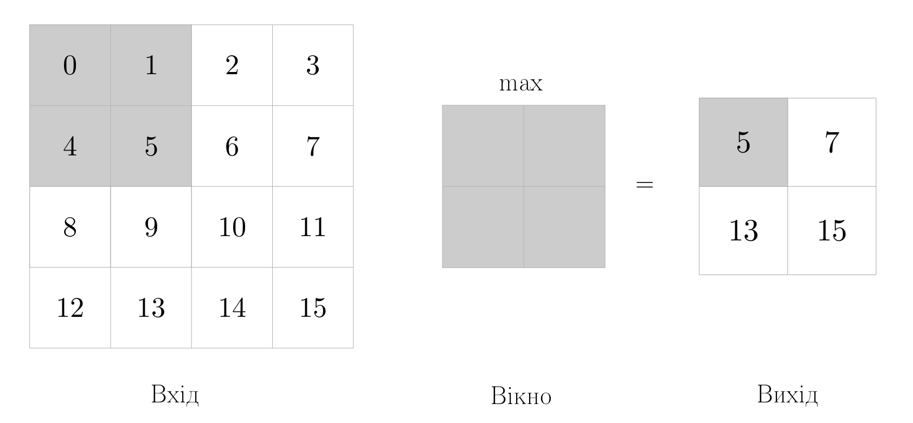]


???
Операцiя максимiзацiйного агрегування або операцiя вибору максимального значення iз сусiднiх (max-pooling) – агресивне зменшення розмiру карти ознак, багато в чому подiбне до згортки з прогалинами. Операцiя вибору максимального значення iз сусiднiх полягає в наступному: ми дивимось на вхiдну карту ознак через двовимiрне вiкно та обираємо з нього максимальне значення для кожного каналу. Концептуально це нагадує згортку, але замiсть перетворення локальних шаблонiв з використанням ядра згортки (фiльтра) вони перетво­
рюються за рахунок жорстко заданої тензорної операцiї вибору максимального значення. Головна вiдмiннiсть вiд згортки полягає в тому, що вибiр максимального значення з сусiднiх зазвичай здiйснюється у вiкнi розмiром 2×2 i кроком 2, щоб зменшити роздiльну здатнiсть карти ознак в два рази. Власне згортка, навпаки, зазвичай виконується з вiкном 3×3 i кроком 1.

Логiчно постають наступнi питання: з якою метою здiйснюється зменшення розмiру карти ознак та чому б просто не використати карти ознак бiльшого
розмiру, тобто прибрати операцiю вибору максимального значення iз сусiднiх (MaxPooling2D)? Зменшення розмiру карти ознак використовується для зменшення кiлькостi коефiцiєнтiв пiд час обробки, а також для впровадження iєрархiчних просторових фiльтрiв шляхом створення послiдовних шарiв згортки для перегляду усе бiльш великих вiкон (з точки зору долi вихiдних даних, якi вони охоплюють).

Слiд наголосити, що операцiя вибору максимального значення iз сусiднiх – не єдиний спосiб зменшення карти ознак. Крiм операцiї вибору максимального значення iз сусiднiх ми можемо використовувати згортки з прогалинами або операцiю вибору середнього значення за сусiднiми елементами (average pooling), коли кожен локальний шаблон перетворюються шляхом взяття середнього значення для кожного каналу в шаблонi замiсть максимального. Однак, операцiя вибору максимального значення зазвичай дає кращi результати, нiж цi альтернативнi способи. Причина в тому, що ознаки, як правило, кодують просторову присутнiсть деякого шаблону або поняття в рiзних дiлянках карти ознак, тому максимальна присутнiсть ознак набагато iнформативнiша, нiж середня присутнiсть. Бiльш розумна стратегiя зменшення розмiру карти ознак полягає в тому, щоб спочатку отримати щiльнi карти ознак (шляхом звичайної згортки без прогалин), а потiм розглянути максимальнi значення ознак у невеликих шаблонах, а не розрiдженi вiкна на вхiдних даних (шляхом згортки з прогалинами) або усередненi шаблони, якi можуть спричинити втрату iнформацiї.

---

class: middle, black-slide

.center[
<video loop controls preload="auto" height="600" width="800">
  <source src="./figures/lec5/maxPooling.mp4" type="video/mp4">
</video>
]

---


class: middle, black-slide

## Операція максимізаційного агрегування (max-pooling)
.smaller-xx[
```python
from tensorflow import keras
from tensorflow.keras import layers
input = keras.Input(shape=(28, 28, 1))
x = layers.Conv2D(filters=32, kernel_size=3, activation="relu") (input)
x = layers.Conv2D(filters=64, kernel_size=3, activation="relu") (x)
x = layers.Conv2D(filters=128, kernel_size=3, activation="relu") (x)
x = layers.Flatten() (x)
output = layers.Dense(10, activation="softmax") (x)
model_without_max_pool = keras.Model(inputs=input, outputs=output)
```
```python
model_without_max_pool.summary()
```

```bash
Model: "model_1"
_________________________________________________________________
 Layer (type)                Output Shape              Param #   
=================================================================
 input_2 (InputLayer)        [(None, 28, 28, 1)]       0         
                                                                 
 conv2d_3 (Conv2D)           (None, 26, 26, 32)        320       
                                                                 
 conv2d_4 (Conv2D)           (None, 24, 24, 64)        18496     
                                                                 
 conv2d_5 (Conv2D)           (None, 22, 22, 128)       73856     
                                                                 
 flatten_1 (Flatten)         (None, 61952)             0         
                                                                 
 dense_1 (Dense)             (None, 10)                619530    
                                                                 
=================================================================
Total params: 712202 (2.72 MB)
Trainable params: 712202 (2.72 MB)
Non-trainable params: 0 (0.00 Byte)
```
]
???

Що не так із цим налаштуванням? Дві речі:

- Це не сприяє вивченню просторової ієрархії функцій. Вікна 3×3 у третьому шарі міститимуть лише інформацію, що надходить із вікон 7×7 у початковому введенні. Шаблони високого рівня, отримані мережею, все одно будуть дуже малими щодо початкового входу, чого може бути недостатньо, щоб навчитися класифікувати цифри (спробуйте розпізнати цифру, дивлячись на неї лише через вікна розміром 7 × 7 пікселів! ). Нам потрібні ознаки з останнього шару згортки, якіб містили сукупну інформацію про вхідні дані.

- Остаточна карта ознак має в сукупності 22×22×128 = 61 952 коефіцієнтів на приклад. Це величезне число. Коли ми приводимо його в одновимірний масив, щоб зверху накласти щільний шар розміром 10, цей шар матиме понад півмільйона параметрів. Це дуже багато для такої маленької моделі та призведе до інтенсивного перенавчання моделі.

Коротше кажучи, зменшення розмiру карти ознак використовується для зменшення кiлькостi коефiцiєнтiв пiд час обробки, а також для впровадження iєрархiчних просторових фiльтрiв шляхом створення послiдовних шарiв згортки для перегляду усе бiльш великих вiкон (з точки зору долi вихiдних даних, якi вони охоплюють).


На цьому етапі ви повинні зрозуміти основи convnets &mdash; карти ознак, згортка та максимальне об’єднання &mdash; також ви побачили як можна побудувати невелику мережу для вирішення класичної проблеми, такої як класифікація цифр MNIST. 

---


class: middle, black-slide

# FLATTEN

.center[
<video loop controls preload="auto" height="500" width="700">
  <source src="./figures/lec5/FLATTEN.mp4" type="video/mp4">
</video>
]

---

class: end-slide, center
count: false

.larger-xxxx[🏁]
