class: middle, center, title-slide
# Нейронні мережі

Лекція 6: Комп'ютерний зір І

  
Кочура Юрій Петрович 
[iuriy.kochura@gmail.com](mailto:iuriy.kochura@gmail.com)  
<a href="https://t.me/y_kochura">@y_kochura</a>  

---

class:  black-slide,
background-image: url(./figures/lec1/nn.jpg)
background-size: cover

 
# Сьогодні
.larger-x[
Як змусити нейронні мережі «бачити»?  

🎙️ Система людського зору  
🎙️ Ситема комп'ютерного зору  
🎙️ Застосування комп'ютерного зору  

 Як оцінити якість моделі та порівняти різні моделі на однакових завданнях?  
🎙️ .bold[Класифікація]: точність, влучність, повнота, F1 міра 
🎙️ .bold[Детекція]: IoU, AP, AUC 
    
]

---

class: blue-slide, middle, center
count: false

.larger-xx[Візуальне сприйняття]

---

class: middle

# Система людського зору

.center.width-100[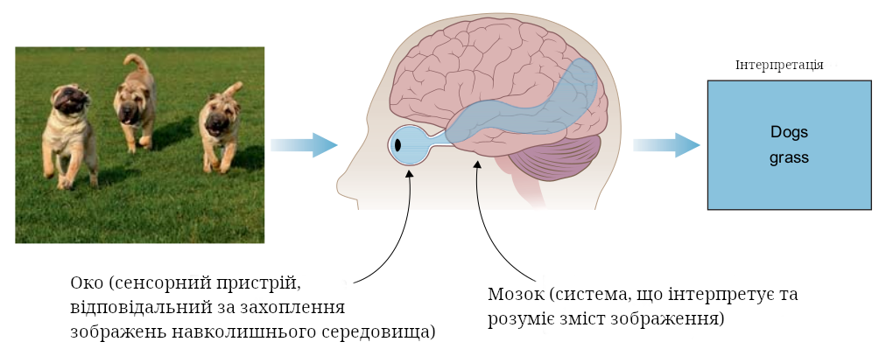]

.footnote[Джерело: Mohamed Elgendy. Deep Learning for Vision Systems, 2020.]

???
На найвищому рівні системи зору загалом однакові для людей, тварин, комах та більшості живих організмів. Вони складаються із сенсора або ока для захоплення зображення та мозку для обробки й інтерпретації цього зображення. Потім система видає припущення щодо компонентів зображення на основі даних, витягнутих із нього.

Розгляньмо, як працює система зору людини. Припустимо, ми хочемо інтерпретувати зображення собак, яке бачимо на цьому слайді. Ми дивимося на нього й одразу розуміємо, що зображення складається з кількох собак (а саме трьох). Нам досить природно класифікувати та виявляти об’єкти на цьому зображенні, тому що впродовж багатьох років ми навчалися розпізнавати собак.

---

class: middle

# Ситема комп'ютерного зору

.center.width-100[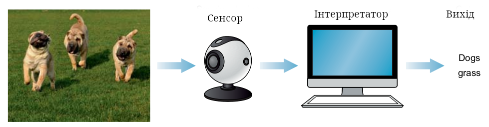]

.footnote[Джерело: Mohamed Elgendy. Deep Learning for Vision Systems, 2020.]

???
Науковці надихнулися системою зору людини і за останні роки досягли вражаючих результатів у відтворенні зорових здібностей за допомогою машин. Щоб імітувати людську систему зору, нам потрібні ті самі два основні компоненти: сенсорний пристрій, який відтворює функцію ока, та потужний алгоритм, що імітує функції мозку з інтерпретації та класифікації вмісту зображення (див. рисунок на слайді).

---

class: middle

# Сенсорні пристрої

Розглянемо приклад автономного транспортного засобу (АТЗ).

.success[Головна мета системи зору АТЗ — забезпечити здатність автомобіля розуміти навколишнє середовище та безпечно й вчасно переміщатися з точки A в точку B. Щоб досягти цієї мети, транспортні засоби оснащуються комбінацією сенсорів, здатних виявляти об’єкти в радіусі 360 градусів — пішоходів, велосипедистів, інші автомобілі, дорожні знаки та інші об’єкти — на відстані до трьох футбольних полів.]

Деякі сенсорні пристрої, які зазвичай використовуються в АТЗ:

- Лідар &mdash; метод, подібний до радара, який використовує невидимі світлові імпульси для створення високоточної 3D-карти навколишньої місцевості.
- Камери допомагають розпізнавати дорожні знаки та розмітку, але не здатні точно вимірювати відстань.
- Радар може визначати відстань і швидкість, але не "бачить" з високою деталізацією.

.footnote[Джерело: Mohamed Elgendy. Deep Learning for Vision Systems, 2020.]

???
Системи зору проєктуються для виконання конкретного завдання. Важливим аспектом їхнього проєктування є вибір найбільш відповідного сенсорного пристрою для захоплення зображення навколишнього середовища — чи то камера, радар, рентген, комп’ютерна томографія (КТ), лідар або комбінація кількох пристроїв, — щоб отримати повну картину сцени та успішно виконати поставлене завдання.

У застосуваннях для медичної діагностики як сенсорні пристрої використовують рентгенівські апарати або сканери комп’ютерної томографії (КТ).

---

class: middle

# Розпізнавання зображень

.alert.smaller-xx[Тварини, люди та комахи мають очі як сенсорні пристрої, але структура, якість зображення та роздільна здатність очей різняться в залежності від потреб кожного організму. **Бджоли та інші комахи** мають складні очі, що складаються з багатьох лінз — до 30 000 в одному оці. Складні очі мають низьку роздільну здатність, що обмежує їх здатність розпізнавати об'єкти на великій відстані. Проте вони дуже чутливі до руху, що критично для виживання під час швидкого польоту. Бджоли не потребують високої роздільної здатності зображень. Їхні системи зору налаштовані на те, щоб помічати найменші рухи під час польоту.]

.center.width-90[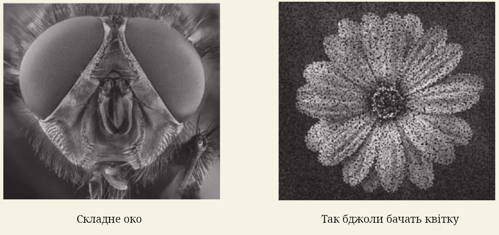]

.footnote[Джерело: Mohamed Elgendy. Deep Learning for Vision Systems, 2020.]

---

class: middle

# Інтерпретатор

.width-100[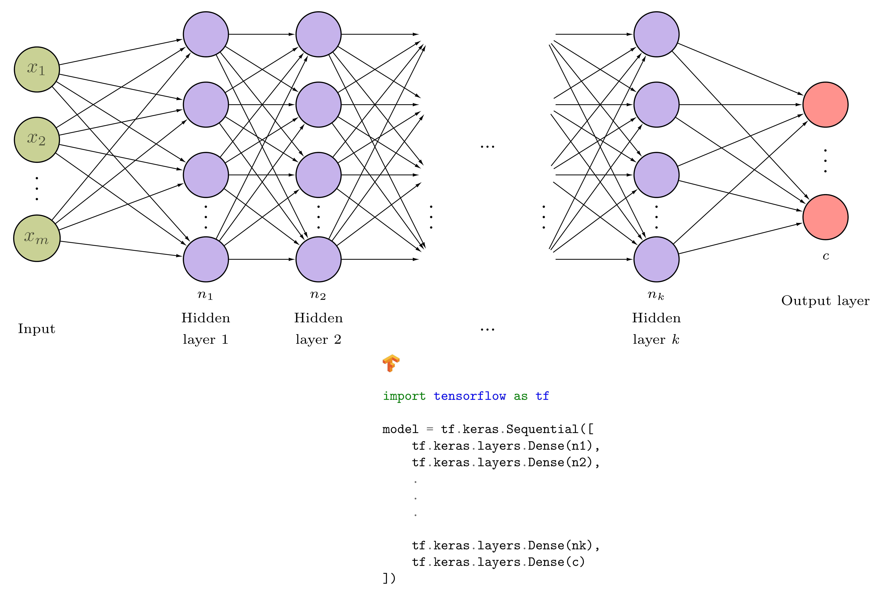]

???
Інтерпретатор — це програма або пристрій, який розпізнає, аналізує і перекладає (інтерпретує) певну інформацію або команди в зрозумілий для системи або користувача вигляд.

Алгоритми комп’ютерного зору зазвичай використовуються як інтерпретатори. Інтерпретатор — це мозок системи зору. Його роль полягає в тому, щоб прийняти зображення, отримане від сенсорного пристрою, та навчитися розпізнавати особливості та патерни для ідентифікації об’єктів. Для цього нам потрібно створити мозок. Науковців надихнуло, як працює наш мозок, і вони спробували розібратися в роботі центральної нервової системи, щоб зрозуміти, як створити штучний мозок. Так народилися штучні нейронні мережі (ШНМ).

---

class: middle

## Чи може машинне навчання досягти кращої продуктивності, ніж людський мозок?

.success[Останні досягнення в ШІ та глибокому навчанні дозволили машинам перевершити людську зорову здатність у багатьох застосуваннях класифікації зображень та виявлення об'єктів. Можливості цих технологій швидко поширюються на нові сфери.]

.footnote[Джерело: Mohamed Elgendy. Deep Learning for Vision Systems, 2020.]

---

class: middle

# Застосування CV

.width-90[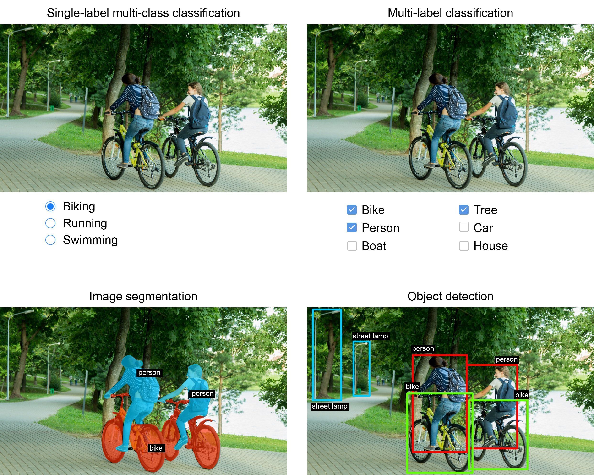]

.footnote[Джерело: Francois Chollet. Deep Learning with Python, 2021.]

???
Є три основні завдання комп'ютерного зору

---

class: middle

# Класифікація зображень

.success[Метою є присвоєння одного або кількох лейблів зображенню. Це може бути або класифікація з одною міткою (зображення може належати тільки до однієї категорії), або класифікація з кількома мітками (визначення всіх категорій, до яких належить зображення, як показано на попередньому слайді). 

.smaller-x[Наприклад, коли ви шукаєте ключове слово в додатку Google Photos, за лаштунками ви запитуєте дуже велику модель для класифікації за кількома мітками — модель з більш ніж 20 000 різних класів, навчена на мільйонах зображень..]]

.footnote[Джерело: Francois Chollet. Deep Learning with Python, 2021.]

---

class: middle

# Детекція об'єктів

.success[Метою є намалювати прямокутники (так звані *обмежувальні рамки*) навколо об'єктів інтересу на зображенні та асоціювати кожен прямокутник з певним класом. 

.smaller-x[Автономний автомобіль може використовувати модель детекції об'єктів для моніторингу автомобілів, пішоходів та знаків, що потрапляють в поле зору його камер.]]

.footnote[Джерело: Francois Chollet. Deep Learning with Python, 2021.]

---

class: middle

# Сегментація зображень

.success[Метою є «сегментація» або «поділ» зображення на різні ділянки, при цьому кожна ділянка зазвичай представляє певну категорію. 

.smaller-x[Наприклад, коли Zoom або Google Meet показують користувацький фон під час відеодзвінка, вони використовують модель сегментації зображень, щоб точно відокремити ваше обличчя від того, що знаходиться позаду, з точністю до пікселів.]]

.footnote[Джерело: Francois Chollet. Deep Learning with Python, 2021.]

---

class: middle

# Приклади сегментації зображень

.width-100[]

.grid[
.center.kol-1-2[Семантична сегментація]
.center.kol-1-2[Екземплярна сегментація]]

.footnote[Джерело: Francois Chollet. Deep Learning with Python, 2021.]

???
- Semantic segmentation, where each pixel is independently classified into a semantic category, like “cat.” If there are two cats in the image, the corresponding pixels are all mapped to the same generic “cat” category.

- Instance segmentation, which seeks not only to classify image pixels by category, but also to parse out individual object instances. In an image with two cats in it, instance segmentation would treat “cat 1” and “cat 2” as two separate classes of pixels.

---

class: middle, center

# Демо

.larger-x[[Computer Vision Explorer](https://vision-explorer.allenai.org/classification)]

---

class: blue-slide, middle, center
count: false

.larger-xx[Метрики оцінки]

 .larger-x[Класифікація]

---

class: middle
# Матриця невідповідностей 

.center.width-45[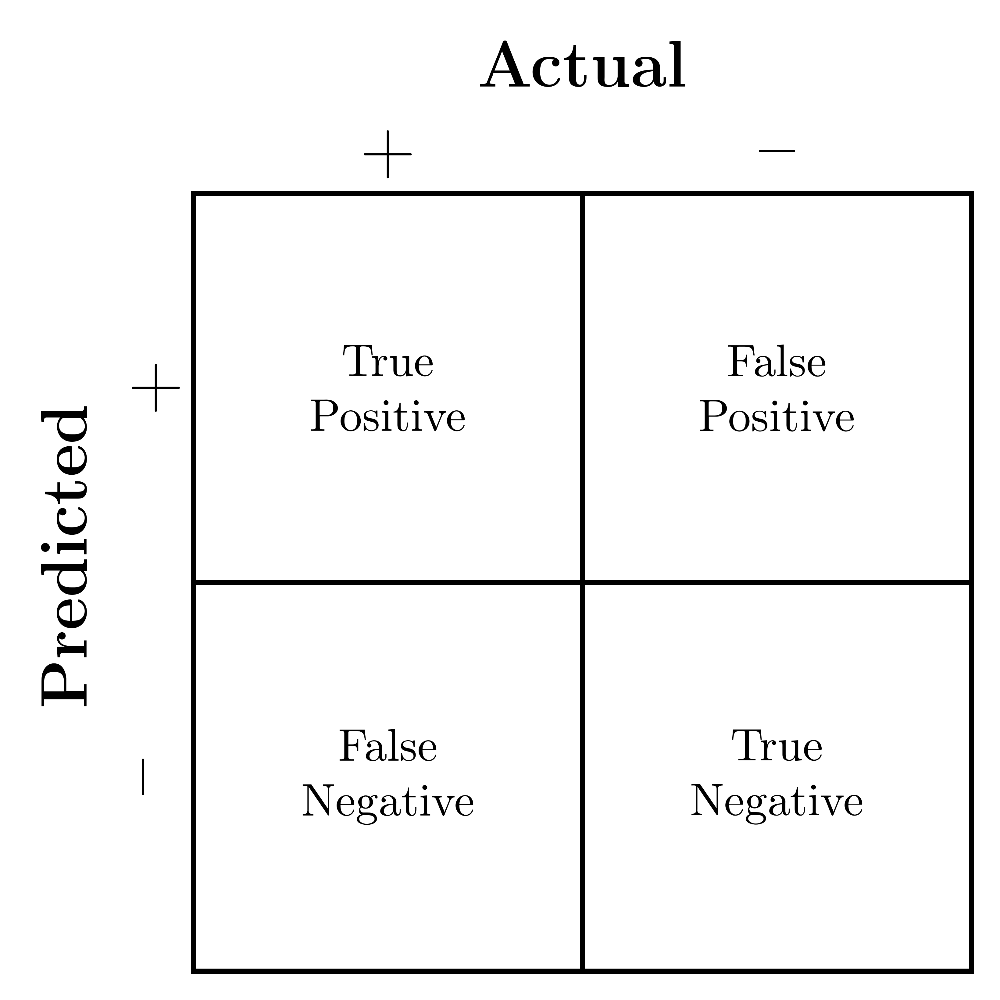]

.smaller-x[
- True Positive (TP)
- True Negative (TN)
- False Positive (FP)
- False Negative (FN)
]

???
A **confusion matrix**, also known as an **error matrix** is a specific table layout that allows visualization of the performance of an algorithm, typically a supervised learning one.

---

class: middle

# Приклад 1: Виявлення котів

.center.width-100[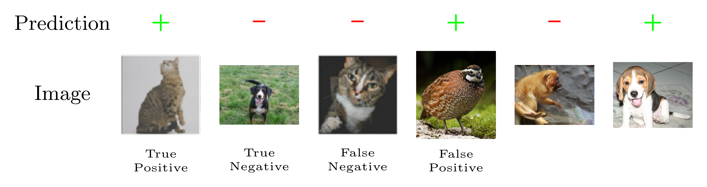]

---

class: middle

# Приклад 2: Виявлення пневмонії

.center.width-100[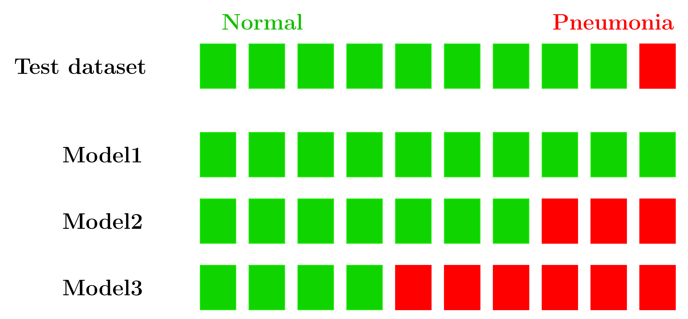]

.footnote[Credits: Andrew Ng and Kian Katanforoosh. CS230 Deep Learning.]

???
Let’s consider a simple binary classification problem, where we are trying to predict if a patient is healthy or has pneumonia. We have a test set with 10 patients, where 9 patients are healthy (shown as green squares) and 1 patient has pneumonia (shown as a red square).

We trained 3 models for this task (Model1, Model2, Model3), and we’d like to compare the performance of these models. The predictions from each model on the test set are shown below.

---

class: middle 

# Точність

.grid.center[
.kol-1-2.center[
.center.width-60[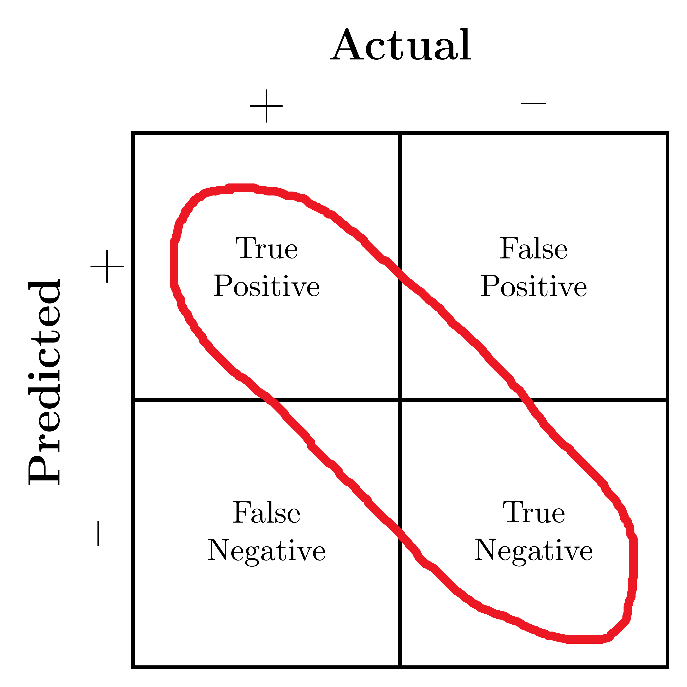]]
.kol-1-2[ .center.width-100[]]
]

.smaller-x[

$$\text{Accuracy} = \frac{TP + TN}{TP + TN + FP + FN}$$

Якщо використовувати точність (accuracy) як метрику оцінки, здається, що найкращою моделлю є Model1:

$$\begin{aligned}
\text{Accuracy($M\_1$)}  = \frac{9}{10} &&  \text{Accuracy($M\_2$)}  = \frac{8}{10} &&  \text{Accuracy($M\_3$)}  = \frac{5}{10}
\end{aligned}$$

]

.footnote[Credits: Andrew Ng and Kian Katanforoosh. CS230 Deep Learning.]

???
Загалом, коли є дисбаланс класів (що трапляється майже завжди!), точність не є доброю метрикою для оцінки.

---

class: middle 

# Повнота

.grid.center[
.kol-1-2.center[
.center.width-60[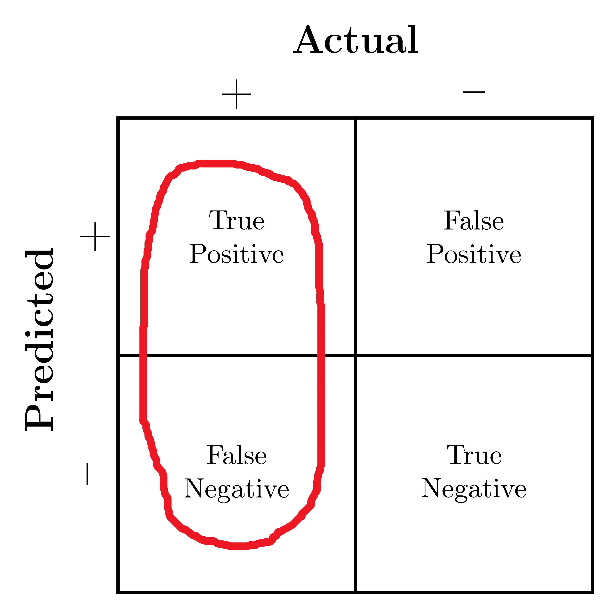]]
.kol-1-2[ .center.width-100[]]
]

.smaller-x[

$$\text{Recall} = \frac{TP}{TP + FN}$$

Якою є чутливість кожної моделі?

$$\begin{aligned}
\text{Recall($M\_1$)}  = \frac{0}{1} &&  \text{Recall($M\_2$)}  = \frac{1}{1} &&  \text{Recall($M\_3$)}  = \frac{1}{1}
\end{aligned}$$

]

.footnote[Credits: Andrew Ng and Kian Katanforoosh. CS230 Deep Learning.]

???
Для виявлення пневмонії важливо знайти всіх пацієнтів, які мають пневмонію. Прогнозувати пацієнтів з пневмонією як здорових неприпустимо (оскільки пацієнти залишаться без лікування). Тому природне питання, яке виникає при оцінці наших моделей: Скільки пацієнтів з пневмонією модель правильно передбачила як хворих на пневмонію?

---

class: middle 

# Влучність

.grid.center[
.kol-1-2.center[
.center.width-60[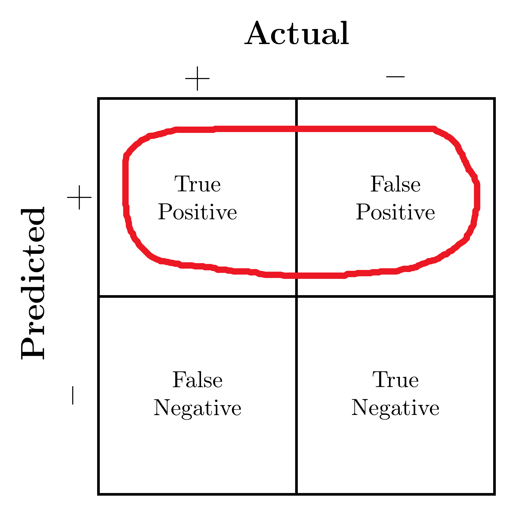]]
.kol-1-2[ .center.width-100[]]
]

.smaller-x[

$$\text{Precision} = \frac{TP}{TP + FP}$$

Якою є влучність кожної моделі?

$$\begin{aligned}
\text{Precision($M\_1$)}  = \frac{0}{0} &&  \text{Precision($M\_2$)}  = \frac{1}{3} &&  \text{Precision($M\_3$)}  = \frac{1}{6}
\end{aligned}$$

]

.footnote[Credits: Andrew Ng and Kian Katanforoosh. CS230 Deep Learning.]

???
Imagine that the treatment for pneumonia is very costly and therefore you would also like to make sure only patients with pneumonia receive treatment. A natural question to ask would be: *Out of all the patients that are predicted to have pneumonia, how many actually have pneumonia?*

This metric is precision, which is expressed as the following (Percentage of positive examples that are correctly predicted).

---

class: middle 

# F1 міра

.smaller-x[

$$F\_1 = \frac{2}{\frac{1}{\text{Повнота}} + \frac{1}{\text{Влучнiсть}}} = 2 \cdot \frac{\text{Влучнiсть} \cdot \text{Повнота}}{\text{Влучнiсть} + \text{Повнота}}$$

Якою є міра F1 для кожної моделі?

$$\begin{aligned}
F\_1(M\_1)  = 0 &&  F\_1(M\_2)  = \frac{1}{2} &&  F\_1(M\_3)  = \frac{2}{7}
\end{aligned}$$

]

.footnote[Credits: Andrew Ng and Kian Katanforoosh. CS230 Deep Learning.]

???
Precision and recall are both useful, but having multiple evaluation metrics makes it difficult to directly compare models. From Andrew Ng’s machine learning book:

.italic[“Having multiple-number evaluation metrics makes it harder to compare algorithms. Better to combine them to a single evaluation metric. Having a single-number evaluation metric speeds up your ability to make a decision when you are selecting among a large number of classifiers. It gives a clear preference ranking among all of them, and therefore a clear direction for progress.”] - Machine Learning Yearning

F1 score is a metric that combines recall and precision by taking their harmonic mean.

---

class: blue-slide, middle, center
count: false

.larger-xx[Детекція об'єктів]

???
Для детекції об'єктів використовуються дві основні метрики: коефіцієнт Жакарра (IoU) та середня усереднена точність (mAP). Давайте розглянемо невеликий приклад

---

class: middle

# Intersection over Union (IoU)

.center.width-100[]

???
Детекція об'єктів полягає в знаходженні об'єктів, їх класифікації та локалізації шляхом малювання обмежувальних рамок навколо них. (IoU) — це інтуїтивно зрозуміла метрика, яка вимірює відповідність обмежувальної рамки.

Чим вищий IoU, тим краща відповідність. IoU — відмінна метрика, оскільки вона добре працює для об'єктів будь-якого розміру та форми. Ця метрика для кожного об'єкта разом з влучність та повнотою складають основу для повної метрики виявлення об'єктів — середньої усередненої точності (mAP).

---

class: middle

## Average Precision (AP): the Area Under Curve (AUC)

.center.width-80[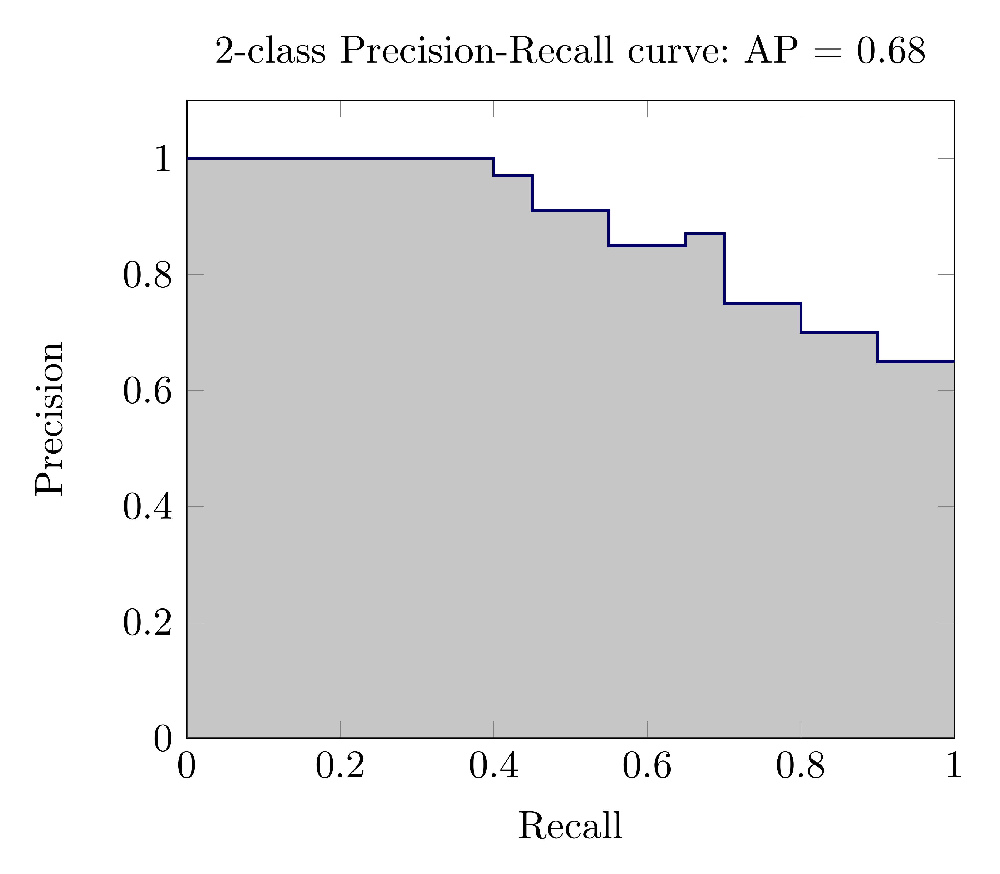]

???
Детектори об'єктів створюють кілька прогнозів: кожне зображення може мати кілька передбачених об'єктів, і є багато зображень, для яких потрібно зробити інференс. Кожен передбачений об'єкт має свою впевненість: це показує, наскільки детектор впевнений у своєму прогнозі.

Ми можемо вибирати різні пороги впевненості для визначення, які прогнози приймати від детектора. Наприклад, якщо ми встановимо поріг на 0.7, то будуть прийняті прогнози з впевненістю, що перевищує 0.7, а прогнози з низькою впевненістю будуть відкинуті. Оскільки існує багато різних порогів для вибору, як узагальнити ефективність детектора?

Відповідь дає крива влучність-повнота. Для кожного порогу впевненості ми можемо виміряти влучність та повноту детектора, отримуючи одну точку даних. Якщо ми з'єднаємо ці точки разом для кожного порогу, отримаємо криву влучність-повнота, як показано нижче.

Чим краща модель, тим вищі влучність і повнота: це штовхає межу кривої (темну лінію) вгору та вправо. Ми можемо узагальнити ефективність моделі однією метрикою, взявши площу під кривою (показано сірим кольором). Це дає нам число від 0 до 1, де більше значення — краще. Цю метрику зазвичай називають усередненою точністю (AP).

---

class: middle, center

# Демо

.larger-x[[Evaluation Metrics](https://www.kaggle.com/kyuriy/evaluation-metrics-for-multi-class-classification)]

---

class: end-slide, center
count: false

.larger-xxxx[🏁]
