class: middle, center, title-slide
# Нейронні мережі

Лекція 7: Комп'ютерний зір ІІ

  
Кочура Юрій Петрович 
[iuriy.kochura@gmail.com](mailto:iuriy.kochura@gmail.com)  
<a href="https://t.me/y_kochura">@y_kochura</a>  

---

class:  black-slide,
background-image: url(./figures/lec1/nn.jpg)
background-size: cover

 
# Сьогодні
.larger-x[
Як створювати нейронні мережі для деяких просунутих задач комп'ютерного зору:  

🎙️ Класифікація  
🎙️ Детекція об'єктів  
🎙️ Сегментація  

]

---

class: middle

.width-90.center[]

.footnote[Джерело: [Aurélien Géron](https://www.oreilly.com/content/introducing-capsule-networks/), 2018.]

???

Для кожної з цих задач потрібна своя архітектура нейронної мережі.

---

class: blue-slide, middle, center
count: false

.larger-xx[Класифікація]

Поради з використання ConvNet для класифікації зображень

---

class: middle

# Згорткові нейронні мережі

- Згорткові нейронні мережі поєднують згорткові шари, шари агрегації (pooling) та повнозв’язні шари.
- Забезпечують передові результати для .bold[просторово структурованих даних], таких як зображення, звук або текст. 

.center.width-110[]

.footnote[Джерело: [Dive Into Deep Learning](https://d2l.ai/), 2020.]

???
Просторово структуровані дані — це такі дані, в яких важливе розташування елементів у просторі, тобто є структура або взаємозв’язки між сусідніми елементами.

Приклади:

*Зображення*

- Кожен піксель має своє місце, і значення пікселів поруч часто пов’язані.

- Наприклад, краї об'єктів, форми — це все просторові ознаки.

*Текст*

 - Розташування слів у реченні має значення.

 - Хоч текст не є фізичним простором, але порядок — це структурована послідовність.

---

class: middle

# Класифікація
- Активація у вихідному шарі &mdash; це .bold[Softmax]-активація, яка формує вектор ймовірнісних оцінок $$\mathbf{\hat y} = [\hat y\_1, \hat y\_2, \ldots, \hat y\_C ] \in \bigtriangleup^C$$
$$\sum_{i = 1}^C \hat y_i = 1$$
$$\hat y\_i = P(Y=i|\mathbf{x}) = \text{softmax}(z\_i) = \frac{\exp^{z\_i}}{\sum^C\_j \exp^{z\_j}},$$ де $C$ &mdash; кількість класів;
- Функція втрат &mdash; перехресна ентропія: $\mathcal{L} = -\sum_{i=1}^{C} y_i \log(\hat{y}_i)$

---

class: middle

# Три способи покращити дані

.bold[Нестача даних] &mdash; найбільше обмеження для ефективності моделей глибокого навчання.
1. Збір та анотація додаткових даних зазвичай є дорогим і трудомістким завданням.

.center.width-50[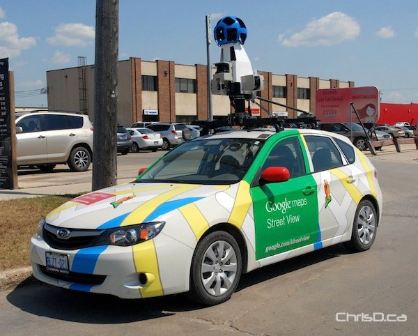]

---

class: middle
count: false

# Три способи покращити дані

.bold[Нестача даних] &mdash; найбільше обмеження для ефективності моделей глибокого навчання.
1. .inactive[Збір додаткових даних зазвичай є дорогим і трудомістким завданням.]
1. Створення синтетичних даних може бути складним завдання і не відображати реальний розподіл.

.center.width-90[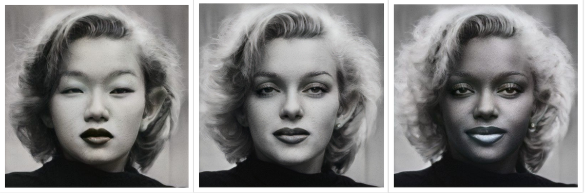]
Мерилін Монро в азійському, оригінальному та африканському стилях

.footnote[Джерело: [Generative models and bias](https://blog.demaupeou.com/post/generative-models-bias/), 2021.]

---

class: middle
count: false

# Три способи покращити дані

.bold[Нестача даних] &mdash; найбільше обмеження для ефективності моделей глибокого навчання.
1. .inactive[Збір додаткових даних зазвичай є дорогим і трудомістким завданням.]
1. .inactive[Створення синтетичних даних може бути складним завдання і не відображати реальний розподіл.]
1. .bold[Доповнення] даних за допомогою базових перетворень &mdash; простий та ефективний підхід, але пошук хорошої стратегії для доповнення даних може вимагати численних експериментів. 

.center.width-40[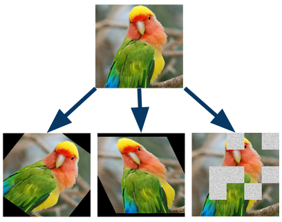]

.footnote[Джерело: [DeepAugment](https://github.com/barisozmen/deepaugment), 2020.]

---

class: middle
background-size: contain

background-image: url(./figures/lec7/augmentation-ua.png)

.footnote[Джерело: [DeepAugment](https://github.com/barisozmen/deepaugment), 2020.]

---

class: middle

.center.width-100[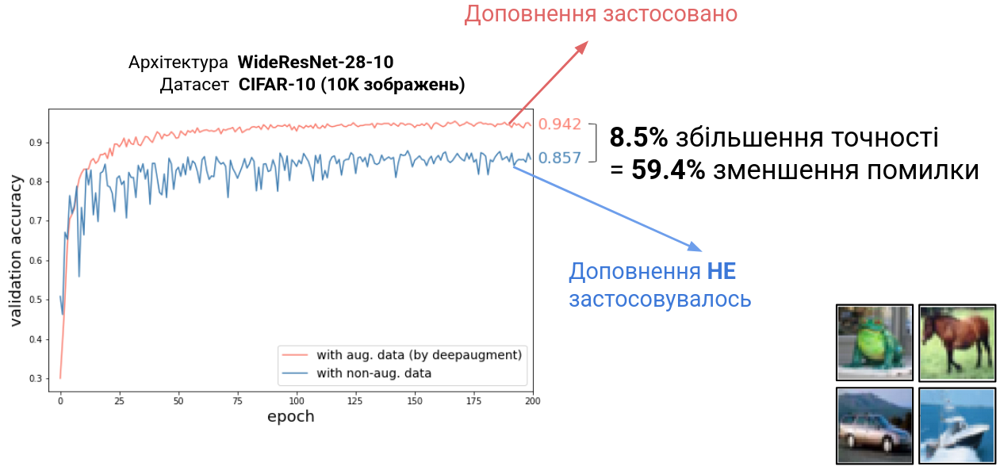]

$$\text{Error Reduction} = \frac{E\_\text{old} - E\_\text{new}}{E\_\text{old}}\cdot 100\% = \frac{0.143 - 0.058}{0.143}\cdot 100\% = 59.4\% $$

.footnote[Джерело: [DeepAugment](https://github.com/barisozmen/deepaugment), 2020.]

---

class: middle

# Попередньо навчені моделі

- Навчання моделі «з нуля» може тривати .bold[дні] або навіть .bold[тижні].
- Багато моделей, .bold[навчених на великих наборах даних], доступні у відкритому доступі. Їх можна використовувати як: **екстрактори ознак** або як основу для розумної *ініціалізації* при донавчанні.
- Такі моделі слід розглядати як .bold[універсальні], .bold[багаторазові] активи.

???

Слід підкреслити, що це вже стало стандартною практикою в глибокому навчанні. Лише незначна кількість фахівців усе ще навчає моделі з нуля.
З поширенням foundation models таких випадків стає ще менше.

---

class: middle

# Передавальне навчання

- Беремо попередньо навчену мережу, видаляємо останній (або кілька останніх) шарів і використовуємо решту як .bold[фіксований] екстрактор ознак.
- На основі цих ознак навчаємо .bold[нову модель] для .bold[нової задачі].
- Часто показує кращі результати, ніж ручне створення ознак або навчання моделі лише на нових даних.

 
.center.width-100[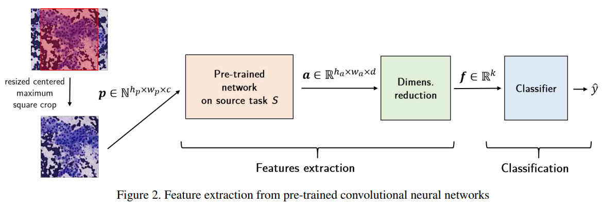]

.footnote[Джерело: Mormont et al, [Comparison of deep transfer learning strategies for digital pathology](http://hdl.handle.net/2268/222511), 2018.]

---

class: middle

.center.width-65[]

## Тонке налаштування

Ми не лише використовуємо попередньо навчену модель для нової задачі, але й дозволяємо моделі адаптуватися до нових даних, змінюючи її ваги під час навчання.

.footnote[Джерело: [Dive Into Deep Learning](https://d2l.ai/), 2020.]

???
Тонке налаштування — це популярний підхід у глибокому навчанні, особливо коли ми маємо обмежену кількість даних для нової задачі, але можемо використати знання, отримані на інших великих наборах даних.

---

class: middle

Моделі, які попередньо навчені на **ImageNet**: передані/тонко налаштовані мережі зазвичай працюють краще навіть тоді, коли вхідні зображення належать до іншої доменної області (наприклад, біомедичні зображення, супутникові зображення або картини).

.center.width-75[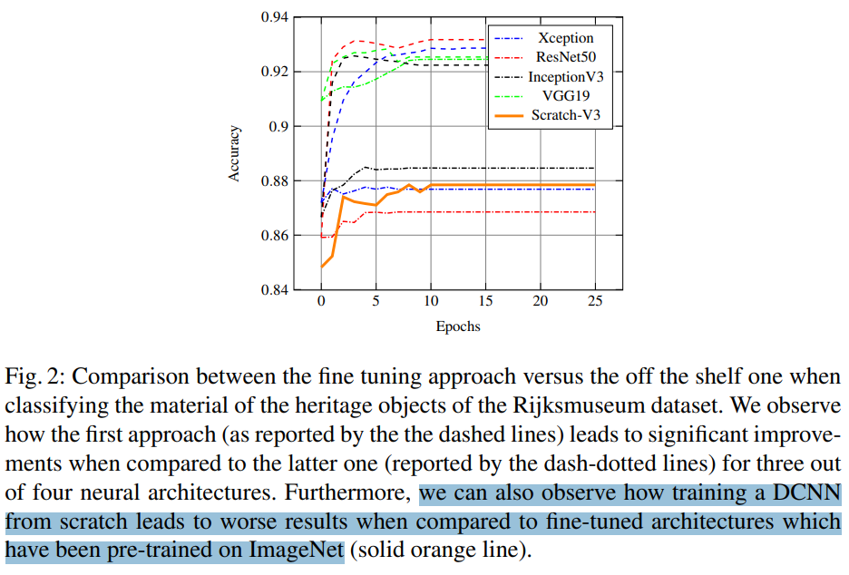]

.footnote[Джерело: Matthia Sabatelli et al, [Deep Transfer Learning for Art Classification Problems](http://openaccess.thecvf.com/content_ECCVW_2018/papers/11130/Sabatelli_Deep_Transfer_Learning_for_Art_Classification_Problems_ECCVW_2018_paper.pdf), 2018.]

---

class: blue-slide, middle, center
count: false

.larger-xx[Детекція об'єктів]

---

class: middle

Найпростіша стратегія для переходу від класифікації зображень до детекції об'єктів &mdash; це класифікація локальних ділянок на різних масштабах і в різних місцях.

.center.width-80[]

.footnote[Джерело: Francois Fleuret, [EE559 Deep Learning](https://fleuret.org/ee559/), EPFL.]

---

exclude: true
class: middle

## Intersection over Union (IoU)

Стандартним показником ефективності для виявлення об'єктів є (Intersection over Union, IoU) між передбаченою прямокутною рамкою $\hat{B}$ та анотованою прямокутною рамкою $B$.
$$\text{IoU}(B,\hat{B}) = \frac{\text{area}(B \cap \hat{B})}{\text{area}(B \cup \hat{B})}.$$

.center.width-45[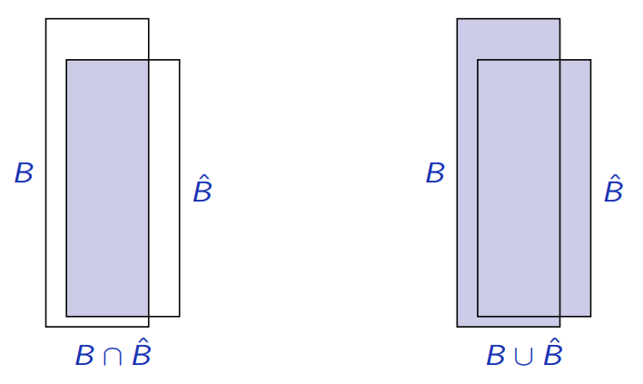]

.footnote[Джерело: Francois Fleuret, [EE559 Deep Learning](https://fleuret.org/ee559/), EPFL.]

---

class: middle 

Підхід зі слайдінгом вікна оцінює класифікатор на великій кількості позицій та масштабів.

Цей підхід зазвичай є .bold[обчислювально витратним], оскільки ефективність безпосередньо залежить від роздільної здатності та кількості вікон, поданих до класифікатора (чим більше вікон, тим краще, але й тим дорожче).

---

# OverFeat 

.grid[
.kol-2-3[

Складність підходу зі слайдінгом вікна була знижена в піонерській мережі OverFeat (Sermanet et al, 2013) шляхом додавання блоку регресії для передбачення обмежувальної рамки об'єкта $(x, y, w, h)$.

]
.kol-1-3[.center.width-100[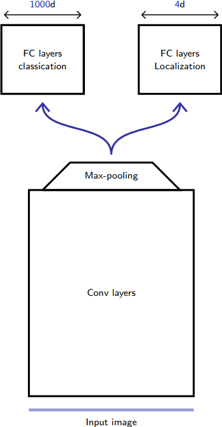]]
]

.footnote[Джерело: Francois Fleuret, [EE559 Deep Learning](https://fleuret.org/ee559/), EPFL.]

???
У цій роботі автори запропонували метод OverFeat, який поєднує в собі задачі розпізнавання, локалізації та виявлення об'єктів за допомогою конволюційних нейронних мереж (CNN). Ключовою ідеєю було додавання  блоку регресії до мережі для передбачення координат прямокутної рамки об'єкта (замість традиційного методу слайдінга вікна), що значно покращило ефективність та швидкість виявлення об'єктів на зображеннях.

Це була одна з перших робіт, яка демонструвала використання CNN для локалізації та детекції об'єктів в реальних умовах.

---

class: middle

.center[.width-60[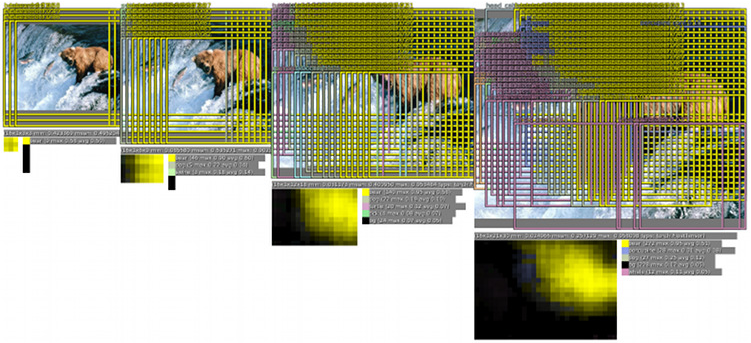] 
.width-60[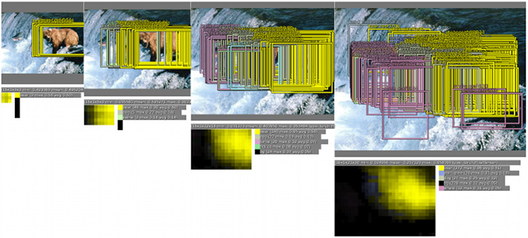]]

Для кожної позиції та масштабу:
- блок класифікатора виводить клас та ймовірність (верхній рис.);
- блок регресії передбачає місцезнаходження об'єкта (нижній рис.).

.footnote[Джерело: Sermanet et al, 2013.]

---

class: middle

.center.width-60[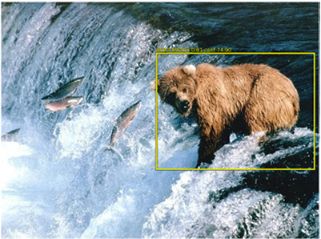]

Ці прямокутні рамки в кінцевому підсумку об'єднуються за допомогою .bold[Non-Maximum Suppression], щоб отримати остаточні передбачення для меншої кількості об'єктів.

.footnote[Джерело: Sermanet et al, 2013.]

???

Non-Maximum Suppression (NMS) — це метод, який допомагає усунути зайві та дублюючі прямокутні рамки, залишаючи лише найкращі (з найбільшими ймовірностями) для кожного виявленого об'єкта.

NMS:
1. Почати з усіх прямокутних рамок виявлення, кожна з яких має бал впевненості.
2. Відсортувати всі рамки за балом впевненості (від найвищого до найнижчого).
3. Вибрати рамку з найвищим балом впевненості та додати її до фінального списку виявлених об'єктів.
4. Обчислити IoU між цією рамкою та всіма іншими залишковими рамками.
5. Видалити рамки з IoU менше за попередньо визначений поріг (зазвичай 0.5-0.7).
6. Повторювати кроки 3-5, поки не залишиться одна рамка.

IoU = Area of Intersection / Area of Union
(range from 0 (no overlap) to 1 (perfect overlap))

---

class: middle

Архітектура OverFeat має кілька .bold[недоліків]:
- це роз'єднана система (2 окремі блоки з відповідними втратами, спеціальний процес об'єднання);
- орієнтована на точне визначення місця (локалізації) об'єкта на зображенні, а не на виявленні самого об'єкта;
- не враховує загальний контекст зображення при прийнятті рішень, через це потрібно виконувати значне постоброблення для того, щоб зробити детекцію об'єктів більш узгодженою та точною.

???

Архітектура OverFeat спочатку фокусується на локалізації об'єкта: вона визначає координати прямокутної рамки, де, ймовірно, знаходиться об'єкт. Однак вона не оптимізується на комплексному виявленні об'єкта (включаючи правильну класифікацію та точне об'єднання результатів). Це означає, що в OverFeat більше уваги приділяється визначенню точного місця розташування об'єкта, ніж безпосередньо його виявленню та класифікації.

---

# YOLO (You Only Look Once)

.center.width-65[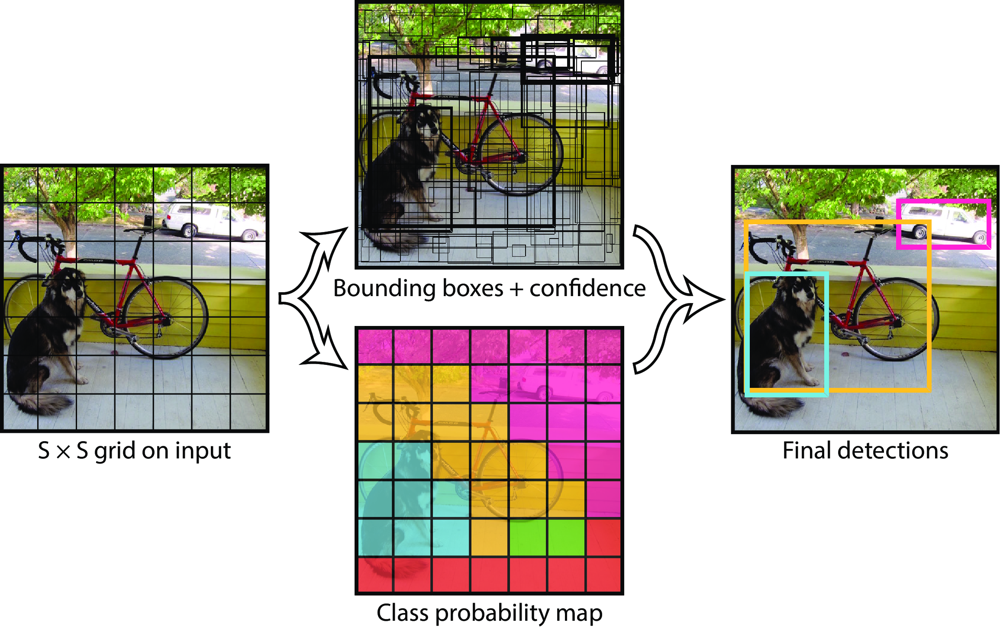]

YOLO (Redmon et al., 2015) розглядає задачу детекції об'єктів як задачу регресії.

Зображення розбивається на сітку розміру $S \times S$. Для кожної клітинки сітки передбачаються такі значення: $B$ обмежувальні рамки, ймовірність для кожної з цих рамок та $C$ класова ймовірність. Ці прогнози кодуються як тензор розміру $S \times S \times (5B + C)$. 

.footnote[Джерело: Redmon et al, 2015.]

---

class: middle

Для $S=7$, $B=2$, $C=20$,  мережа передбачає вектор розміру $30$ для кожної клітинки. 

.center.width-100[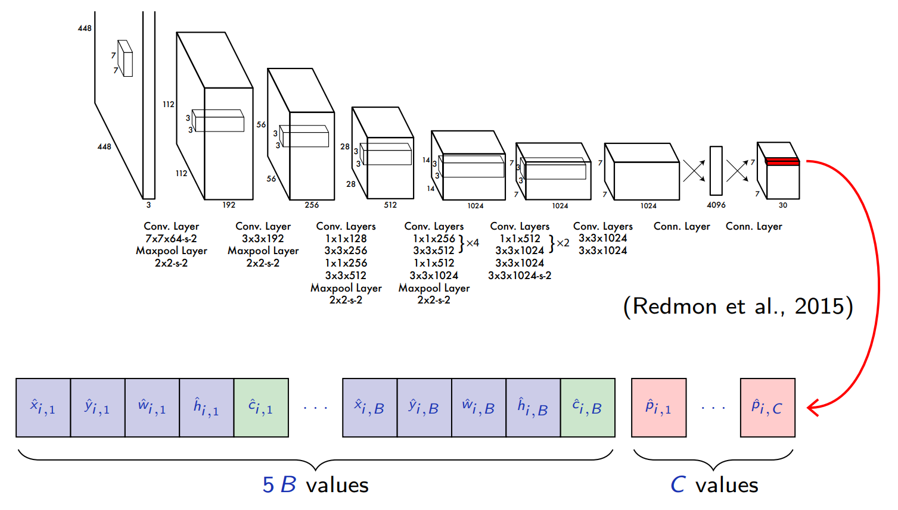]

.footnote[Джерело: Francois Fleuret, [EE559 Deep Learning](https://fleuret.org/ee559/), EPFL.]

---

class: middle

Мережа виконує передбачення оцінок класів та регресій обмежувальних рамок, .bold[і незважаючи на те, що вихід формується повнозв’язними шарами, він зберігає 2D структуру].

- На відміну від методів ковзаючого вікна, YOLO аналізує зображення як єдине ціле.
- Модель обробляє усе зображення як на етапі навчання, так і під час тестування, тому неявно враховує контекст про класи та їхній зовнішній вигляд.

.footnote[Джерело: Francois Fleuret, [EE559 Deep Learning](https://fleuret.org/ee559/), EPFL.]

---

class: middle

Під час навчання YOLO припускає, що в кожній клітинці сітки $S \times S$ може бути щонайбільше один об’єкт (а точніше &mdash; центр об’єкта). Для кожного зображення визначаються: індекс клітинки $i = 1, ..., S\times S$, індекс передбаченої рамки $j = 1, ..., B$ та індекс класу $c = 1, ..., C$:

- $\mathbb{1}_i^\text{obj}$ дорівнює $1$, якщо в клітинці $i$ є об’єкт, і $0$ — інакше;
- $\mathbb{1}_{i,j}^\text{obj}$ дорівнює $1$, якщо в клітинці $i$ є об’єкт і передбачена рамка $j$ є тією, що найкраще його описує (має найбільше перекриття), і $- 0$ — інакше;
- $p_{i,c}$ дорівнює $1$, якщо в клітинці $i$ є об’єкт класу $c$, і $0$ — інакше;
- $x_i, y_i, w_i, h_i$ &mdash; координати анотованої обмежувальної рамки навколо об’єкта (визначаються тільки якщо $\mathbb{1}_i^\text{obj}=1$; координати та розміри - задані відносно меж клітинки);
- $c_{i,j}$ &mdash; це IoU між передбаченою рамкою та реальним об’єктом.

.footnote[Джерело: Francois Fleuret, [EE559 Deep Learning](https://fleuret.org/ee559/), EPFL.]

---

class: middle

Навчання починається з обчислення $\mathbb{1}\_{i,j}^\text{obj}$ та $c\_{i,j}$ для зображення, після чого виконується один крок мінімізації функції втрат:
.smaller-x[
$$
\begin{aligned}
& \lambda\_\text{coord} \sum\_{i=1}^{S \times S} \sum\_{j=1}^B \mathbb{1}\_{i,j}^\text{obj} \left( (x\_i - \hat{x}\_{i,j})^2 + (y\_i - \hat{y}\_{i,j})^2 + (\sqrt{w\_i} - \sqrt{\hat{w}\_{i,j}})^2 + (\sqrt{h\_i} - \sqrt{\hat{h}\_{i,j}})^2\right)\\\\
& + \lambda\_\text{obj} \sum\_{i=1}^{S \times S} \sum\_{j=1}^B \mathbb{1}\_{i,j}^\text{obj} (c\_{i,j} - \hat{c}\_{i,j})^2 + \lambda\_\text{noobj} \sum\_{i=1}^{S \times S} \sum\_{j=1}^B (1-\mathbb{1}\_{i,j}^\text{obj}) \hat{c}\_{i,j}^2  \\\\
& + \lambda\_\text{classes} \sum\_{i=1}^{S \times S} \mathbb{1}\_i^\text{obj} \sum\_{c=1}^C (p\_{i,c} - \hat{p}\_{i,c})^2 
\end{aligned}
$$
]

де $\hat{p}\_{i,c}$, $\hat{x}\_{i,j}$, $\hat{y}\_{i,j}$, $\hat{w}\_{i,j}$, $\hat{h}\_{i,j}$ та $\hat{c}\_{i,j}$ &mdash; це значення, які генерує нейромережа як свій вихід.

.footnote[Джерело: Francois Fleuret, [EE559 Deep Learning](https://fleuret.org/ee559/), EPFL.]

---

class: middle 

Навчання YOLO залежить від .bold[багатьох інженерних рішень], що добре ілюструє складність практичного застосування глибокого навчання:
- попереднє навчання перших 20 згорткових шарів на датасеті ImageNet для задачі класифікації;
- використання вхідних зображень розміром $448 \times 448$ для детекції замість $224 \times 224$;
- застосування Leaky ReLU як функцій активації для всіх шарів;
- використання dropout після першого згорткового шару;
- нормалізація параметрів обмежувальних рамок до діапазону $[0,1]$;
- квадратична функція втрат не лише для координат прямокутників, але й для довіри (confidence) та класових оцінок;
- зменшення ваги великих обмежувальних рамок шляхом використання квадратного кореня з їх розміру у функції втрат;
- зменшення впливу порожніх комірок (які не містять об'єктів) шляхом меншого вагового коефіцієнта у функції втрат для довіри;
- аугментація даних за допомогою масштабування, трансляції та перетворень у просторі HSV.

.footnote[Джерело: Francois Fleuret, [EE559 Deep Learning](https://fleuret.org/ee559/), EPFL.]

---

class: middle, center, black-slide

<iframe width="600" height="450" src="https://www.youtube.com/embed/YmbhRxQkLMg" frameborder="0" allowfullscreen></iframe>

YOLO (Redmon, 2017).

---

exclude: true
class: middle

## SSD

The Single Shot Multi-box Detector (SSD; Liu et al, 2015) improves upon YOLO by using a fully-convolutional architecture and multi-scale maps.

.center.width-80[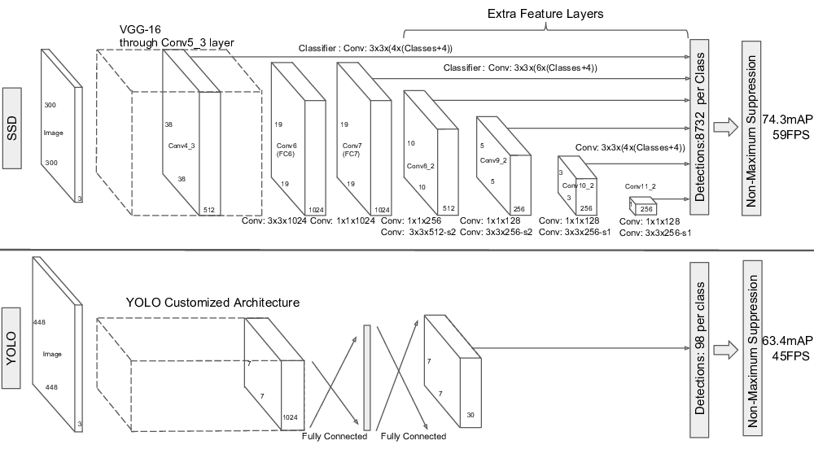]

.footnote[Джерело: Francois Fleuret, [EE559 Deep Learning](https://fleuret.org/ee559/), EPFL.]

---

# Region-based CNNs (R-CNNs)

Альтернатива великій кількості заздалегідь визначених боксів &mdash; використання *пропозицій регіонів*, які спочатку виділяються на зображенні.

Головні архітектури цього підходу &mdash; R-CNNs:
- (Slow) R-CNN (Girshick et al, 2014)
- Fast R-CNN ([Girshick et al, 2015](https://openaccess.thecvf.com/content_iccv_2015/papers/Girshick_Fast_R-CNN_ICCV_2015_paper.pdf))
- Faster R-CNN ([Ren et al, 2015](https://arxiv.org/pdf/1506.01497))
- Mask R-CNN ([He et al, 2017](https://arxiv.org/pdf/1703.06870))

.center.width-80[]

.footnote[Джерело: [Rich feature hierarchies for accurate object detection and semantic segmentation
Tech report (v5)](https://arxiv.org/pdf/1311.2524v5), 2014.]

???
R-CNN — архітектура нейронної мережі для детекції об’єктів, яка поєднує:

 - виділення регіонів-кандидатів (region proposals) за допомогою selective search;

 - витяг ознак з кожного регіону окремо за допомогою глибокої CNN;

 - класифікацію кожного регіону незалежно.

  ✅ Локалізує та сегментує об’єкти
  ❌ Повільна: CNN запускається для кожного регіону окремо

---

class: middle

## R-CNN

Архітектура R-CNN складається з 4 частин:
1. Селективний пошук застосовується до вхідного зображення для генерації якісних регіонів-кандидатів.
2. Попередньо навчена згорткова нейронна мережа (опорна мережа, backbone) вставляється перед вихідним шаром. Вона масштабує кожен запропонований регіон до потрібного розміру та виконує прямий прохід, щоб отримати вектор ознак для кожного регіону.
3. Отримані ознаки подаються на SVM-класифікатор для визначення класу об’єкта.
4. Ті ж ознаки використовуються в лінійній регресії для прогнозування координат обмежувальної рамки (bounding box).

.center.width-90[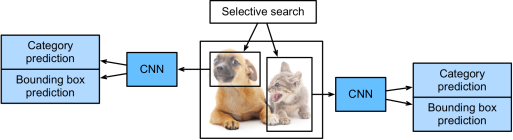]

.footnote[Джерело: [Dive Into Deep Learning](https://d2l.ai/), 2020.]

???
Під "якісними" маються на увазі регіони з високим перекриттям (IoU) з реальними об’єктами.

---

class: middle

.center.width-90[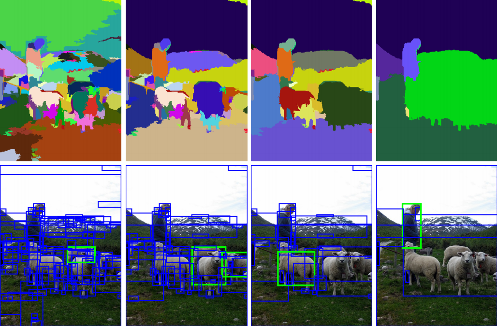]

Селективний пошук (Uijlings et al, 2013) групує сусідні пікселі зі схожою текстурою, кольором або яскравістю,
аналізуючи вікна різних розмірів на зображенні.

---

class: middle

.grid[
.kol-3-5[
  

## Fast R-CNN

- R-CNN повільна, оскільки ознаки витягуються окремо для кожного регіону-кандидата.
- Fast R-CNN використовує все зображення як вхід для CNN і витягує спільну карту ознак, замість обробки кожного регіону окремо.
- Fast R-CNN вводить RoI pooling, який дозволяє отримувати вектори ознак фіксованого розміру для регіонів-кандидатів різного розміру.

]
.kol-2-5[.width-100[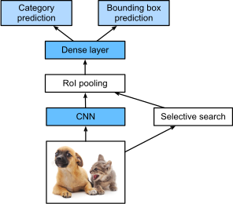]

.width-100[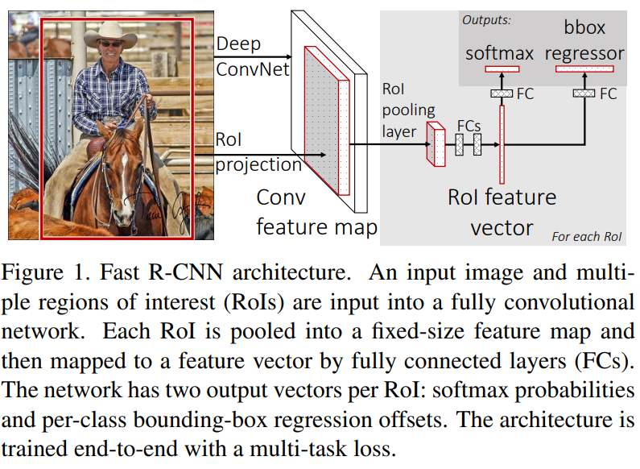]]
]

.footnote[Джерело: [Dive Into Deep Learning](https://d2l.ai/), 2020.]

---

class: middle

.center.width-70[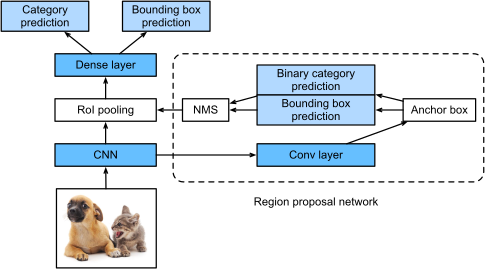]

## Faster R-CNN

- Продуктивність як R-CNN, так і Fast R-CNN залежить від якості регіонів-кандидатів, отриманих за допомогою селективного пошуку.
- Faster R-CNN замінює селективний пошук на мережу пропозицій регіонів (Region Proposal Network, RPN).
- Ця мережа зменшує кількість запропонованих регіонів, зберігаючи високу точність виявлення об’єктів.і

.footnote[Джерело: [Dive Into Deep Learning](https://d2l.ai/), 2020.]

---

class: middle, center, black-slide

<iframe width="600" height="450" src="https://www.youtube.com/embed/V4P_ptn2FF4" frameborder="0" allowfullscreen></iframe>

YOLO (v2) vs YOLO 9000 vs SSD vs Faster RCNN

---

class: middle

# Основні висновки

- Одноетапні детектори (YOLO, SSD, RetinaNet тощо) &mdash; швидкі для інференсу, але зазвичай не найточніші для виявлення об'єктів.
- Двоетапні детектори (Fast R-CNN, Faster R-CNN, R-FCN, Light head R-CNN, тощо) &mdash; зазвичай повільніші, але часто є точнішими.
- Вибір мережі залежать від багатьох інженерних рішень.

---

class: middle, 

.center.larger-xxx[🧿[Демо](https://colab.research.google.com/gist/kirisakow/325a557d89262e8d6a4f2918917e82b4/real-time-object-detection-in-webcam-video-stream-using-ultralytics-yolov8.ipynb)]

- Як змінюється точність та розпізнавання об’єктів залежно від відстані до камери?

- Як модель справляється з виявленням об’єктів по одному та у скупченні?

- Як трансформації зображення впливають на результати детекції?

???

- Як змінюється точність та розпізнавання об’єктів залежно від відстані до камери?

- Як модель справляється з детекцією об’єктів по одному та у скупченні?

- Як трансформації зображення впливають на результати детекції?
---

class: blue-slide, middle, center
count: false

.larger-xx[Сегментація]

---

class: middle

.center.width-90[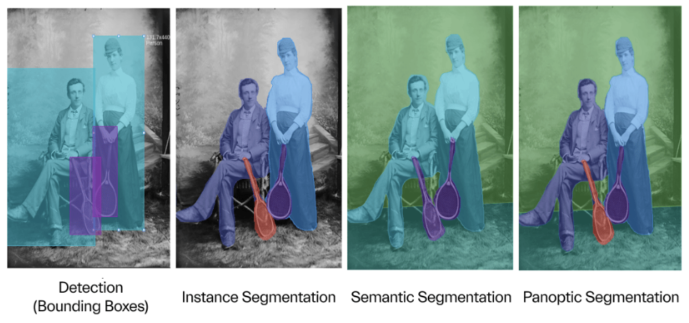]

Сегментація &mdash; це розпізнавання об’єктів на зображенні на рівні пікселів:
- .bold[Семантична сегментація].  Кожному пікселю на зображенні присвоєно мітку відповідно до їх класу (наприклад, автомобіль, пішохід, дорога).

.footnote[Джерело: [Dive Into Deep Learning](https://d2l.ai/), 2020.]

???
Семантична, екземплярна та паноптична сегментація — це три типи сегментації зображень, які використовуються в комп'ютерному зорі для аналізу та класифікації пікселів на зображенні.

Семантична сегментація: Кожен піксель зображення класифікується як такий, що належить до певної категорії (класу), наприклад, "дерево", "автомобіль", "дорога". Не розрізняє окремі об'єкти одного класу. Наприклад, якщо на зображенні є два автомобілі, вони обидва позначаться як "автомобіль" без розділення на окремі екземпляри. Усі пікселі, що належать до автомобілів, матимуть однакову мітку (наприклад, синій колір), незалежно від кількості автомобілів.

Застосування: Аналіз сцени, медична візуалізація.

---

class: middle
count: false

.center.width-90[]

Сегментація &mdash; це розпізнавання об’єктів на зображенні на рівні пікселів:
- .inactive[.bold[Семантична сегментація].  Кожному пікселю на зображенні присвоєно мітку відповідно до їх класу (наприклад, автомобіль, пішохід, дорога).]
- .bold[Екземплярна сегментація]. Крім класифікації пікселів за категоріями, розрізняються окремі об’єкти (екземпляри) одного класу, що підлягають підрахунку (наприклад, "автомобіль 1", "автомобіль 2", "пішохід 1").

.footnote[Джерело: [Dive Into Deep Learning](https://d2l.ai/), 2020.]

???

Екземплярна сегментація: Кожен об'єкт одного класу (наприклад, кожен автомобіль) отримує унікальну мітку. Це дозволяє відокремлювати об'єкти, навіть якщо вони належать до однієї категорії.

Застосування: Робототехніка, відстеження об'єктів, розпізнавання окремих предметів.

---

class: middle
count: false

.center.width-90[]

Сегментація &mdash; це розпізнавання об’єктів на зображенні на рівні пікселів:
- .inactive[.bold[Семантична сегментація].  Кожному пікселю на зображенні присвоєно мітку відповідно до їх класу (наприклад, автомобіль, пішохід, дорога).]
- .inactive[.bold[Екземплярна сегментація]. Крім класифікації пікселів за категоріями, розрізняються окремі об’єкти (екземпляри) одного класу, що підлягають підрахунку (наприклад, "автомобіль 1", "автомобіль 2", "пішохід 1").]
- .bold[Паноптична сегментація]. Поєднання семантичної та екземплярної сегментації (визначення класу для фону та об'єктів + розділення об'єктів).

.footnote[Джерело: [Dive Into Deep Learning](https://d2l.ai/), 2020.]

???

Паноптична сегментація: Поєднує семантичну та екземплярну сегментацію. Кожен піксель зображення класифікується за категорією, а також визначається, до якого окремого об'єкта він належить (для об'єктів, що підлягають підрахунку, як-от люди, машини) або як частина фону (наприклад, небо, трава).

Застосування: Комплексний аналіз сцен, автономні системи.

---

class: middle

.alert[Глибоке навчання розглядає семантичну сегментацію як .bold[класифікацію пікселів]. Згорткові нейронні мережі можуть використовуватися для цього, але потребують певних адаптацій.]

---

class: middle

.center.width-100[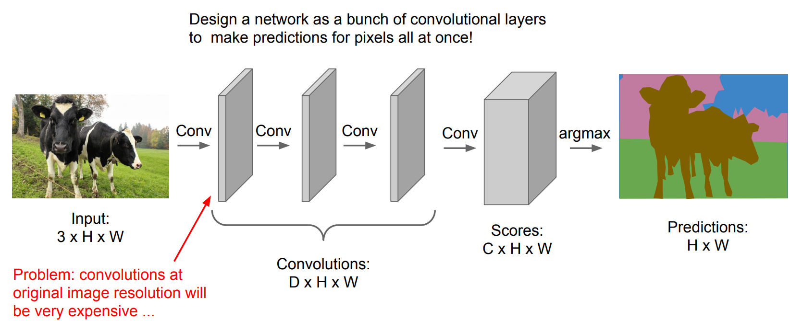]

.footnote[Джерело: [CS231n, Lecture 11](http://cs231n.stanford.edu/slides/2018/cs231n_2018_lecture11.pdf), 2018.]

???
Проєктування згорткової мережі для одночасного передбачення значень усіх пікселів (як у семантичній сегментації) може бути неефективним з кількох причин:
1. .bold[Висока обчислювальна складність]: Згортки на оригінальній роздільній здатності зображення (особливо великих зображень) потребують значних обчислювальних ресурсів, оскільки кожен піксель обробляється окремо. Це призводить до великих витрат пам’яті та часу обробки.

1. .bold[Відсутність повторного використання ознак]: У традиційних згорткових мережах спільні ознаки між перекритими ділянками (патчами) не використовуються ефективно. Це означає, що однакові обчислення можуть виконуватися кілька разів для сусідніх пікселів, що знижує ефективність.

2. .bold[Втрата контекстуальної інформації]: Згорткові шари з малим полем сприйняття (receptive field) не можуть ефективно захоплювати глобальний контекст зображення, що важливо для точної сегментації. Збільшення поля сприйняття через глибші мережі ще більше підвищує обчислювальну складність.

Вирішення проблеми:
1. Зменшення розміру вхідних даних для зниження обчислювального навантаження (з подальшим відновленням через транспоновану згортку або апскейлінг).
2. Повністю згорткові мережі (FCN): Заміна повнозв’язних шарів згортковими для збереження просторової інформації та зменшення кількості параметрів.
3. Архітектури типу U-Net або SegNet: Використання енкодера-декодера для ефективного захоплення як локальних, так і глобальних ознак.

---

class: middle

.center.width-100[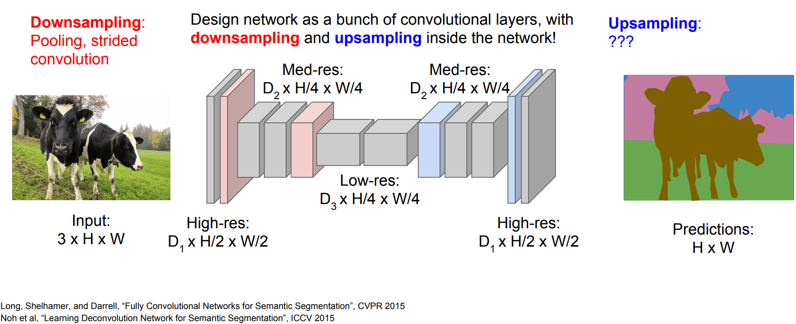]

.footnote[Джерело: [CS231n, Lecture 11](http://cs231n.stanford.edu/slides/2018/cs231n_2018_lecture11.pdf), 2018.]

???

Згорткові шари та шари пулінгу зменшують або зберігають розміри вхідного зображення (ширину та висоту). Для семантичної сегментації необхідно передбачати значення для кожного пікселя, що вимагає збільшення розмірів вхідних даних. Повнозв’язні шари могли б вирішити це завдання, але мають ті ж недоліки: втрачають просторову інформацію, мають багато параметрів і неефективні для великих зображень. Ідеально було б мати шари, які реалізують обернену дію до згортки і пулінгу.

---

background-image: url(./figures/lec7/trans-conv.png)
background-size: contain

# Транспонована згортка
        
       

.larger-x[$$O = (I - 1) S + F - 2P$$]

---

background-image: url(./figures/lec7/trans-convSP.png)
background-size: contain

# Транспонована згортка
        
       

.larger-x[$$O = (I - 1) S + F - 2P$$]

---

exclude: true
class: middle

# Транспонована згортка

.center.width-100[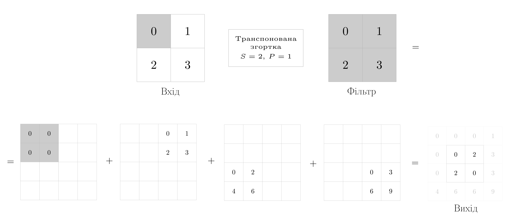]

.larger-x[$$O = (I - 1) S + F - 2P$$]

---

class: middle

## Повністю згорткові мережі (FCNs)

.grid[
.kol-3-4[

Повністю згорткова мережа (FCN) &mdash; це згорткова мережа, у якій повнозв’язні шари замінено на згорткові та транспоновані згорткові шари. 

Для семантичної сегментації найпростіша архітектура FCN включає:
- використання (попередньо навченої) згорткової мережі для зменшення роздільності та вилучення ознак зображення;
- заміну повнозв’язних шарів на  $1 \times 1$ згортку для перетворення кількості каналів у кількість категорій;
- збільшення розміру карти ознак до розміру вхідного зображення за допомогою одного (або кількох) транспонованих згорткових шарів.
]
.kol-1-4[.center.width-90[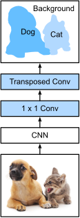]]
]

---

class: middle

.alert[На відміну від повнозв’язних мереж, розміри вихідних даних повністю згорткової мережі (FCN) не є фіксованими. Вони залежать від розмірів вхідного зображення, яке може мати довільні розміри.]

.success[FCN адаптується до будь-якого розміру вхідного зображення, забезпечуючи гнучкість для семантичної сегментації.]

---

exclude: true
class: middle

.center.width-100[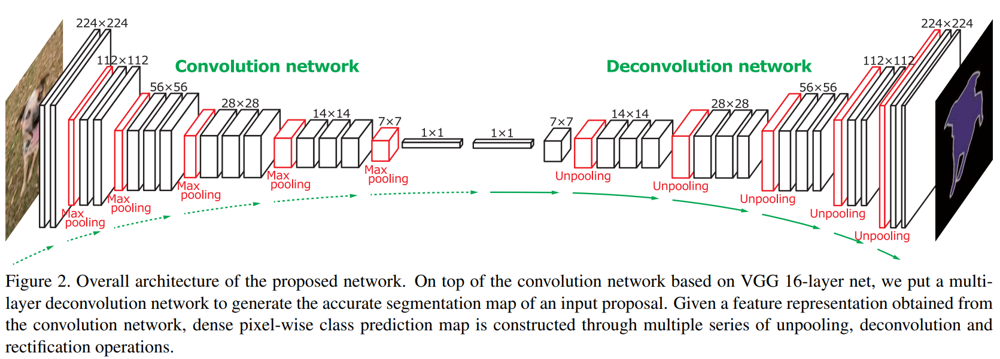]

.footnote[Джерело: [Noh et al](https://arxiv.org/abs/1505.04366), 2015.]

---

class: middle

.center.width-100[]

Попередня архітектура .bold[кодер-декодер] є простим і ефективним способом виконання семантичної сегментації.

Однак представлення з низькою роздільною здатністю в середині мережі може стати вузьким місцем для продуктивності сегментації, оскільки воно має зберігати достатньо інформації для відновлення карти сегментації з високою роздільною здатністю.

.footnote[Джерело: Simon J.D. Prince, [Understanding Deep Learning](https://udlbook.github.io/udlbook/), 2023.]

---

class: middle

## UNet

Архітектура .bold[UNet] реалізує підхід енкодер-декодер із пропускними з’єднаннями (зазвичай конкатенаціями), які напряму з’єднують відповідні шари енкодера та декодера  з однаковою просторовою роздільністю. Це дає змогу декодеру використовувати як:
- .bold[високороздільні ознаки з енкодера]
- так і .bold[низькороздільні ознаки з глибших шарів мережі].

.center.width-80[]

.footnote[Джерело: Simon J.D. Prince, [Understanding Deep Learning](https://udlbook.github.io/udlbook/), 2023.]

???

- Ця ж архітектура застосовується для задач типу image-to-image.

- Кількість фільтрів збільшується в енкодері та зменшується в декодері.

- Завершується 1×1 згорткою для зменшення каналів до кількості класів.

---

class: middle

.center.width-100[]

.center[Результати 3D-сегментації з використанням архітектури UNet.  (a) Зрізи 3D-об’єму кори головного мозку миші,
(b) UNet використовується для класифікації вокселів як таких, що належать або не належать до нейритів. Зв’язані області позначено різними кольорами,
(c) Ансамбль із 5 моделей UNet.]

.footnote[Джерело: Simon J.D. Prince, [Understanding Deep Learning](https://udlbook.github.io/udlbook/), 2023.]

---

class: middle

.center.larger-xxx[🧿[Демо](https://colab.research.google.com/github/YKochura/nn-kpi/blob/main/tutor/unet.ipynb)]

---

class: middle

## Mask R-CNN

.grid[
.kol-1-2[

Задача сегментації є природним розширенням задачі детекції об’єктів. Наприклад, .bold[Mask R-CNN] &mdash; це розширення .bold[Faster R-CNN] для семантичної сегментації: 
- Замість шару RoI Pooling використовується RoI Align, що забезпечує точніше відображення ознак. 
- Додано підмережу на основі FCN для побудови бінарної маски сегментації для кожного виявленого об’єкта.
- Такий підхід дозволяє не лише знаходити об’єкти, а й точно вирізати їх на зображенні (сегментація екземплярів).

]
.kol-1-2[.center.width-95[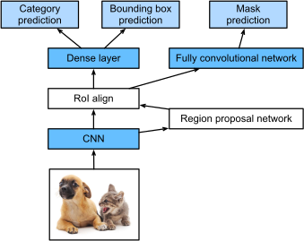]]
]

.footnote[Джерело: [Dive Into Deep Learning](https://d2l.ai/), 2020.]

---

class: middle

background-color: black
background-image: url(./figures/lec7/mask-rcnn-results.png)
background-size: contain

.footnote[Джерело: [He et al](https://arxiv.org/abs/1703.06870), 2017.]

---

class: middle, center, black-slide

<iframe width="600" height="450" src="https://www.youtube.com/embed/OOT3UIXZztE" frameborder="0" allowfullscreen></iframe>

---

class: middle

Значну увагу слід звернути на те, що задачі детекції та сегментації значною мірою базуються на повторному використанні великих моделей, попередньо навчених для класифікації.

.bold[Як самі моделі, так і вихідні коди відповідних алгоритмів або дані, на яких вони навчались, є загальновживаними і придатними до повторного використання ресурсами.]

.footnote[Джерело: Francois Fleuret, [EE559 Deep Learning](https://fleuret.org/ee559/), EPFL.]

---

class: end-slide, center
count: false

.larger-xxxx[🏁]

???

Вікторина:
- Яку архітектуру ви б використали для роботи з зображеннями?
- Чи варто тренувати модель з нуля?
- У чому різниця між виявленням об'єктів та сегментацією?
- Назвіть одну архітектуру для виявлення об'єктів.
- Назвіть одну архітектуру для семантичної сегментації.
- Який тип шару можна використати для збільшення розміру карти ознак (feature map)?