class: middle, center, title-slide 

# Нейронні мережі

Лекція 9: Невизначеність

  
Кочура Юрій Петрович 
[iuriy.kochura@gmail.com](mailto:iuriy.kochura@gmail.com)  
<a href="https://t.me/y_kochura">@y_kochura</a>  

---

class: middle

.center.circle.width-35[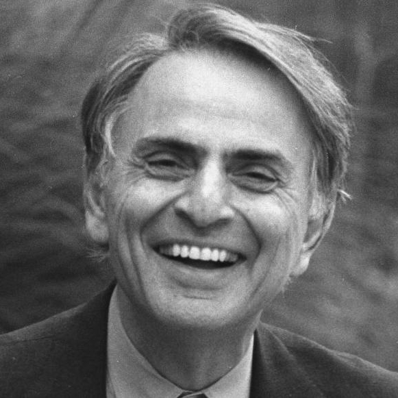]

.quote[«Щоразу, коли наукова стаття представляє певні дані, їх супроводжують межі похибки &mdash; скромне, але промовисте нагадування про те, що .bold[жодне знання не є повним або досконалим]. Це калібрування того, наскільки ми довіряємо тому, що, як нам здається, ми знаємо.»]

.pull-right[Карл Саган]

.footnote[Джерело:  [Carl Sagan Quotes](https://quotefancy.com/quote/2028971/Carl-Sagan-Every-time-a-scientific-paper-presents-a-bit-of-data-it-s-accompanied-by-an).]

???

Якщо межі похибки вузькі &mdash; точність нашого емпіричного знання висока; якщо ці межі широкі &mdash; велика й невизначеність у нашому знанні.

Знання — це артефакт. Це ментальна конструкція.

Невизначеність — це те, наскільки ми довіряємо цій конструкції.

---

class:  black-slide, middle
background-image: url(./figures/lec1/nn.jpg)
background-size: cover

 
# Сьогодні
.larger-x[
 Як оцінювати невизначеність у нейронних мережах і за їх допомогою? 

🎙️ Невизначеність  
🎙️ Алеаторна невизначеність  
🎙️ Епістемічна невизначеність  

]

---

class: blue-slide, middle, center
count: false

.larger-xx[Невизначеність]

---

class: middle

.center.circle.width-35[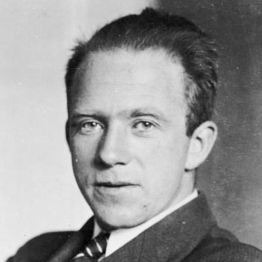]

.quote[«Невизначеність &mdash; фундаментальна властивість природи: не можна одночасно точно виміряти координату і імпульс частинки. Це не про незнання &mdash; це про саму структуру реальності.»]

.pull-right[Вернер Гейзенберг]

.footnote[Додатково:  [Принцип невизначеності](https://uk.wikipedia.org/wiki/%D0%9F%D1%80%D0%B8%D0%BD%D1%86%D0%B8%D0%BF_%D0%BD%D0%B5%D0%B2%D0%B8%D0%B7%D0%BD%D0%B0%D1%87%D0%B5%D0%BD%D0%BE%D1%81%D1%82%D1%96).]

???
Саме це сперечались Айнштайн і Бор. Айнштайн вважав — так, є прихована реальність, яку ми просто не бачимо («Бог не грає в кості»). Бор вважав — ні, нема глибшої реальності за квантовим описом.

---

class: middle

.center.circle.width-35[]

.quote[«Невизначеність існує не в світі, а між спостерігачем і світом.»]

.pull-right[Девід Шпігельгальтер]

.footnote[Додатково:  [The art and science of uncertainty - with David Spiegelhalter](https://www.youtube.com/watch?v=T86Xl1IhlgI).]

???
Невизначеність — це не хвороба буття і не аномалія, яку необхідно будь-якими шляхами усувати. Натомість її варто навчитися приймати й розуміти.

# Притча про невизначеність
Невизначеність — це свого роду порочне подієве коло, за рамки якого вийти надзвичайно складно. Щоб продемонструвати його природу, можна звернутися до однієї давньої китайської притчі. У ній ідеться про старого мудрого селянина, єдиним надбанням якого був кінь. Без нього він би не зміг ані орати, ані сіяти.

Одного разу цей кінь зник. Жителі села почали один поперед одного співчувати втраті старого й жаліти його. Але старий мудрець відповідав: «Звідки ви можете знати, що кінь, який утік, — це саме втрата, а не придбання?» Односельці дуже дивувалися з цих його слів. Аж ось якось вони стали свідками дива — домашній кінь, що втік, не просто повернувся до господаря, а й привів із собою дикого приятеля.

Жителі села стали вітати старого з неймовірною удачею — тепер у нього цілих два коні! Та мудрець, демонструючи критичне мислення, поставив їм чергове запитання: «Звідки вам відомо, що це удача?» Подальша історія, як ви вже здогадалися, побудована за циклічним принципом: удачі та невдачі нескінченно змінюють одна одну. Виходить, що немає ні однозначно поганих, ні однозначно хороших подій, оскільки кожна наступна кидає виклик попередній.

https://huxley.media/mistectvo-neviznachenosti-chomu-ne-znati-ce-ne-strashno-a-korisno/

---

class: middle

Невизначеність стосується ситуацій, у яких наявна .bold[неповна або невідома інформація]. Вона може виникати у прогнозах майбутніх подій, у фізичних вимірюваннях або в ситуаціях, де інформація невідома.

.alert[Врахування невизначеності є необхідним для прийняття оптимальних рішень. Ігнорування невизначеності може призводити до субоптимальних, хибних або навіть катастрофічних рішень.] 

---

class: middle

.italic[Випадок 1]. Перша смертельна аварія за участю автомобіля з системою допомоги водієві у травні 2016 року: система сприйняття автомобіля переплутала білу вантажівку зі світлим небом і тому не застосувала гальма.

.grid[
.kol-2-3[.center.width-100[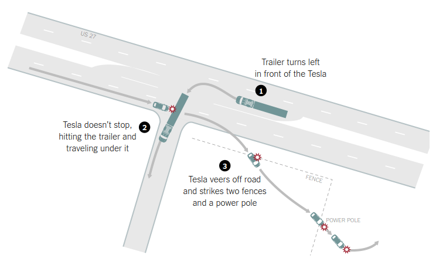]]
.kol-1-3[.center.width-100[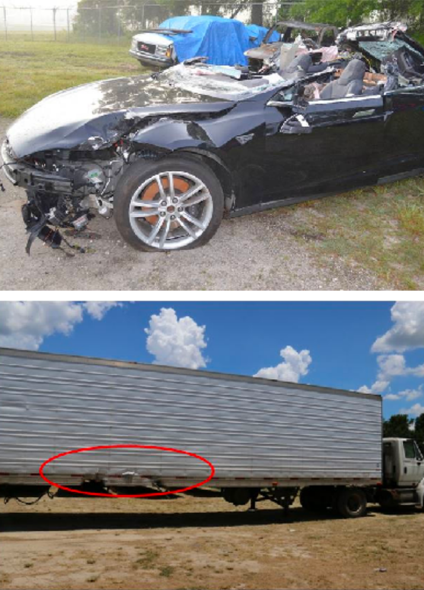]]
]

.footnote[Автори: Kendall and Gal, [What Uncertainties Do We Need in Bayesian Deep Learning for Computer Vision?](https://papers.nips.cc/paper/7141-what-uncertainties-do-we-need-in-bayesian-deep-learning-for-computer-vision.pdf), 2017.]

---

class: middle, center

.center[<video controls autoplay loop muted preload="auto" height="500" width="640">
  <source src="./figures/lec9/tesla.mp4" type="video/mp4">
</video>]

---

class: middle

.center.width-60[]

.italic[Випадок 2]. Система класифікації зображень помилково ідентифікувала двох афроамериканців як горил, демонструючи расову упередженість у моделях глибокого навчання.

.footnote[Автори: Kendall and Gal, [What Uncertainties Do We Need in Bayesian Deep Learning for Computer Vision?](https://papers.nips.cc/paper/7141-what-uncertainties-do-we-need-in-bayesian-deep-learning-for-computer-vision.pdf), 2017.]

---

class: middle

.alert[Системи, що припустилися цих помилок, найімовірніше не враховували власну невизначеність. Якби вони могли оцінювати свою невизначеність, вони могли б позначити ці випадки як невизначені і таким чином уникнути хибних передбачень.]

---

class: blue-slide, middle, center
count: false

.larger-xx[Алеаторна невизначеність]

???
Згідно з Девідом Шпігельгальтером, невизначеності можна розділити на два основні типи. Перший — це так звана «алеаторна невизначеність». Тобто те, чого ми точно не можемо знати. На думку Шпігельгальтера, «алеаторна невизначеність» часто непереборна. Другий тип — «епістемічна невизначеність».

Це те, чого ми поки що не знаємо. Науковець вважає, що якщо ми хочемо ухвалювати свідомі, обґрунтовані рішення, нам варто навчитися розрізняти ці два типи невизначеності та розуміти їхню внутрішню динаміку. На думку Шпігельгальтера, «алеаторна невизначеність» часто непереборна.

Це означає, що її можна не брати до уваги. А ось з «епістемічною невизначеністю» можна працювати. Варто спробувати її мінімізувати. Найкраще це робити за допомогою збору статистичних даних, уточнених моделей або глибшого аналітичного дослідження.

---

class: middle

Алеаторна невизначеність — це невизначеність, що виникає внаслідок притаманної стохастичності справжнього процесу генерації даних. Цю невизначеність .bold[неможливо зменшити] за рахунок збільшення обсягу даних.

Поширений приклад — спостережний шум, зумовлений обмеженнями вимірювальних приладів. Збір більшої кількості даних не зменшить шум.

---

class: middle

Припущення щодо процесу генерації даних можуть допомогти розрізнити різні типи алеаторної невизначеності:

- Гомоскедастична невизначеність — постійна в усьому просторі входів.
- Гетероскедастична невизначеність — змінюється в просторі входів.

 
.center.width-90[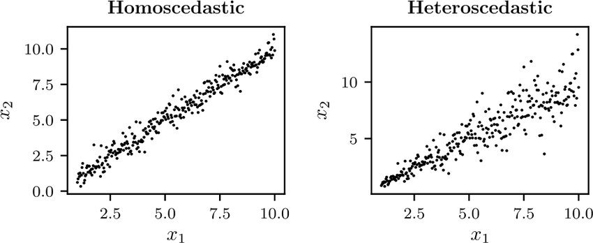]

---

# Нейронна оцінка щільності

Розглянемо навчальні дані $(\mathbf{x}, y) \sim p(\mathbf{x}, y)$, де
- $\mathbf{x} \in \mathbb{R}^p$,
- $y \in \mathbb{R}$.

Ми не прагнемо навчити функцію $\hat{y} = f(\mathbf{x})$, яка давала б лише точкові оцінки.

Натомість ми хочемо навчитися повній умовній щільності $$p(y|\mathbf{x}).$$ 

---

class: middle

## НМ з гаусівським вихідним шаром

Ми можемо моделювати алеаторну невизначеність на виході, представивши умовний розподіл як нормальний (гаусів) розподіл,
$$p(y|\mathbf{x}) = \mathcal{N}(y; \mu(\mathbf{x}), \sigma^2(\mathbf{x})),$$
де $\mu(x)$ та $\sigma^2(\mathbf{x})$ — параметричні функції, які необхідно навчити, наприклад, нейронні мережі.

Примітка: нормальний розподіл — це модельний вибір. Інші параметричні розподіли будуть розглянуті пізніше.

---

class: middle

.center.width-80[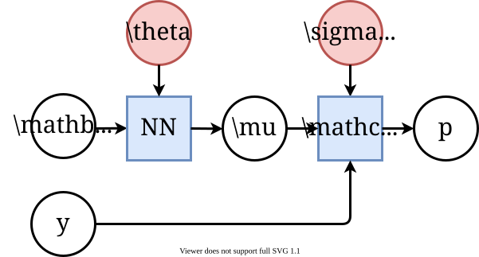]

.center[Випадок 1: Гомоскедастична алеаторна невизначеність]

.footnote[Джерело: University of Liège.]

---

class: middle

Маємо,
$$\begin{aligned}
&\arg \max\_{\theta,\sigma^2} p(\mathbf{d}|\theta,\sigma^2) \\\\
&= \arg \max\_{\theta,\sigma^2} \prod\_{\mathbf{x}\_i, y\_i \in \mathbf{d}} p(y\_i|\mathbf{x}\_i, \theta,\sigma^2) \\\\
&= \arg \max\_{\theta,\sigma^2} \prod\_{\mathbf{x}\_i, y\_i \in \mathbf{d}} \frac{1}{\sqrt{2\pi} \sigma} \exp\left(-\frac{(y\_i-\mu(\mathbf{x}\_i))^2}{2\sigma^2}\right) \\\\
&= \arg \min\_{\theta,\sigma^2} \sum\_{\mathbf{x}\_i, y\_i \in \mathbf{d}}  \frac{(y\_i-\mu(\mathbf{x}\_i))^2}{2\sigma^2} + \log(\sigma) + C
\end{aligned}$$

.question[Що зміниться, якщо $\sigma^2$ зафіксувати?]

---

class: middle

.center.width-80[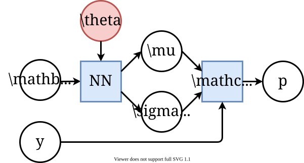]

.center[Випадок 2: Гетероскедастична алеаторна невизначеність]

.footnote[Джерело: University of Liège.]

---

class: middle

Аналогічно гомоскедастичному випадку, за винятком того, що $\sigma^2$ тепер є функцією від $\mathbf{x}\_i$:
$$\begin{aligned}
&\arg \max\_{\theta} p(\mathbf{d}|\theta) \\\\
&= \arg \max\_{\theta} \prod\_{\mathbf{x}\_i, y\_i \in \mathbf{d}} p(y\_i|\mathbf{x}\_i, \theta) \\\\
&= \arg \max\_{\theta} \prod\_{\mathbf{x}\_i, y\_i \in \mathbf{d}} \frac{1}{\sqrt{2\pi} \sigma(\mathbf{x}\_i)} \exp\left(-\frac{(y\_i-\mu(\mathbf{x}\_i))^2}{2\sigma^2(\mathbf{x}\_i)}\right) \\\\
&= \arg \min\_{\theta} \sum\_{\mathbf{x}\_i, y\_i \in \mathbf{d}}  \frac{(y\_i-\mu(\mathbf{x}\_i))^2}{2\sigma^2(\mathbf{x}\_i)} + \log(\sigma(\mathbf{x}\_i)) + C
\end{aligned}$$

.question[Яка роль $2\sigma^2(\mathbf{x}\_i)$? А $\log(\sigma(\mathbf{x}\_i))$?]

???

Зверніть увагу на коректну параметризацію $\sigma^2(\mathbf{x}\_i)$, щоб гарантувати її додатність.

---

class: middle

.alert[Моделювання $p(y|\mathbf{x})$ як нормального розподілу часто є недостатнім, оскільки умовний розподіл може бути .bold[мультимодальним].]

---

class: middle

## Модель суміші гаусіанів

Модель суміші гаусіанів (МСГ) визначає $p(y|\mathbf{x})$ як суміш $K$ гаусових компонент,
$$p(y|\mathbf{x}) = \sum\_{k=1}^K \pi\_k \mathcal{N}(y;\mu\_k, \sigma\_k^2),$$
де $0 \leq \pi\_k \leq 1$ для всіх $k$ та $\sum\_{k=1}^K \pi\_k = 1$.

.center.width-60[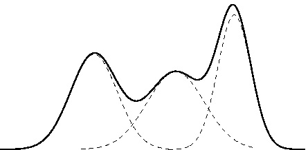]

.footnote[Джерело: University of Liège.]

---

class: middle

.bold[Мережа щільності суміші] (МЩС) — це реалізація моделі суміші гаусіанів на основі нейронної мережі.

.center.width-100[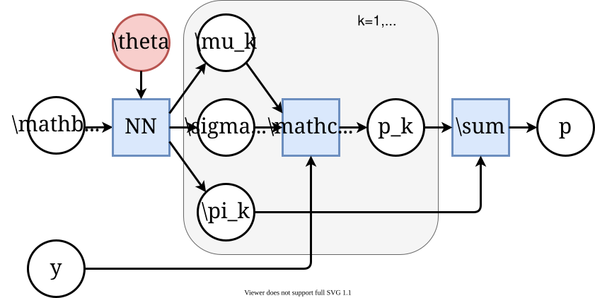]

.footnote[Джерело: University of Liège.]

---

class: middle

## Ілюстрація

Розглянемо навчальні дані, згенеровані випадковим чином як
$$y\_i = \mathbf{x}\_i + 0.3\sin(4\pi \mathbf{x}\_i) + \epsilon\_i$$
з $\epsilon\_i \sim \mathcal{N}$.

---

class: middle

.center[

.width-55[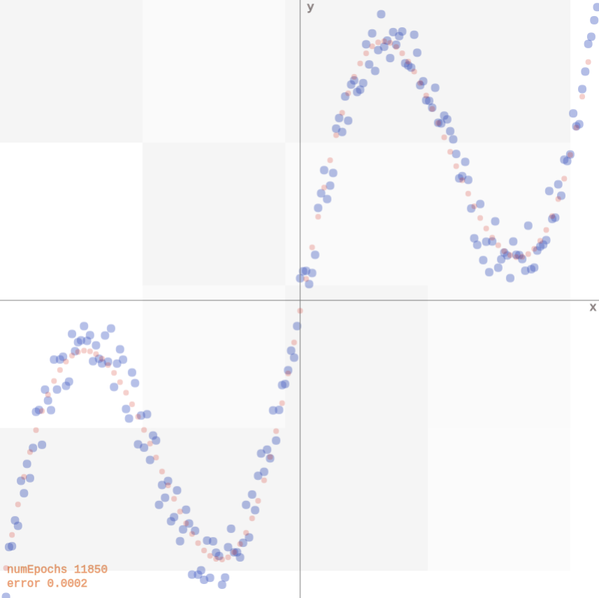]

Дані можна апроксимувати двошаровою мережею, яка видає точкові оцінки для $y$
([демо](http://otoro.net/ml/mixture/index.html)).

]

.footnote[Автор: David Ha, [Mixture Density Networks](http://blog.otoro.net/2015/06/14/mixture-density-networks/), 2015.]

---

class: middle

.center[

.width-55[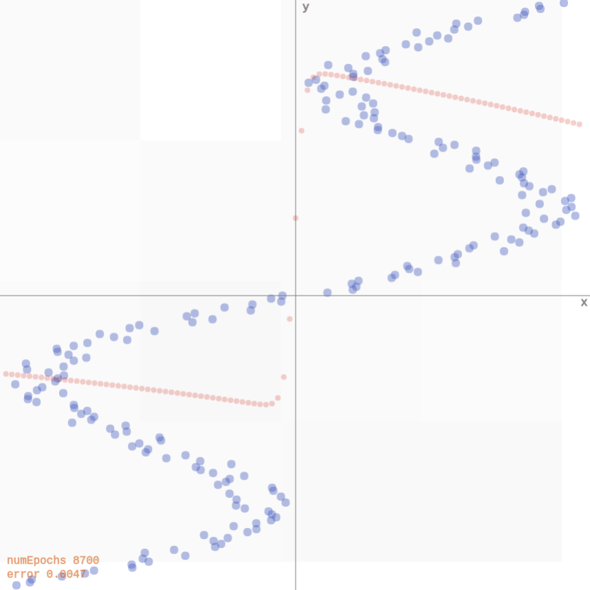]

Якщо поміняти місцями $\mathbf{x}\_i$ та $y\_i$, мережа стикається з труднощами, оскільки для кожного входу існує кілька правильних виходів. Вона видає середнє значення правильних відповідей
([демо](http://otoro.net/ml/mixture/inverse.html)).

]

.footnote[Автор: David Ha, [Mixture Density Networks](http://blog.otoro.net/2015/06/14/mixture-density-networks/), 2015.]

???
Точкова оцінка фундаментально не здатна представити мультимодальний розподіл. Для цього потрібні моделі, які явно моделюють невизначеність — наприклад, mixture density networks або генеративні моделі.

---

class: middle

.center[

.width-55[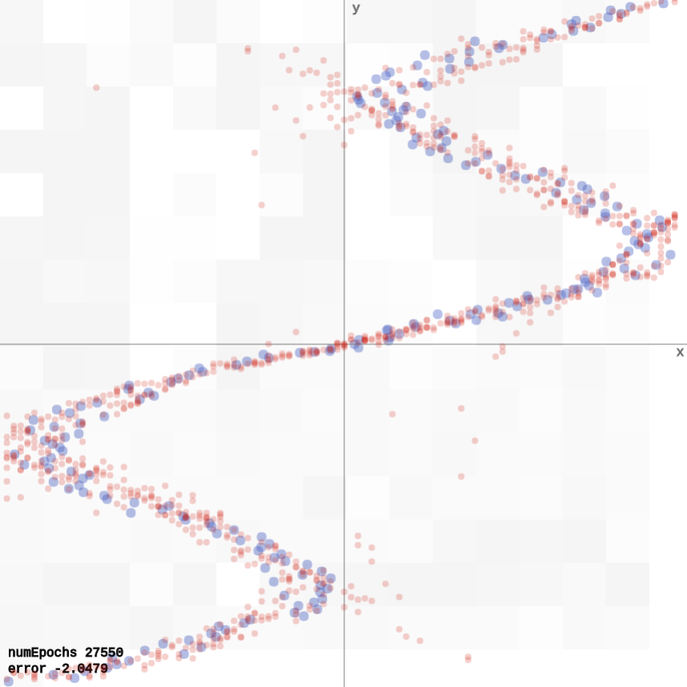]

Мережа щільності суміші моделює дані коректно, оскільки для кожного входу прогнозує розподіл виходу, а не точкову оцінку
([демо](http://otoro.net/ml/mixture/mixture.html)).

]

.footnote[Автор: David Ha, [Mixture Density Networks](http://blog.otoro.net/2015/06/14/mixture-density-networks/), 2015.]

---

class: middle

.alert[Моделі суміші гаусіанів є гнучким способом моделювання мультимодальних розподілів, проте вони обмежені кількістю компонент $K$, яка має бути великою для моделювання складних розподілів.]

---

class: middle

# Нормалізуючі потоки

Нормалізуючі потоки (Normalizing flows) — це більш гнучке сімейство нейронних апроксиматорів розподілу, здатне моделювати складні мультимодальні розподіли без необхідності у великій кількості компонент.

.footnote[Інфо: [Normalizing Flows Explained](https://www.youtube.com/watch?v=x11yFPsttRw).]

???

Мотивувати тим, що вибір параметричного сімейства розподілів не завжди є простим завданням. Нам потрібно щось більш гнучке.

---

class: middle

## Теорема про заміну змінних

.center.width-80[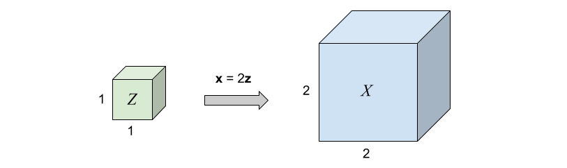]

Припустимо, що $p(\mathbf{z})$ — рівномірно розподілений одиничний куб у $\mathbb{R}^3$ і $\mathbf{x} = f(\mathbf{z}) = 2\mathbf{z}$.
Оскільки сумарна імовірнісна маса повинна зберігатися,
$$p(\mathbf{x})=p(\mathbf{x}=f(\mathbf{z})) = p(\mathbf{z})\frac{V\_\mathbf{z}}{V\_\mathbf{x}}=p(\mathbf{z}) \frac{1}{8},$$
де $\frac{1}{8} = \left| \det \left( \begin{matrix}
2 & 0 & 0 \\\\ 
0 & 2 & 0 \\\\
0 & 0 & 2
\end{matrix} \right)\right|^{-1}$ — обернений визначник якобіана лінійного перетворення $f$.

.footnote[Джерело: University of Liège.]

???

Інтуїтивно: імовірнісна маса у просторі $z$ повинна зберігатися у просторі $x$. Оскільки перетворення $f$ збільшує об'єм у 8 разів, щільність у кожній точці повинна бути поділена на 8 для збереження сумарної маси.

---

class: middle

Що відбувається, якщо $f$ є нелінійною функцією?

.center.width-70[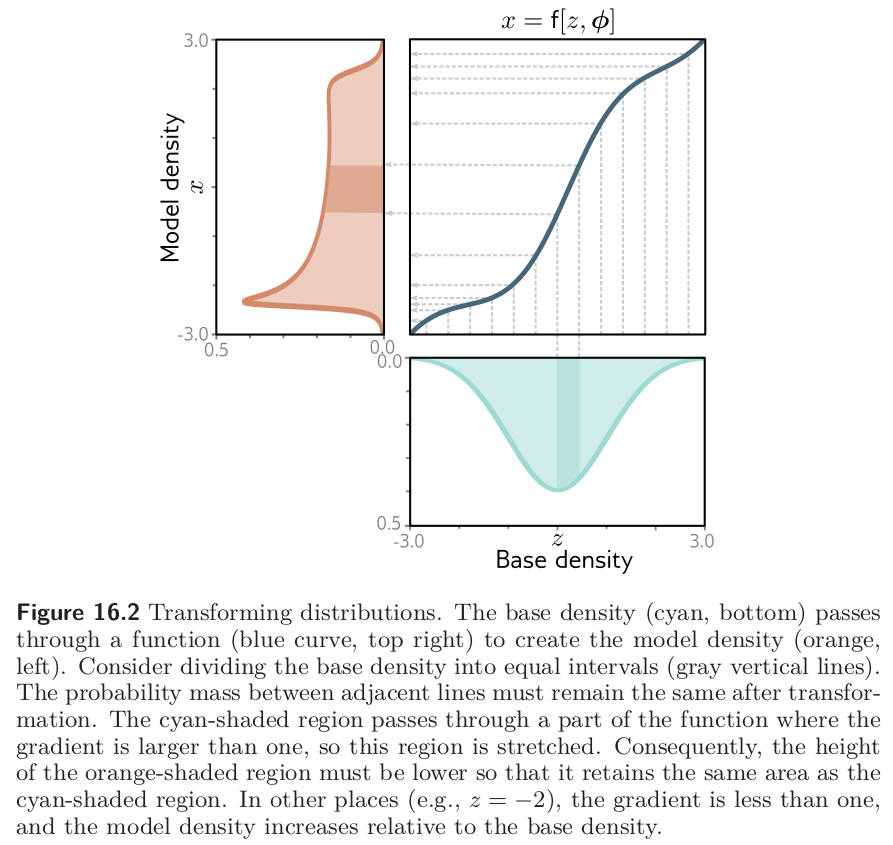]

.footnote[Джерело зображення: Simon J.D. Prince, [Understanding Deep Learning](https://udlbook.github.io/udlbook/), 2023.]

???

Беремо простий базовий розподіл (блакитний, знизу) — наприклад, стандартний гаусіан — і пропускаємо через функцію $x = f[z, \phi]$ (нейронна мережа з параметрами $\phi$) (синя крива, праворуч), щоб отримати складний модельний розподіл (помаранчевий, ліворуч).

Розділимо базовий розподіл на рівні інтервали (сірі вертикальні лінії). Ймовірнісна маса між сусідніми лініями повинна залишатись однаковою після перетворення.

Звідси випливає:
$$p\_x(x) = p_z(z) \cdot \left|\frac{dz}{dx}\right|$$

Нормалізуючий потік — це по суті деформація простого розподілу через гнучку функцію (параметризована нейронною мережею, яка навчається підбирати потрібне перетворення під конкретні дані). Де функція розтягує простір — щільність падає, де стискає — зростає. Так із гаусіана можна отримати довільно складний мультимодальний розподіл.

---

class: middle

## Теорема про заміну змінних

Якщо $f$ є нелінійною,
- якобіан $J\_f(\mathbf{z})$ відображення $\mathbf{x} = f(\mathbf{z})$ описує нескінченно мале лінійне перетворення в околі точки $\mathbf{z}$;
- якщо функція є бієктивним відображенням, то маса повинна зберігатися локально.

Тому локальна зміна щільності дає
$$p(\mathbf{x}=f(\mathbf{z})) = p(\mathbf{z})\left| \det J\_f(\mathbf{z}) \right|^{-1}.$$

Аналогічно, для $g = f^{-1}$ маємо $$p(\mathbf{x})=p(\mathbf{z}=g(\mathbf{x}))\left| \det J\_g(\mathbf{x}) \right|.$$

???

Матриця Якобі функції f: R^n -> R^m у точці z ∈ R^n — це матриця розміром m × n, що описує лінійне перетворення, індуковане функцією в цій точці. Геометрично матрицю Якобі можна розглядати як матрицю частинних похідних, що описує, як функція локально розтягує або стискає площі та об'єми в околі точки z.

Визначник матриці Якобі функції f у точці z має геометричну інтерпретацію: це коефіцієнт, на який функція локально масштабує площі або об'єми. Зокрема, якщо визначник додатний, функція локально збільшує площі та об'єми; якщо від'ємний — зменшує. Абсолютне значення визначника дає коефіцієнт масштабування площ або об'ємів.

---

class: middle

## Приклад: шари зв'язності (coupling layers)

Припустимо, $\mathbf{z} = (\mathbf{z}\_a, \mathbf{z}\_b)$ та $\mathbf{x} = (\mathbf{x}\_a, \mathbf{x}\_b)$. Тоді,
- Пряме відображення $\mathbf{x} = f(\mathbf{z})$: 
$$\mathbf{x}\_a = \mathbf{z}\_a, \quad \mathbf{x}\_b = \mathbf{z}\_b \odot \exp(s(\mathbf{z}\_a)) + t(\mathbf{z}\_a),$$
- Зворотне відображення $\mathbf{z} = g(\mathbf{x})$:
$$\mathbf{z}\_a = \mathbf{x}\_a, \quad \mathbf{z}\_b = (\mathbf{x}\_b - t(\mathbf{x}\_a)) \odot \exp(-s(\mathbf{x}\_a)),$$

де $s$ і $t$ — довільні нейронні мережі.

---

class: middle

Для $\mathbf{x} = (\mathbf{x}\_a, \mathbf{x}\_b)$ логарифм правдоподібності дорівнює
$$\begin{aligned}\log p(\mathbf{x}) &= \log p(\mathbf{z}) \left| \det J\_f(\mathbf{z}) \right|^{-1}\end{aligned}$$
де якобіан $J\_f(\mathbf{z}) = \frac{\partial \mathbf{x}}{\partial \mathbf{z}}$ є нижньою трикутною матрицею $$\left( \begin{matrix}
\mathbf{I} & 0 \\\\
\frac{\partial \mathbf{x}\_b}{\partial \mathbf{z}\_a} & \text{diag}(\exp(s(\mathbf{z}\_a))) \end{matrix} \right),$$
такою, що $\left| \det J\_f(\mathbf{z}) \right| = \prod\_i \exp(s(\mathbf{z}\_a))\_i = \exp(\sum\_i s(\mathbf{z}\_a)\_i)$.

Отже, логарифм правдоподібності дорівнює
$$\begin{aligned}\log p(\mathbf{x}) &= \log p(\mathbf{z}) - \sum\_i s(\mathbf{z}\_a)\_i\end{aligned}$$

---

class: middle 

## Нормалізуючі потоки

Нормалізуючий потік — це заміна змінних $f$, яка перетворює базовий розподіл $p(\mathbf{z})$ на $p(\mathbf{x})$ за допомогою дискретної послідовності оборотних перетворень.

 
.center.width-100[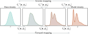]

.footnote[Джерело зображення: Simon J.D. Prince, [Understanding Deep Learning](https://udlbook.github.io/udlbook/), 2023.]

---

class: middle

Формально,
$$\begin{aligned}
&\mathbf{z}\_0 \sim p(\mathbf{z}) \\\\
&\mathbf{z}\_k = f\_k(\mathbf{z}\_{k-1}), \quad k=1,...,K \\\\
&\mathbf{x} = \mathbf{z}\_K = f\_K \circ ... \circ f\_1(\mathbf{z}\_0).
\end{aligned}$$

Теорема про заміну змінних дає
$$\log p(\mathbf{x}) = \log p(\mathbf{z}\_0) - \sum\_{k=1}^K \log \left| \det J\_{f\_k}(\mathbf{z}\_{k-1}) \right|.$$

---

class: middle

.center.width-90[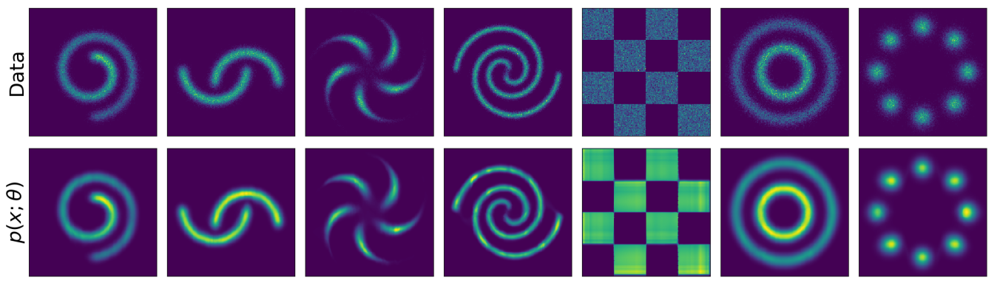]

.center[Нормалізуючі потоки здатні апроксимувати складні мультимодальні розривні щільності.]

.footnote[Джерело зображення: [Wehenkel and Louppe](https://arxiv.org/abs/1908.05164), 2019.]

---

class: middle

## Умовні нормалізуючі потоки

Нормалізуючі потоки також можуть оцінювати щільності $p(\mathbf{x} | c)$, що залежать від контексту $c$.

- Перетворення робляться умовними шляхом прийняття $c$ як додаткового входу. Наприклад, у шарі зв'язності мережі можна розширити до $s(\mathbf{z}, c)$ та $t(\mathbf{z}, c)$.
- Опційно базовий розподіл $p(\mathbf{z})$ також може залежати від $c$.

(Відповідно, алеаторна невизначеність деякого виходу $y$ при заданому вході $\mathbf{x}$ може бути змодельована умовним нормалізуючим потоком $p(y|\mathbf{x})$, де контекст $c$ — це вхід $\mathbf{x}$.)

---

class: middle

.center.width-100[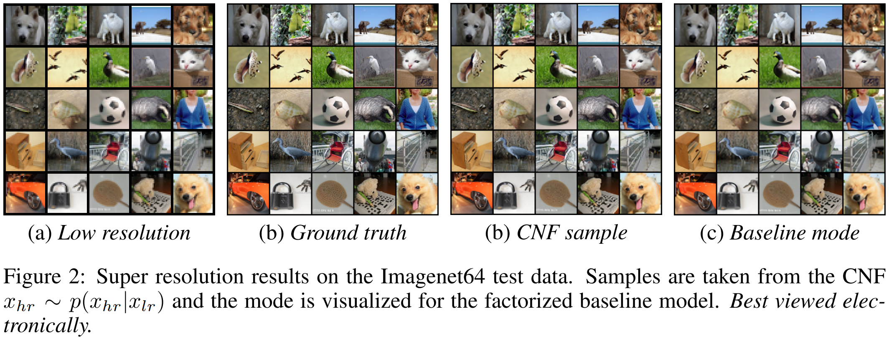]

.footnote[Джерело зображення: [Winkler et al](https://arxiv.org/abs/1912.00042), 2019.]

---

class: middle

## Нормалізуючі потоки неперервного часу

.grid[
.kol-1-2[
Перейдемо від дискретної послідовності перетворень до нейронного звичайного диференціального рівняння з оборненою динамікою, де:
$$\begin{aligned}
&\mathbf{z}\_0 \sim p(\mathbf{z})\\\\
&\frac{d\mathbf{z}(t)}{dt} = f(\mathbf{z}(t), t, \theta)\\\\
&\mathbf{x} = \mathbf{z}(1) = \mathbf{z}\_0 + \int\_0^1 f(\mathbf{z}(t), t) dt.
\end{aligned}$$
]
.kol-1-2.center[
<video autoplay muted loop width="80%">
     <source src="./figures/lec9/ffjord.mp4" type="video/mp4">
</video>
]
]

Миттєва заміна змінних дає
$$\log p(\mathbf{x}) = \log p(\mathbf{z}(0)) - \int\_0^1 \text{Tr} \left( \frac{\partial f(\mathbf{z}(t), t, \theta)}{\partial \mathbf{z}(t)} \right) dt.$$

.footnote[Джерело зображення: [Grathwohl et al](https://arxiv.org/abs/1810.01367), 2018.]

---

class: blue-slide, middle, center
count: false

.larger-xx[Епістемічна невизначеність]

???
Другий тип — «епістемічна невизначеність».

Це те, чого ми поки що не знаємо. Варто спробувати її мінімізувати. Найкраще це робити за допомогою збору статистичних даних, уточнених моделей або глибшого аналітичного дослідження.

---

class: middle

Епістемічна невизначеність враховує невизначеність щодо моделі або її параметрів.
Вона відображає наше незнання того, яка модель найкраще пояснює зібрані дані. Її .bold[можна усунути] за достатньої кількості даних.

.footnote[Автори: Kendall and Gal, [What Uncertainties Do We Need in Bayesian Deep Learning for Computer Vision?](https://papers.nips.cc/paper/7141-what-uncertainties-do-we-need-in-bayesian-deep-learning-for-computer-vision.pdf), 2017.]

.footnote[Джерело: University of Liège.]

???

Як тільки ми вибрали модель справжнього процесу генерації даних, ми стикаємося з невизначеністю щодо того, наскільки можна довіряти моделі або її параметрам.

---

# Байєсові нейронні мережі

Для врахування епістемічної невизначеності в нейронній мережі ми моделюємо наше незнання апріорним розподілом $p(\mathbf{\omega})$ над її вагами і оцінюємо апостеріорний розподіл $p(\mathbf{\omega}|\mathbf{d})$ за навчальною вибіркою $\mathbf{d}$.

  
.center[
.width-60[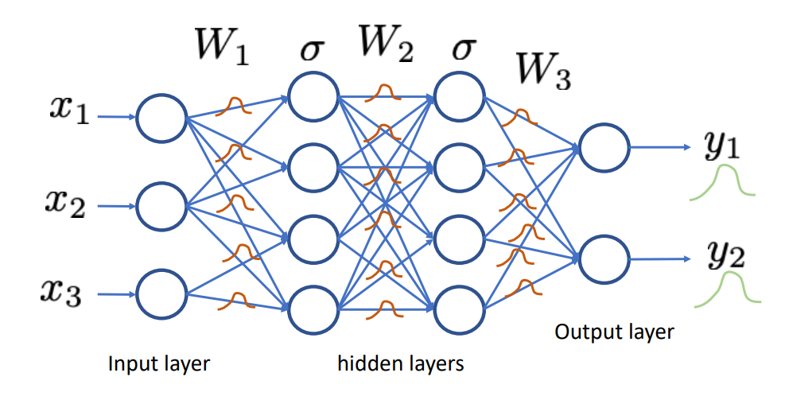] &nbsp;&nbsp;&nbsp;&nbsp; .circle.width-30[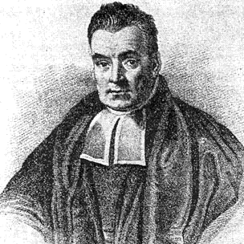]
]

---

class: middle

Апріорний прогнозний розподіл у точці $\mathbf{x}$ отримується інтегруванням по всіх можливих конфігураціях ваг,
$$p(y|\mathbf{x}) = \int p(y|\mathbf{x}, \mathbf{\omega}) p(\mathbf{\omega}) d\mathbf{\omega}.$$

За наявності навчальних даних $\mathbf{d}=\\{(\mathbf{x}\_1, y\_1), ..., (\mathbf{x}\_N, y\_N)\\}$ байєсівське оновлення дає апостеріорний розподіл
$$p(\mathbf{\omega}|\mathbf{d}) = \frac{p(\mathbf{d}|\mathbf{\omega})p(\mathbf{\omega})}{p(\mathbf{d})}$$
де правдоподібність $p(\mathbf{d}|\omega) = \prod\_i p(y\_i | \mathbf{x}\_i, \omega).$

Апостеріорний прогнозний розподіл тоді дорівнює
$$p(y|\mathbf{x},\mathbf{d}) = \int p(y|\mathbf{x}, \mathbf{\omega}) p(\mathbf{\omega}|\mathbf{d}) d\mathbf{\omega}.$$

---

class: middle

Баєсівські нейронні мережі легко описати формально, проте здійснення байєсівського висновку в них є вкрай нетривіальним.

$p(\mathbf{d})$ неможливо обчислити аналітично, що призводить до неаналітичності апостеріорного розподілу $p(\mathbf{\omega}|\mathbf{d})$.

Тому ми повинні покладатися на наближення.

---

# Варіаційний вивід

Варіаційний вивід може бути використаний для побудови апроксимації $q(\mathbf{\omega};\nu)$ апостеріорного розподілу $p(\mathbf{\omega}|\mathbf{d})$.

Можна показати, що мінімізація
$$\text{KL}(q(\mathbf{\omega};\nu) || p(\mathbf{\omega}|\mathbf{d}))$$
за варіаційними параметрами $\nu$ еквівалентна максимізації нижньої оцінки правдоподібності (ELBO):
$$\text{ELBO}(\nu) = \mathbb{E}\_{q(\mathbf{\omega};\nu)} \left[\log p(\mathbf{d}| \mathbf{\omega})\right] - \text{KL}(q(\mathbf{\omega};\nu) || p(\mathbf{\omega})).$$

???

Вивести на дошці.

---

class: middle

Інтеграл у ELBO є аналітично нерозв'язним для майже всіх $q$, але його можна максимізувати за допомогою стохастичного градієнтного підйому:

1. Зробити вибірку $\hat{\omega} \sim q(\mathbf{\omega};\nu)$.
2. Виконати один крок максимізації за $\nu$ для
$$\hat{L}(\nu) = \log p(\mathbf{d}|\hat{\omega}) - \log\frac{q(\hat{\omega};\nu)}{p(\hat{\omega})} $$

У контексті байєсових нейронних мереж ця процедура також відома як **Bayes by Backprop** (Blundell et al, 2015).

---

# Dropout

Dropout — це емпірична техніка, яку спочатку було запропоновано для запобігання перенавчанню нейронних мереж.

На кожному *кроці навчання*:
- Виключити кожен вузол мережі з імовірністю $p$.
- Оновити ваги вузлів, що залишилися, за допомогою зворотного поширення помилки.

.center.width-70[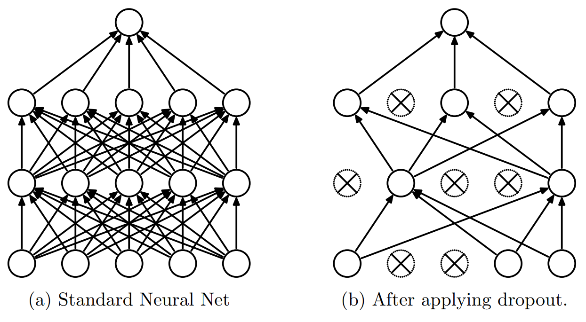]

???

Нагадати студентам, що Dropout використовувався у лекції 8 при реалізації Трансформера.

---

class: middle

Під час **тестування** можна:
- Робити передбачення за допомогою навченої мережі *без* dropout, але масштабуючи ваги на імовірність dropout $p$ (швидко і стандартно).
- Зробити вибірку $T$ нейронних мереж за допомогою dropout і усереднити їхні передбачення (повільніше, але теоретично обґрунтованіше).

---

class: middle, center

.width-100[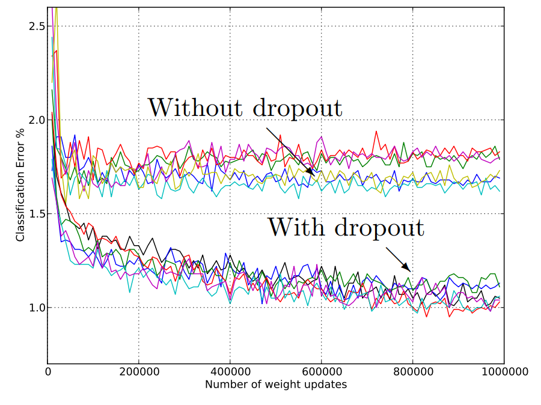]

---

class: middle

## Чому dropout працює?
- Він робить навчені ваги вузла менш чутливими до ваг інших вузлів.
- Це змушує мережу навчати кілька незалежних представлень закономірностей і, таким чином, зменшує перенавчання.
- Апроксимує **байєсівське усереднення моделей**.

---

class: middle

## Dropout як варіаційний вивід

Яке варіаційне сімейство $q$ відповідає dropout?

- Розіб'ємо ваги $\omega$ за шарами,
$\omega = \\{ \mathbf{W}\_1, ..., \mathbf{W}\_L \\},$
де $\mathbf{W}\_i$ додатково розбивається за нейронами
$\mathbf{W}\_i = \\{ \mathbf{w}\_{i,1}, ..., \mathbf{w}\_{i,q\_i} \\}.$
- Варіаційні параметри $\nu$ розбиваються аналогічно: $\nu = \\{ \mathbf{M}\_1, ..., \mathbf{M}\_L \\}$, де $\mathbf{M}\_i = \\{ \mathbf{m}\_{i,1}, ..., \mathbf{m}\_{i,q\_i} \\}$.
- Тоді запропонований $q(\omega;\nu)$ визначається таким чином:
$$
\begin{aligned}
q(\omega;\nu) &= \prod\_{i=1}^L q(\mathbf{W}\_i; \mathbf{M}\_i) \\\\
q(\mathbf{W}\_i; \mathbf{M}\_i)  &= \prod\_{k=1}^{q\_i} q(\mathbf{w}\_{i,k}; \mathbf{m}\_{i,k}) \\\\
q(\mathbf{w}\_{i,k}; \mathbf{m}\_{i,k}) &= p\delta\_0(\mathbf{w}\_{i,k}) + (1-p)\delta\_{\mathbf{m}\_{i,k}}(\mathbf{w}\_{i,k})
\end{aligned}
$$
де $\delta\_a(x)$ позначає (багатовимірний) розподіл Дірака, зосереджений у точці $a$.

???

Зверніть увагу, що це передбачає параметризацію $\mathbf{h} = \mathbf{W}\mathbf{x}$ без транспонування $\mathbf{W}$.

---

class: middle

За попереднім визначенням $q$, вибірка параметрів $\hat{\omega} = \\{ \hat{\mathbf{W}}\_1, ..., \hat{\mathbf{W}}\_L \\}$ виконується так:
- Для кожного шару $i$ та нейрона $k$ зробити бінарну вибірку $z\_{i,k} \sim \text{Bernoulli}(1-p)$.
- Обчислити $\hat{\mathbf{W}}\_i = \mathbf{M}\_i \text{diag}([z\_{i,k}]\_{k=1}^{q\_{i-1}})$,
де $\mathbf{M}\_i$ позначає матрицю, складену зі стовпців $\mathbf{m}\_{i,k}$.

.grid[
.kol-3-5[
Тобто $\hat{\mathbf{W}}\_i$ отримується обнуленням стовпців $\mathbf{M}\_i$ з імовірністю $p$.

Це **строго еквівалентно dropout**, тобто виключенню нейронів із мережі з імовірністю $p$.

]
.kol-2-5[.center.width-100[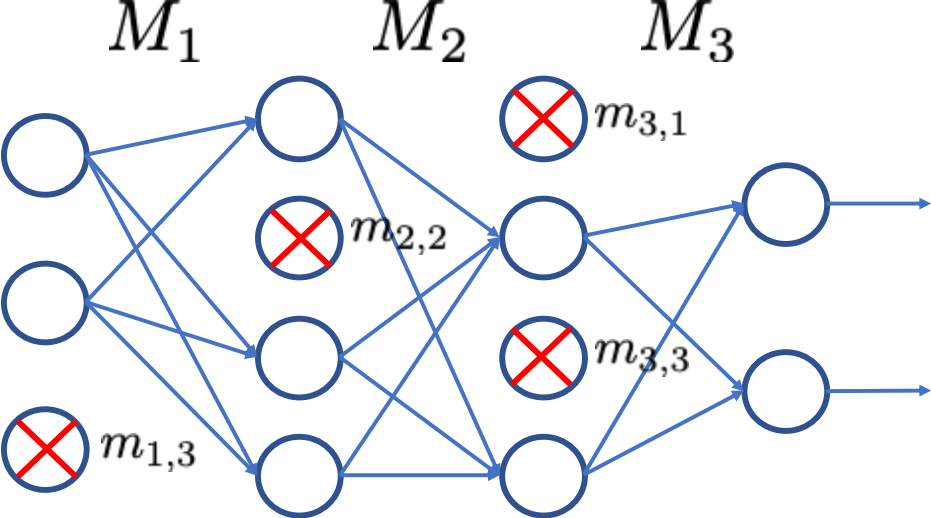]]
]

---

class: middle

Таким чином, один крок стохастичного градієнтного спуску по ELBO стає:
1. Зробити вибірку $\hat{\omega} \sim q(\mathbf{\omega};\nu)$ $\Leftrightarrow$ Випадково обнулити нейрони мережі $\Leftrightarrow$ Dropout.
2. Виконати один крок максимізації за $\nu = \\{ \mathbf{M}\_i \\}$ для
$$\hat{L}(\nu) = \log p(\mathbf{d}|\hat{\omega}) - \text{KL}(q(\mathbf{\omega};\nu) || p(\mathbf{\omega})).$$

---

class: middle

Максимізація $\hat{L}(\nu)$ еквівалентна мінімізації
$$-\hat{L}(\nu) = -\log p(\mathbf{d}|\hat{\omega}) + \text{KL}(q(\mathbf{\omega};\nu) || p(\mathbf{\omega})) $$

Це також еквівалентно одному кроку мінімізації стандартної функції втрат класифікації або регресії:
- Перший доданок — типова функція втрат (наприклад, крос-ентропія).
- Другий доданок змушує $q$ залишатися близьким до апріорного розподілу $p(\omega)$.
    - Якщо $p(\omega)$ — нормальний, мінімізація $\text{KL}$ еквівалентна $\ell\_2$-регуляризації.
    - Якщо $p(\omega)$ — розподіл Лапласа, мінімізація $\text{KL}$ еквівалентна $\ell\_1$-регуляризації.

---

class: middle

.success[Це доводить, що при .bold[навчанні мережі з dropout] зі стандартною функцією втрат класифікації або регресії насправді .bold[неявно виконується варіаційний вивід] для апроксимації апостеріорного розподілу ваг.]

---

class: middle

## Оцінки невизначеності за допомогою dropout

Коректні оцінки невизначеності в точці $\mathbf{x}$, що враховують як алеаторну, так і епістемічну невизначеність, можна отримати обґрунтованим способом за допомогою інтегрування методом Монте-Карло:
- Зробити вибірку $T$ наборів параметрів мережі $\hat{\omega}\_t$ з $q(\omega;\nu)$.
- Обчислити передбачення для $T$ мереж, $\\{ f(\mathbf{x};\hat{\omega}\_t) \\}\_{t=1}^T$.
- Апроксимувати прогнозне середнє та дисперсію як
$$
\begin{aligned}
\mathbb{E}\_{p(y|\mathbf{x},\mathbf{d})}\left[y\right] &\approx \frac{1}{T} \sum\_{t=1}^T f(\mathbf{x};\hat{\omega}\_t) \\\\
\mathbb{V}\_{p(y|\mathbf{x},\mathbf{d})}\left[y\right] &\approx \sigma^2 + \frac{1}{T} \sum\_{t=1}^T f(\mathbf{x};\hat{\omega}\_t)^2 - \hat{\mathbb{E}}\left[y\right]^2,
\end{aligned}
$$
де $\sigma^2$ — прийнятий рівень шуму в моделі спостережень.

---
 

## Піксельна регресія глибини

.center.width-80[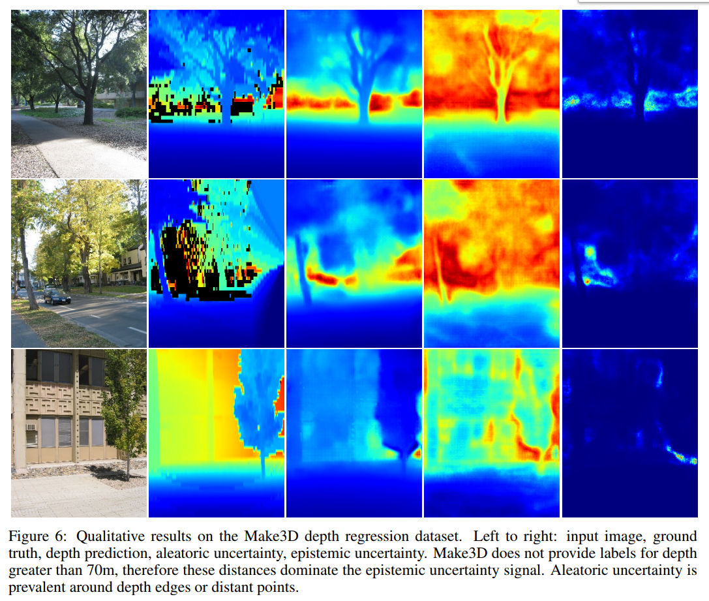]

.footnote[Автори: Kendall and Gal, [What Uncertainties Do We Need in Bayesian Deep Learning for Computer Vision?](https://papers.nips.cc/paper/7141-what-uncertainties-do-we-need-in-bayesian-deep-learning-for-computer-vision.pdf), 2017.]

---

exclude: true

# Байєсові нескінченно широкі мережі

Розглянемо одношаровий багатошаровий перцептрон (МШП) з прихованим шаром розміру $q$ та обмеженою функцією активації $\sigma$:

$$\begin{aligned}
f(x) &= b + \sum\_{j=1}^q v\_j h\_j(x)\\\\
h\_j(x) &= \sigma\left(a\_j + \sum\_{i=1}^p u\_{i,j}x\_i\right)
\end{aligned}$$

Припустимо гаусові апріорні розподіли $v\_j \sim \mathcal{N}(0, \sigma\_v^2)$, $b \sim \mathcal{N}(0, \sigma\_b^2)$, $u\_{i,j} \sim \mathcal{N}(0, \sigma\_u^2)$ та $a\_j \sim \mathcal{N}(0, \sigma\_a^2)$.

---

exclude: true
class: middle

Для фіксованого значення $x^{(1)}$ розглянемо апріорний розподіл $f(x^{(1)})$, що визначається
апріорними розподілами для ваг та зсувів.

Маємо
$$\mathbb{E}[v\_j h\_j(x^{(1)})] = \mathbb{E}[v\_j] \mathbb{E}[h\_j(x^{(1)})] = 0,$$
оскільки $v\_j$ та $h\_j(x^{(1)})$ статистично незалежні, а $v\_j$ має нульове математичне сподівання за припущенням.

Дисперсія внеску кожного прихованого нейрона $h\_j$ дорівнює
$$\begin{aligned}
\mathbb{V}[v\_j h\_j(x^{(1)})] &= \mathbb{E}[(v\_j h\_j(x^{(1)}))^2] - \mathbb{E}[v\_j h\_j(x^{(1)})]^2 \\\\
&= \mathbb{E}[v\_j^2] \mathbb{E}[h\_j(x^{(1)})^2] \\\\
&= \sigma\_v^2 \mathbb{E}[h\_j(x^{(1)})^2],
\end{aligned}$$
що є скінченним, оскільки $h\_j$ обмежена функцією активації.

Визначимо $V(x^{(1)}) = \mathbb{E}[h\_j(x^{(1)})^2]$, що є однаковим для всіх $j$.

---

exclude: true
class: middle

## Що відбувається при $q \to \infty$?

Згідно з центральною граничною теоремою, при $q \to \infty$ сумарний внесок
прихованих нейронів, $\sum\_{j=1}^q v\_j h\_j(x)$, до значення $f(x^{(1)})$ стає нормальним із дисперсією $q \sigma_v^2 V(x^{(1)})$.

Зсув $b$ також є нормальним із дисперсією $\sigma\_b^2$, тому при великих $q$ апріорний
розподіл $f(x^{(1)})$ є нормальним із дисперсією $\sigma\_b^2 + q \sigma_v^2 V(x^{(1)})$.

---

exclude: true
class: middle

Відповідно, для $\sigma\_v = \omega\_v q^{-\frac{1}{2}}$ при деякому фіксованому $\omega\_v$ апріорний розподіл $f(x^{(1)})$ збігається до нормального з нульовим математичним сподіванням та дисперсією $\sigma\_b^2 + \omega\_v^2 \sigma_v^2 V(x^{(1)})$ при $q \to \infty$.

Для двох або більше фіксованих значень $x^{(1)}, x^{(2)}, ...$ аналогічне міркування показує, що
при $q \to \infty$ спільний розподіл виходів збігається до багатовимірного нормального
з нульовими математичними сподіваннями та коваріаціями
$$\begin{aligned}
\mathbb{E}[f(x^{(1)})f(x^{(2)})] &= \sigma\_b^2 + \sum\_{j=1}^q \sigma\_v^2 \mathbb{E}[h\_j(x^{(1)}) h\_j(x^{(2)})] \\\\
&= \sigma\_b^2 + \omega_v^2 C(x^{(1)}, x^{(2)})
\end{aligned}$$
де $C(x^{(1)}, x^{(2)}) = \mathbb{E}[h\_j(x^{(1)}) h\_j(x^{(2)})]$ і є однаковим для всіх $j$.

---

exclude: true
class: middle

Цей результат стверджує, що для будь-якого набору фіксованих точок $x^{(1)}, x^{(2)}, ...$
спільний розподіл $f(x^{(1)}), f(x^{(2)}), ...$ є багатовимірним
нормальним.

Іншими словами, *нескінченно широкий одношаровий МШП* збігається до
**гаусівського процесу**.

 

.center.width-80[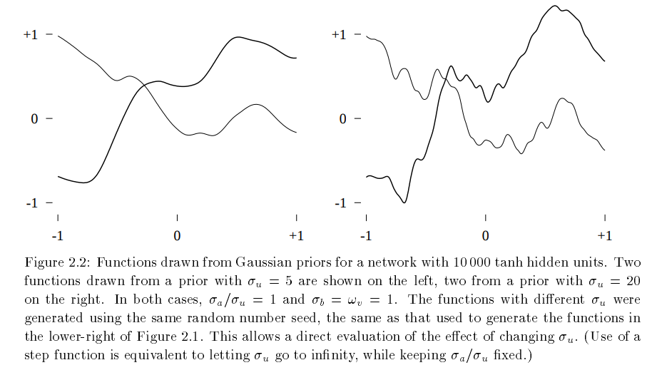]

.center[(Neal, 1995)]

---

class: end-slide, center
count: false

.larger-xxxx[🏁]
